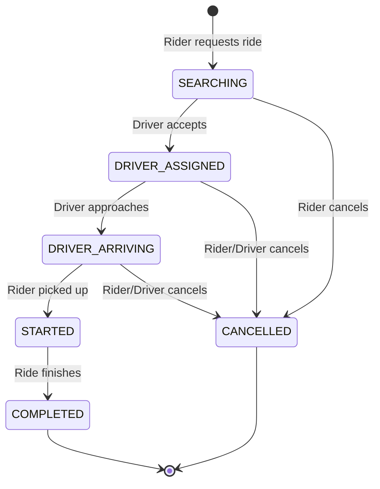
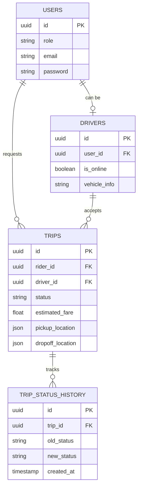

# Ridesharing Project Overview

Welcome to the Uber-like ride-hailing backend project! This document provides a comprehensive A to Z guide to understanding the project's architecture, data flow, and core functionalities. It is designed to help new developers get up to speed without any headaches.

## 1. High-Level Architecture

The project is built as a robust, service-oriented monolithic backend that is designed to eventually scale into microservices. It follows industry-standard patterns used by companies like Uber, Lyft, and Grab.

### Tech Stack
- **Runtime:** Node.js
- **Framework:** Fastify (for high-performance routing)
- **Database:** PostgreSQL (primary data store)
- **ORM:** Drizzle ORM (type-safe database interactions)
- **Caching & Real-time Data:** Redis (for driver geolocations, fast lookups, and rate-limiting)
- **Authentication:** JWT (JSON Web Tokens)
- **Real-time Communication:** WebSockets (`@fastify/websocket`)
- **Infrastructure:** Docker & Docker Compose (for easy local setup)

## 2. Core Modules

The application is structured into modular feature sets located in `api/src/modules/`:

- **Auth (`/api/v1/auth`):** Handles user registration and login, generating JWTs.
- **Users (`/api/v1/users`):** Manages basic user profile information.
- **Drivers (`/api/v1/drivers`):** Handles driver-specific actions like becoming a driver, toggling online/offline status, and updating real-time geolocation.
- **Trips (`/api/v1/trips`):** The core engine of the app. Manages the lifecycle of a ride request, driver matching, and fare estimation.
- **Common:** Shared utilities like WebSocket connections, validation schemas, and middlewares.

## 3. The Trip Lifecycle Flow

The most critical part of this system is the state machine governing a trip. A trip strictly transitions through specific statuses to prevent race conditions and fraud.

### State Machine Flow



### Step-by-Step Scenario: A Complete Ride

1. **Rider Requests:** The rider calls `POST /api/v1/trips/request`. A new trip is created in the DB with status `SEARCHING`.
2. **Driver Discovery:** Drivers ping `GET /api/v1/trips/pending` to see available rides or receive WebSocket notifications.
3. **Driver Accepts:** A driver calls `POST /api/v1/trips/:id/accept`. The backend atomically updates the trip to `DRIVER_ASSIGNED` and assigns the `driverId`.
4. **Driver Arriving:** The driver nears the pickup location and calls `POST /api/v1/trips/:id/arrived`. Status becomes `DRIVER_ARRIVING`.
5. **Trip Starts:** The rider is picked up. Driver calls `POST /api/v1/trips/:id/start`. Status becomes `STARTED`.
6. **Trip Completes:** The driver reaches the destination and calls `POST /api/v1/trips/:id/complete`. Status becomes `COMPLETED`.

## 4. Real-time Architecture

Because ride-hailing requires sub-second updates for GPS tracking and dispatching, traditional HTTP polling is insufficient.

```mermaid
sequenceDiagram
    participant Rider
    participant Server (Fastify + WS)
    participant Redis
    participant Driver
    
    Driver->>Server (Fastify + WS): WS: Update Location (Lat, Lng)
    Server (Fastify + WS)->>Redis: GEOADD driver_locations
    Rider->>Server (Fastify + WS): WS: Subscribe to Driver Location
    Server (Fastify + WS)->>Redis: GEORADIUS (find nearest)
    Server (Fastify + WS)-->>Rider: Push Driver Coordinates
```

### Redis Role
Instead of writing high-frequency location updates to PostgreSQL, driver GPS coordinates are pushed into **Redis** using Geospatial commands. This allows ultra-fast queries for "find nearest drivers within 5km".

## 5. Database Schema & Data Flow

The database is managed via Drizzle ORM (`api/src/db/schema/`). 



### Important Schema Patterns
- **Trip Status History:** Every time a trip changes state, an immutable record is inserted into `TRIP_STATUS_HISTORY`. This is crucial for auditing, customer support, and debugging race conditions.
- **Enums:** Roles (`RIDER`, `DRIVER`, `ADMIN`) and Trip Statuses are strictly enforced using database Enums to guarantee data integrity.

## 6. How to Run Locally

The project utilizes Docker to spin up dependencies seamlessly.

1. Copy the environment file:
   ```bash
   cd api
   cp .env.example .env
   ```
2. Start the infrastructure (PostgreSQL, Redis):
   ```bash
   docker-compose up -d
   ```
3. Install dependencies & run the API:
   ```bash
   cd api
   npm install
   npm run dev
   ```

## 7. Next Steps for Scaling (Roadmap)
The current architecture is a highly optimized monolith. As the project scales, the following steps are planned:
- **Kafka Integration:** Moving domain events (e.g., `trip.completed`) to Kafka for async processing (notifications, analytics).
- **Microservices:** Splitting the monolith into `auth-service`, `trip-service`, `dispatch-service`, and `location-service`.
- **Surge Pricing Engine:** Implementing dynamic pricing based on real-time supply and demand.

---
*This guide should serve as your primary entry point into the codebase. When modifying features, always consider the strict state machines, real-time requirements, and transactional safety.*
