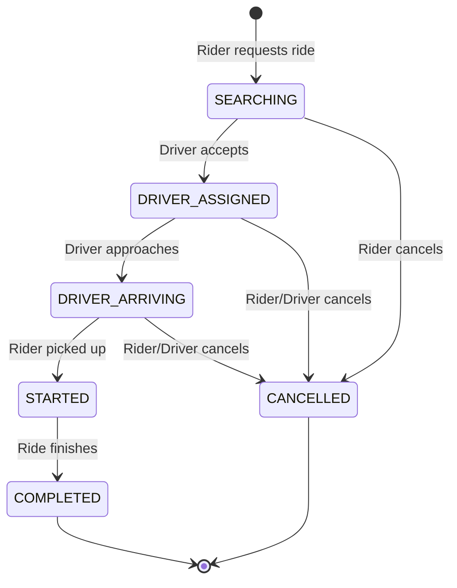
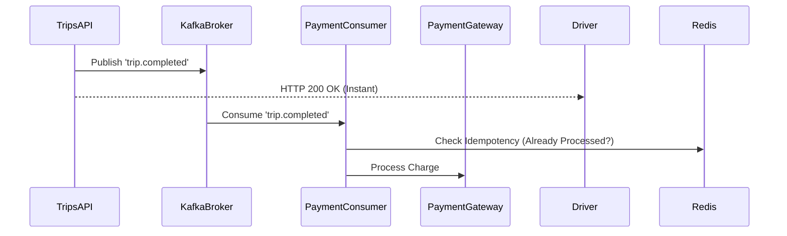

# Ridesharing Project Overview

Welcome to the Uber-like ride-hailing backend project! This document provides a comprehensive A to Z guide to understanding the project's architecture, data flow, new features, and a step-by-step guide on how a ride happens from creation to completion.

## 1. High-Level Architecture

The project is built as a robust, service-oriented monolithic backend that is designed to eventually scale into microservices. It follows industry-standard patterns used by companies like Uber, Lyft, and Grab.

### Tech Stack
- **Runtime:** Node.js
- **Framework:** Fastify (for high-performance routing)
- **Database:** PostgreSQL (primary data store)
- **ORM:** Drizzle ORM (type-safe database interactions)
- **Caching & Real-time Data:** Redis (for driver geolocations, fast lookups, and rate-limiting)
- **Event Streaming:** Kafka (for asynchronous, event-driven workflows like notifications and analytics)
- **Authentication:** JWT (JSON Web Tokens)
- **Real-time Communication:** WebSockets (`@fastify/websocket`)
- **Infrastructure:** Docker & Docker Compose (for easy local setup)

## 2. Core Modules

The application is structured into modular feature sets located in `api/src/modules/` and `api/src/infrastructure/`:

- **Auth (`/api/v1/auth`):** Handles user registration and login, generating JWTs.
- **Users (`/api/v1/users`):** Manages basic user profile information.
- **Drivers (`/api/v1/drivers`):** Handles driver-specific actions like becoming a driver, toggling online/offline status, and updating real-time geolocation.
- **Trips (`/api/v1/trips`):** Manages the core lifecycle states of a ride request.
- **Pricing (`/api/v1/pricing`):** An industrial-grade fare engine utilizing OSRM for real road-distance, computing dynamic multipliers (peak hours, traffic, surge, and zones) across multiple vehicle types.
- **Matching (`/api/v1/matching`):** An asynchronous sequential matching engine that ranks drivers using weighted strategies and offers trips sequentially with locking mechanisms.
- **Kafka Infrastructure (`infrastructure/kafka`):** Handles async events (`trip.created`, `trip.accepted`, `trip.completed`) via highly resilient consumers featuring Redis idempotency and Dead Letter Queues (DLQ).

## 3. The Complete Ride Guide (Rider Creation to Ride End)

Here is exactly how a full ride flow works end-to-end through the APIs and internal systems:

### Step 1: Rider Gets a Fare Estimate
- **Action:** Rider enters pickup and dropoff locations in the app.
- **API Call:** `POST /api/v1/pricing/estimate`
- **Internal Flow:** The `PricingService` calls OSRM to get real road distance and time. It calculates base fares, distance/time fares, applies surge/traffic multipliers, and returns a breakdown for all vehicle types (`MINI`, `SUV`, `PREMIUM`, etc.).

### Step 2: Rider Requests a Ride
- **Action:** Rider selects a vehicle type and taps "Confirm Ride".
- **API Call:** `POST /api/v1/trips/request`
- **Internal Flow:** 
  1. A trip is inserted into PostgreSQL with status `SEARCHING`.
  2. A `trip.created` event is published to Kafka for async analytics.
  3. The trip ID is sent to the **Matching Queue**.

### Step 3: Backend Finds and Ranks Drivers
- **Internal Flow:**
  1. The `MatchingWorker` picks up the trip from the queue.
  2. It queries **Redis** to find all ONLINE drivers within a 2km radius.
  3. The `RankingStrategy` sorts these drivers based on proximity, driver rating, and reliability.

### Step 4: Sequential Driver Offering
- **Internal Flow:**
  1. The top-ranked driver receives a `PENDING` trip offer (Trip status remains `SEARCHING`).
  2. The system waits up to 15 seconds. 
  3. If the driver ignores or rejects it, the offer is `EXPIRED` and the system moves to the next ranked driver.
  4. If no drivers in 2km accept, the radius expands to 5km, then 8km.

### Step 5: Driver Accepts the Ride
- **Action:** Driver taps "Accept".
- **API Call:** `POST /api/v1/trips/:id/accept`
- **Internal Flow:**
  1. The `MatchingRepository` locks the trip using atomic transactions, ensuring no other driver can accept it.
  2. Trip status changes from `SEARCHING` to `DRIVER_ASSIGNED`.
  3. Driver status changes to `ON_TRIP`.
  4. A `trip.accepted` event is sent to Kafka, which triggers the `trip.accepted.handler.js` to send a push notification to the rider.

### Step 6: Driver Arrives at Pickup
- **Action:** Driver reaches the rider's location and taps "Arrived".
- **API Call:** `POST /api/v1/trips/:id/arrived`
- **Internal Flow:** Trip status updates to `DRIVER_ARRIVING`.

### Step 7: Ride Starts
- **Action:** Rider gets in the car, and driver swipes "Start Trip".
- **API Call:** `POST /api/v1/trips/:id/start`
- **Internal Flow:** Trip status updates to `STARTED`.

### Step 8: Ride Completes
- **Action:** Driver reaches destination and swipes "Complete Trip".
- **API Call:** `POST /api/v1/trips/:id/complete`
- **Internal Flow:**
  1. Trip status updates to `COMPLETED`.
  2. Driver status returns to `ONLINE`, making them available for new rides.
  3. A `trip.completed` event is sent to Kafka, which triggers the `trip.completed.handler.js` to process the rider's payment asynchronously.

## 4. State Machine Flow

To visualize the above steps, here is the strict state machine that prevents fraud and race conditions:



## 5. Event-Driven Architecture (Kafka)

We use Kafka to ensure that core APIs (like completing a ride) respond instantly without waiting for slow processes (like payment gateways).



## 6. How to Run Locally

The project utilizes Docker to spin up dependencies seamlessly.

1. Copy the environment file:
   ```bash
   cd api
   cp .env.example .env
   ```
2. Start the infrastructure (PostgreSQL, Redis, Kafka via KRaft):
   ```bash
   docker-compose up -d
   ```
3. Install dependencies & run the API:
   ```bash
   cd api
   npm install
   npm run dev
   ```

---
*This guide serves as your primary entry point into the codebase. Ensure you understand the sequential matching and Kafka event flows before modifying trip lifecycles.*
