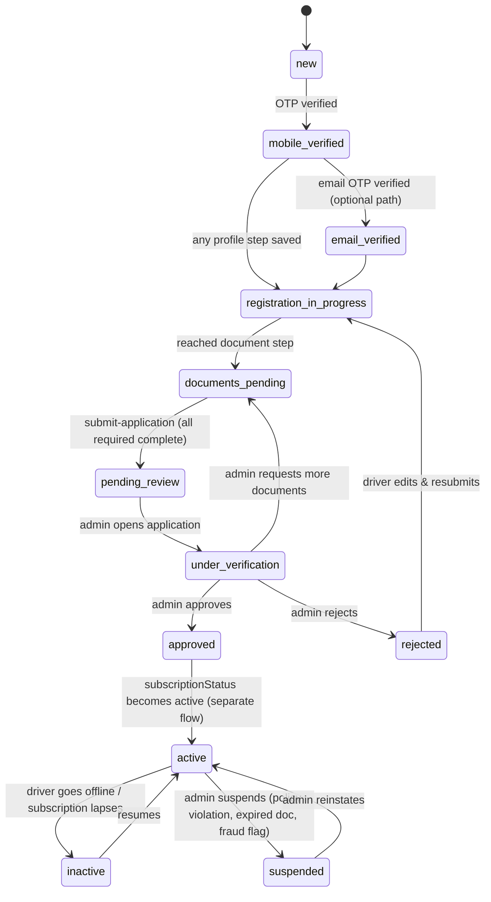
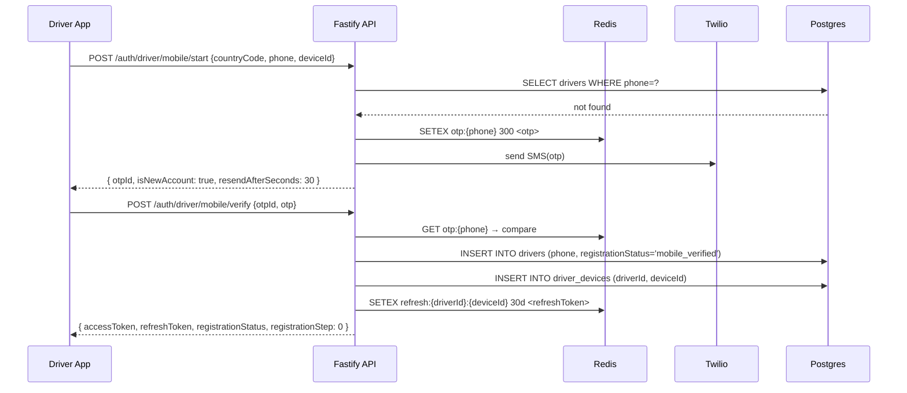
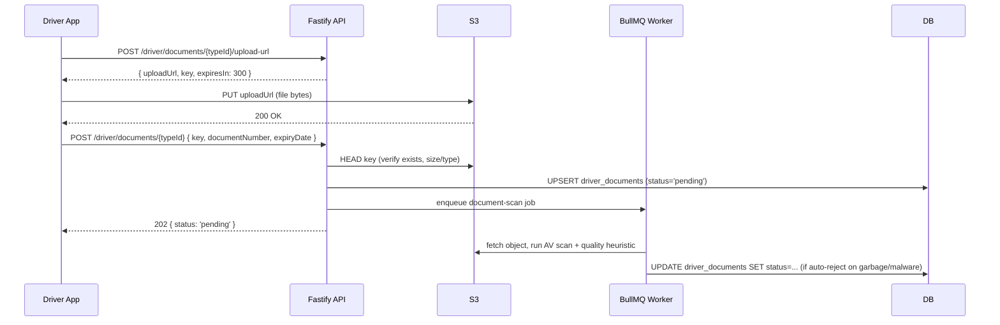
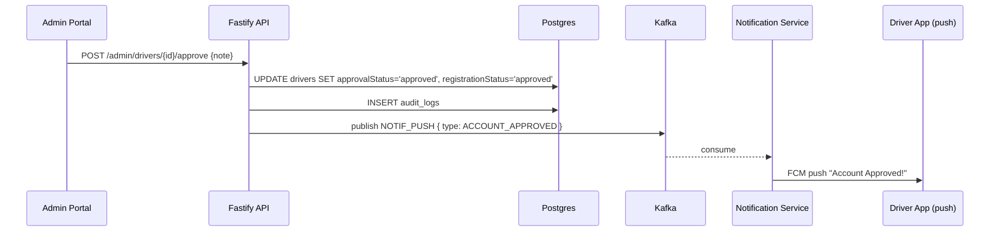
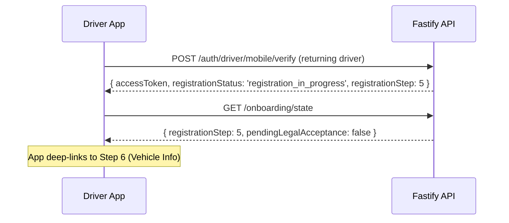

# Driver Registration & Onboarding — System Design

Status: **Design proposal** (no code changed). Scope: extend the existing subscription-based
rideshare backend (Fastify + Drizzle + Postgres + Redis + Kafka + BullMQ + Firebase + Twilio +
Razorpay) to support multi-country, multi-language, fully admin-configurable driver onboarding.

This document is written against the actual current codebase, not a green-field platform:

| Already built (reuse as-is) | Gap this design fills |
|---|---|
| `users`, `drivers`, `admins`, `audit_logs`, `vehicle_types`, `zones`, `subscriptions`, `subscription_plans` tables | No `countries`/`states`/`cities`, no i18n, no dynamic questionnaire, no document/bank/emergency-contact tables |
| Phone OTP via Twilio (`utils/otp.js`, Redis-backed) | No email OTP, no resend/retry limits, no device tracking |
| JWT access + refresh tokens (`@fastify/jwt`, Redis refresh store) | No device registration, no multi-device session list |
| `approvalStatus` (pending/approved/rejected) + `subscriptionStatus` flat columns on `drivers` | No granular registration state machine, no resumable partial registration |
| Kafka topics: `AUDIT_LOG`, `NOTIF_PUSH`, `DRIVER_STATUS_CHANGED`, `DRIVER_LOCATION` | No `DRIVER_REGISTRATION_*` / document-expiry events |
| Fastify module pattern: `modules/<domain>/<domain>.{routes,service}.js` | New modules needed: `onboarding`, `geo`, `documents`, `i18n` |
| Portal: React 19 + Vite + Radix UI + TanStack Query/Table + react-hook-form | New admin screens for questionnaire builder, geo/document config, translations |
| Driver mobile app: Flutter (`app/`) | Driver app doesn't appear to exist yet as a separate target — flows below assume a new Flutter driver app reusing the rider app's shell |

Everything below is additive: existing tables/columns are kept for backward compatibility;
new tables reference them by FK.

---

## 1. Complete User Flow

```
Step 0  Language & Country select (device locale pre-fill, overridable)
Step 1  Login/Register — mobile OR email, OTP verified
Step 2  Personal information (name, DOB, gender, referral code)
Step 3  Accept Terms & Privacy Policy (versioned, per-country)
Step 4  Driving location (country → state → city, admin-curated list)
Step 5  Dynamic onboarding questionnaire (admin-defined, conditional)
Step 6  Vehicle information
Step 7  Document upload (admin-defined per country/city/vehicle type)
Step 8  Profile photo
Step 9  Bank details (optional)
Step 10 Emergency contact (optional)
Step 11 Review & edit any section
Step 12 Submit → status = PENDING_REVIEW, admin notified, driver sees status screen
```

Key behavioral rules:

- **Resumability**: every step writes to the DB immediately (no client-side-only draft state).
  `drivers.registration_step` tracks the furthest completed step. On relogin, the app calls
  `GET /v1/onboarding/state` and deep-links straight to the next incomplete step — this is how
  "drivers returning later to continue registration" (edge case list) is handled without a
  separate draft/session table.
- **Single bundled config fetch**: on entering onboarding, the app calls
  `GET /v1/onboarding/config` once and gets country/city tree, active legal document version,
  active questionnaire (with conditional rules), required document list for the driver's
  country/city/vehicle type, and vehicle categories — all in the driver's selected language.
  This is what makes "no app update required when forms change" true: the screens are rendered
  from this payload, not hardcoded.
- Steps 9–10 (bank, emergency contact) are optional and can be skipped and completed later from
  the driver app's profile section even after approval.

---

## 2. UX Wireframes (representative screens)

Text wireframes for the screens with the most non-obvious behavior. (Every step's screen follows
the same shell: progress bar top, back button, primary CTA bottom, error copy inline under fields.)

**2.1 Login (mobile/email toggle)**
```
┌─────────────────────────────┐
│  ← [progress: step 1/12]    │
│                              │
│   Drive with us              │
│                              │
│  [ Mobile ] [ Email ]  <tabs>│
│                              │
│  ┌────┐ ┌──────────────────┐│
│  │ 🇮🇳+91│ 98765 43210      ││
│  └────┘ └──────────────────┘│
│                              │
│        [ Continue → ]        │
│                              │
│  By continuing you agree to  │
│  receive an SMS OTP.         │
└─────────────────────────────┘
```
Country-code selector is a searchable sheet (flag + name + dial code), sourced from `countries`
table, not hardcoded — driver picks it independently of device locale so an expat driver
registering a foreign number still works.

**2.2 OTP**
```
┌─────────────────────────────┐
│  Enter the code sent to      │
│  +91 98765 43210   [Edit]    │
│                              │
│   [1][2][3][4][5][6]         │
│                              │
│  Resend code in 00:28         │
│  (becomes "Resend code" link  │
│   button after countdown)     │
│                              │
│  Attempts left: 3             │
└─────────────────────────────┘
```
Countdown, attempts-left, and disabled-resend states come directly from the OTP rate-limit
policy (§12) — the client just reflects the values in the `send-otp` response.

**2.3 Driving city (cascading, admin-curated)**
```
Country: [ India ▾ ]
State:   [ Karnataka ▾ ]      (disabled until country picked)
City:    [ Bengaluru ▾ ]      (disabled until state picked; only is_active=true cities shown)
```

**2.4 Dynamic questionnaire (renderer, not hardcoded screens)**
```
┌─────────────────────────────┐
│ Do you own a vehicle?  *     │
│  ○ Yes   ○ No                │
├─────────────────────────────┤
│ (shown only if "No" above)   │
│ Are you interested in a       │
│ vehicle rental program?       │
│  ○ Yes   ○ No                │
├─────────────────────────────┤
│ How many hours/week can you   │
│ drive?                        │
│  [ Number input ]              │
└─────────────────────────────┘
```
One generic `QuestionRenderer` component switches on `question_type`; conditional questions are
hidden/shown client-side by re-evaluating the rule tree on every answer change (§7), then
re-validated server-side on submit.

**2.5 Document upload (per document type card)**
```
┌─────────────────────────────┐
│ Driver's License        ⚠ req│
│ ┌───────────┐ ┌───────────┐ │
│ │  Front    │ │  Back     │ │
│ │ [Camera]  │ │ [Camera]  │ │
│ │ [Gallery] │ │ [Gallery] │ │
│ └───────────┘ └───────────┘ │
│ Document number: [_________] │
│ Expiry date:     [__/__/____]│
└─────────────────────────────┘
```
Card set is generated from the `document_types` + `document_type_requirements` the config
endpoint returned — a new country can require a different document set with zero app changes.

**2.6 Review**
```
Personal Info          [Edit]
Driving Location        [Edit]
Questionnaire           [Edit]
Vehicle                 [Edit]
Documents               [Edit]
Profile Photo           [Edit]
Bank Details (skip)     [Edit]
Emergency Contact (skip)[Edit]

        [ Submit Application ]
```
Each `[Edit]` deep-links back to that step's screen pre-filled; submit is disabled until every
`required` item is complete (server re-validates regardless — see §9).

**2.7 Post-submit status**
```
   ⏳  Your application is under review
   We'll notify you once it's verified.
   Reference: DRV-2026-000482
   [ Check status ]  [ Contact support ]
```

**2.8 Admin — questionnaire builder (portal, Radix + TanStack Table)**
```
Onboarding Questions                          [+ New Question]
┌───┬──────────────────────────────┬────────┬──────┬────────┐
│ ⠿ │ Question (default language)  │ Type   │ Req. │ Active │
├───┼──────────────────────────────┼────────┼──────┼────────┤
│ ⠿ │ Do you own a vehicle?        │ Yes/No │  ✔   │  ●     │
│ ⠿ │ How many hours/week?         │ Number │  ✔   │  ●     │
│ ⠿ │ Worked with another platform?│ Yes/No │      │  ●     │
└───┴──────────────────────────────┴────────┴──────┴────────┘
Drag ⠿ to reorder → PATCH /v1/admin/onboarding-questions/reorder
Row click → editor drawer: Type, Options, Required, Conditional rule builder
("Show if [question] [operator] [value]"), Translations tab (per-language grid).
```

---

## 3. Database Schema

All new tables use the same Drizzle style as the existing schema files. Grouped by concern.

### 3.1 Geo / country hierarchy

```js
// drizzle/schema/countries.js
export const countries = pgTable('countries', {
  id:          uuid('id').primaryKey().defaultRandom(),
  name:        varchar('name', { length: 100 }).notNull(),
  isoCode:     varchar('iso_code', { length: 2 }).unique().notNull(),   // ISO 3166-1 alpha-2
  dialCode:    varchar('dial_code', { length: 8 }).notNull(),           // "+91"
  currencyCode:varchar('currency_code', { length: 3 }).notNull(),       // ISO 4217
  defaultLanguageCode: varchar('default_language_code', { length: 8 }),
  isActive:    boolean('is_active').default(true),
  sortOrder:   integer('sort_order').default(0),
  createdAt:   timestamp('created_at').defaultNow(),
  updatedAt:   timestamp('updated_at').defaultNow(),
});

// drizzle/schema/states.js
export const states = pgTable('states', {
  id:          uuid('id').primaryKey().defaultRandom(),
  countryId:   uuid('country_id').references(() => countries.id).notNull(),
  name:        varchar('name', { length: 100 }).notNull(),
  code:        varchar('code', { length: 10 }),
  isActive:    boolean('is_active').default(true),
  createdAt:   timestamp('created_at').defaultNow(),
});

// drizzle/schema/cities.js
export const cities = pgTable('cities', {
  id:          uuid('id').primaryKey().defaultRandom(),
  stateId:     uuid('state_id').references(() => states.id).notNull(),
  countryId:   uuid('country_id').references(() => countries.id).notNull(), // denormalized for fast filtering
  name:        varchar('name', { length: 100 }).notNull(),
  timezone:    varchar('timezone', { length: 50 }),
  isActive:    boolean('is_active').default(true),
  sortOrder:   integer('sort_order').default(0),
  createdBy:   uuid('created_by'),
  createdAt:   timestamp('created_at').defaultNow(),
  updatedAt:   timestamp('updated_at').defaultNow(),
});
```
`zones` (existing) stays a fare-multiplier geofence table, orthogonal to `cities`
(operational city list a driver picks from). A `zones.city_id` FK can be added later to bind
pricing zones to a city, but that's out of scope here.

### 3.2 Localization

```js
// drizzle/schema/languages.js
export const languages = pgTable('languages', {
  code:        varchar('code', { length: 8 }).primaryKey(),   // "en", "hi", "es-MX"
  name:        varchar('name', { length: 60 }).notNull(),
  nativeName:  varchar('native_name', { length: 60 }).notNull(),
  isRtl:       boolean('is_rtl').default(false),
  isActive:    boolean('is_active').default(true),
  isDefault:   boolean('is_default').default(false),
});

// drizzle/schema/translations.js
// Generic polymorphic translation store for every admin-editable entity.
export const translations = pgTable('translations', {
  id:          uuid('id').primaryKey().defaultRandom(),
  entityType:  varchar('entity_type', { length: 60 }).notNull(),  // 'onboarding_question', 'onboarding_question_option', 'document_type', 'legal_document', 'vehicle_type', 'notification_template'
  entityId:    uuid('entity_id').notNull(),
  fieldName:   varchar('field_name', { length: 60 }).notNull(),   // 'label', 'description', 'placeholder'
  languageCode:varchar('language_code', { length: 8 }).references(() => languages.code).notNull(),
  value:       text('value').notNull(),
  updatedAt:   timestamp('updated_at').defaultNow(),
}, (t) => ({
  uniq: unique().on(t.entityType, t.entityId, t.fieldName, t.languageCode),
}));
```
Static UI chrome (button labels, generic validation messages) is **not** stored per-row here —
it ships as versioned JSON bundles (`i18next`-compatible) served from
`GET /v1/i18n/bundles/:lang/:namespace`, cached on device, and refreshable without an app store
release (§13). Only *content that admins author* (questions, documents, legal text) goes through
the `translations` table.

### 3.3 Legal documents

```js
// drizzle/schema/legal-documents.js
export const legalDocuments = pgTable('legal_documents', {
  id:          uuid('id').primaryKey().defaultRandom(),
  type:        varchar('type', { length: 20 }).notNull(),   // 'terms' | 'privacy_policy'
  version:     varchar('version', { length: 20 }).notNull(),
  countryId:   uuid('country_id').references(() => countries.id), // null = global default
  contentUrl:  text('content_url').notNull(),               // rendered markdown/html, CDN-hosted
  effectiveFrom: timestamp('effective_from').notNull(),
  isActive:    boolean('is_active').default(true),
  createdAt:   timestamp('created_at').defaultNow(),
});

// drizzle/schema/driver-legal-acceptances.js
export const driverLegalAcceptances = pgTable('driver_legal_acceptances', {
  id:             uuid('id').primaryKey().defaultRandom(),
  driverId:       uuid('driver_id').references(() => drivers.id).notNull(),
  legalDocumentId:uuid('legal_document_id').references(() => legalDocuments.id).notNull(),
  acceptedAt:     timestamp('accepted_at').defaultNow(),
  ip:             varchar('ip', { length: 45 }),
  userAgent:      text('user_agent'),
});
```
Every acceptance is immutable and timestamped — this is the audit trail a legal/compliance team
will ask for. If `legal_documents` gets a new version, the driver is re-prompted at next login
(`GET /v1/onboarding/state` reports `pendingLegalAcceptance: true`).

### 3.4 Dynamic onboarding questionnaire

```js
// drizzle/schema/onboarding-questions.js
export const onboardingQuestions = pgTable('onboarding_questions', {
  id:           uuid('id').primaryKey().defaultRandom(),
  code:         varchar('code', { length: 60 }).unique().notNull(),  // stable key, e.g. 'own_vehicle'
  questionType: varchar('question_type', { length: 20 }).notNull(),
  // 'single_choice' | 'multiple_choice' | 'dropdown' | 'yes_no' | 'rating' | 'text' | 'number' | 'date'
  isRequired:   boolean('is_required').default(false),
  sortOrder:    integer('sort_order').default(0),
  isActive:     boolean('is_active').default(true),
  countryId:    uuid('country_id').references(() => countries.id),  // null = applies globally
  minValue:     integer('min_value'),        // for 'number'/'rating'
  maxValue:     integer('max_value'),
  dependsOnQuestionId: uuid('depends_on_question_id').references(() => onboardingQuestions.id),
  dependsOnOperator:   varchar('depends_on_operator', { length: 20 }), // 'equals' | 'not_equals' | 'in' | 'gt' | 'lt'
  dependsOnValue:      jsonb('depends_on_value'),
  createdAt:    timestamp('created_at').defaultNow(),
  updatedAt:    timestamp('updated_at').defaultNow(),
});

// drizzle/schema/onboarding-question-options.js
export const onboardingQuestionOptions = pgTable('onboarding_question_options', {
  id:          uuid('id').primaryKey().defaultRandom(),
  questionId:  uuid('question_id').references(() => onboardingQuestions.id).notNull(),
  code:        varchar('code', { length: 60 }).notNull(),   // stable value key
  sortOrder:   integer('sort_order').default(0),
  isActive:    boolean('is_active').default(true),
});

// drizzle/schema/driver-onboarding-answers.js
export const driverOnboardingAnswers = pgTable('driver_onboarding_answers', {
  id:          uuid('id').primaryKey().defaultRandom(),
  driverId:    uuid('driver_id').references(() => drivers.id).notNull(),
  questionId:  uuid('question_id').references(() => onboardingQuestions.id).notNull(),
  answerValue: jsonb('answer_value').notNull(), // string | number | boolean | string[] | ISO date
  answeredAt:  timestamp('answered_at').defaultNow(),
}, (t) => ({ uniq: unique().on(t.driverId, t.questionId) }));
```
Question label/description/option labels are translated via the generic `translations` table
(`entity_type = 'onboarding_question' | 'onboarding_question_option'`).

### 3.5 Vehicle information

```js
// drizzle/schema/driver-vehicles.js
// One row per vehicle a driver registers (kept separate from the flat columns
// still on `drivers` for backward compatibility — those become deprecated read-only mirrors).
export const driverVehicles = pgTable('driver_vehicles', {
  id:                uuid('id').primaryKey().defaultRandom(),
  driverId:          uuid('driver_id').references(() => drivers.id).notNull(),
  vehicleTypeId:     uuid('vehicle_type_id').references(() => vehicleTypes.id).notNull(), // category/rate class
  brand:             varchar('brand', { length: 60 }),
  model:             varchar('model', { length: 60 }).notNull(),
  year:              varchar('year', { length: 4 }).notNull(),
  color:             varchar('color', { length: 30 }),
  registrationNumber:varchar('registration_number', { length: 20 }).notNull(),
  vin:               varchar('vin', { length: 32 }),
  seats:             integer('seats').default(4),
  fuelType:          varchar('fuel_type', { length: 20 }),      // petrol | diesel | electric | hybrid | cng
  transmission:      varchar('transmission', { length: 20 }),  // manual | automatic
  isActive:          boolean('is_active').default(true),
  createdAt:         timestamp('created_at').defaultNow(),
  updatedAt:         timestamp('updated_at').defaultNow(),
}, (t) => ({ uniq: unique().on(t.registrationNumber) }));
```

### 3.6 Documents (admin-configurable per country/city/vehicle type)

```js
// drizzle/schema/document-types.js
export const documentTypes = pgTable('document_types', {
  id:               uuid('id').primaryKey().defaultRandom(),
  code:             varchar('code', { length: 60 }).unique().notNull(), // 'DRIVERS_LICENSE'
  requiresFront:    boolean('requires_front').default(true),
  requiresBack:     boolean('requires_back').default(false),
  requiresPdf:      boolean('requires_pdf').default(false),
  requiresExpiry:   boolean('requires_expiry').default(true),
  requiresDocNumber:boolean('requires_doc_number').default(true),
  maxFileSizeMb:    integer('max_file_size_mb').default(10),
  isActive:         boolean('is_active').default(true),
  sortOrder:        integer('sort_order').default(0),
});

// drizzle/schema/document-type-requirements.js
// Lets admin say "Insurance Certificate is required in India but not in the UAE",
// or "only for Cab category, not Bike".
export const documentTypeRequirements = pgTable('document_type_requirements', {
  id:            uuid('id').primaryKey().defaultRandom(),
  documentTypeId:uuid('document_type_id').references(() => documentTypes.id).notNull(),
  countryId:     uuid('country_id').references(() => countries.id),      // null = all countries
  cityId:        uuid('city_id').references(() => cities.id),            // null = all cities in country
  vehicleTypeId: uuid('vehicle_type_id').references(() => vehicleTypes.id), // null = all vehicle types
  isRequired:    boolean('is_required').default(true),
});

// drizzle/schema/driver-documents.js
export const driverDocuments = pgTable('driver_documents', {
  id:             uuid('id').primaryKey().defaultRandom(),
  driverId:       uuid('driver_id').references(() => drivers.id).notNull(),
  documentTypeId: uuid('document_type_id').references(() => documentTypes.id).notNull(),
  frontUrl:       text('front_url'),
  backUrl:        text('back_url'),
  pdfUrl:         text('pdf_url'),
  documentNumber: varchar('document_number', { length: 60 }),
  expiryDate:     timestamp('expiry_date'),
  status:         varchar('status', { length: 20 }).default('pending'), // pending | approved | rejected | expired
  rejectionReason:text('rejection_reason'),
  verifiedBy:     uuid('verified_by').references(() => admins.id),
  verifiedAt:     timestamp('verified_at'),
  uploadedAt:     timestamp('uploaded_at').defaultNow(),
}, (t) => ({ uniq: unique().on(t.driverId, t.documentTypeId) }));
```
A daily BullMQ job scans `expiry_date < now()` and flips `status = 'expired'`, publishes
`DRIVER_DOCUMENT_EXPIRING` 30/7/1 days ahead, and — if the driver is currently `active` —
suspends them on actual expiry (configurable grace period).

### 3.7 Bank details & emergency contact

```js
// drizzle/schema/driver-bank-accounts.js
export const driverBankAccounts = pgTable('driver_bank_accounts', {
  id:                uuid('id').primaryKey().defaultRandom(),
  driverId:          uuid('driver_id').references(() => drivers.id).notNull(),
  countryId:         uuid('country_id').references(() => countries.id).notNull(),
  bankName:          varchar('bank_name', { length: 100 }),
  accountHolderName: varchar('account_holder_name', { length: 100 }),
  accountNumberEnc:  text('account_number_enc'),      // pgcrypto/KMS envelope-encrypted
  accountNumberLast4:varchar('account_number_last4', { length: 4 }), // for display only
  routingCode:       varchar('routing_code', { length: 30 }),  // IFSC / SWIFT / sort code — country-specific label resolved client-side
  walletProvider:    varchar('wallet_provider', { length: 40 }), // e.g. 'M-Pesa', country-specific
  walletNumberEnc:   text('wallet_number_enc'),
  isVerified:        boolean('is_verified').default(false),
  createdAt:         timestamp('created_at').defaultNow(),
  updatedAt:         timestamp('updated_at').defaultNow(),
});

// drizzle/schema/driver-emergency-contacts.js
export const driverEmergencyContacts = pgTable('driver_emergency_contacts', {
  id:          uuid('id').primaryKey().defaultRandom(),
  driverId:    uuid('driver_id').references(() => drivers.id).notNull(),
  name:        varchar('name', { length: 100 }).notNull(),
  relationship:varchar('relationship', { length: 40 }),
  phone:       varchar('phone', { length: 20 }).notNull(),
  createdAt:   timestamp('created_at').defaultNow(),
});
```

### 3.8 Devices & security

```js
// drizzle/schema/driver-devices.js
export const driverDevices = pgTable('driver_devices', {
  id:         uuid('id').primaryKey().defaultRandom(),
  driverId:   uuid('driver_id').references(() => drivers.id).notNull(),
  deviceId:   varchar('device_id', { length: 100 }).notNull(),  // stable client-generated fingerprint
  platform:   varchar('platform', { length: 20 }),              // ios | android
  fcmToken:   text('fcm_token'),
  ip:         varchar('ip', { length: 45 }),
  lastLoginAt:timestamp('last_login_at').defaultNow(),
  isRevoked:  boolean('is_revoked').default(false),
  createdAt:  timestamp('created_at').defaultNow(),
}, (t) => ({ uniq: unique().on(t.driverId, t.deviceId) }));
```
Refresh tokens stay Redis-backed (existing pattern) but are now keyed per
`(driverId, deviceId)` instead of per `driverId`, so logging in on a new phone doesn't silently
kill the old session — the driver app can show a "manage devices / log out other sessions" list
sourced from this table.

### 3.9 Alterations to existing `drivers` table

Add (nullable, backward compatible):

```js
dateOfBirth:        date('date_of_birth'),
gender:              varchar('gender', { length: 20 }),
referralCode:        varchar('referral_code', { length: 20 }),
referredByDriverId:  uuid('referred_by_driver_id').references(() => drivers.id),
countryId:           uuid('country_id').references(() => countries.id),
stateId:             uuid('state_id').references(() => states.id),
cityId:              uuid('city_id').references(() => cities.id),
preferredLanguageCode: varchar('preferred_language_code', { length: 8 }),
registrationStatus:  varchar('registration_status', { length: 30 }).default('new'),
registrationStep:    integer('registration_step').default(0), // furthest completed step, 0-12
```
`approvalStatus` and `subscriptionStatus` are kept exactly as-is — they're orthogonal to
`registrationStatus` (see state machine, §10). `licenseNumber`/`licenseDoc`/`aadharNumber`/
`aadharDoc`/`vehicleTypeId`/`vehicleNumber`/`vehicleModel`/`vehiclePhoto`/`vehicleYear` columns
are marked deprecated once `driver_documents` and `driver_vehicles` are populated, but left in
place for one release cycle to avoid a breaking migration (dual-write, then drop).

---

## 4. REST API Design

Namespaced under `/v1`. All list endpoints support `?lang=<code>` to localize labels;
all mutation endpoints accept `Idempotency-Key` header (documents/payments especially).

### 4.1 Auth

| Method | Path | Notes |
|---|---|---|
| POST | `/auth/driver/mobile/start` | `{countryCode, phone, deviceId}` → sends OTP, returns `{otpId, isNewAccount, resendAfterSeconds}` |
| POST | `/auth/driver/mobile/verify` | `{otpId, otp}` → `{accessToken, refreshToken, driver, registrationStatus, registrationStep}` |
| POST | `/auth/driver/mobile/resend` | `{otpId}` — rate-limited (§12) |
| POST | `/auth/driver/email/start` | `{email, deviceId}` → sends verification code/link |
| POST | `/auth/driver/email/verify` | `{email, code}` |
| POST | `/auth/refresh` | `{refreshToken}` (device-scoped) |
| POST | `/auth/logout` | revokes current device's refresh token |
| GET | `/auth/devices` | list active sessions (from `driver_devices`) |
| DELETE | `/auth/devices/:deviceId` | remote logout of another device |

### 4.2 Onboarding (driver-facing)

| Method | Path | Notes |
|---|---|---|
| GET | `/onboarding/config` | one-shot bundle: countries/states/cities tree, active legal doc, questionnaire w/ conditional rules, document requirements for driver's country/city/vehicle type, vehicle categories — all localized |
| GET | `/onboarding/state` | `{registrationStatus, registrationStep, pendingLegalAcceptance}` — used to resume |
| PATCH | `/driver/profile` | first/last name, DOB, gender, referral code |
| POST | `/driver/legal-acceptance` | `{legalDocumentId}` |
| PUT | `/driver/driving-location` | `{countryId, stateId, cityId}` |
| POST | `/driver/onboarding-answers` | `[{questionId, value}]` batch upsert |
| POST | `/driver/vehicle` | vehicle info payload |
| POST | `/driver/documents/:documentTypeId/upload-url` | returns presigned S3 PUT URL(s) for front/back/pdf |
| POST | `/driver/documents/:documentTypeId` | `{documentNumber, expiryDate, frontKey, backKey, pdfKey}` confirms upload, sets status=pending |
| POST | `/driver/profile-photo/upload-url` | presigned URL |
| POST | `/driver/profile-photo` | `{key}` confirms |
| PUT | `/driver/bank-details` | optional |
| PUT | `/driver/emergency-contact` | optional |
| GET | `/driver/registration-summary` | full aggregated view for the review screen |
| POST | `/driver/submit-application` | validates completeness server-side → `registrationStatus = pending_review` |

### 4.3 Admin — applications

| Method | Path | Notes |
|---|---|---|
| GET | `/admin/drivers` | `?status=&country=&city=&search=&page=&limit=` |
| GET | `/admin/drivers/:id` | full profile incl. documents, answers, vehicle |
| POST | `/admin/drivers/:id/approve` | `{note}` |
| POST | `/admin/drivers/:id/reject` | `{reason}` |
| POST | `/admin/drivers/:id/request-documents` | `{documentTypeIds[], note}` → status back to `documents_pending`, notifies driver |
| POST | `/admin/drivers/:id/suspend` | `{reason}` |
| POST | `/admin/drivers/:id/activate` | |
| POST | `/admin/drivers/:id/documents/:docId/verify` | approve/reject a single document |

### 4.4 Admin — configuration (drives the dynamic form system)

| Method | Path |
|---|---|
| CRUD | `/admin/countries`, `/admin/states`, `/admin/cities` (+ `PATCH .../enable`, `.../disable`) |
| CRUD | `/admin/languages` |
| CRUD | `/admin/vehicle-types` (existing module, extend with translations) |
| CRUD | `/admin/document-types`, `/admin/document-types/:id/requirements` |
| CRUD | `/admin/onboarding-questions`, `/admin/onboarding-questions/:id/options` |
| PATCH | `/admin/onboarding-questions/reorder` — `{orderedIds[]}` |
| PUT | `/admin/translations/:entityType/:entityId` — `{fieldName, languageCode, value}[]` bulk upsert |
| CRUD | `/admin/legal-documents` (+ auto-versioning: creating a new active row supersedes the prior one) |

All admin write endpoints require `role in ('admin','super_admin')` and write an `audit_logs`
row (existing pattern already used in `driver.service.js`).

---

## 5. Backend Architecture

Follows the existing module convention (`modules/<domain>/<domain>.{routes,service}.js`,
registered as Fastify plugins). New modules:

```
src/modules/
  onboarding/        # steps 2-12 driver-facing endpoints, resume logic
  geo/                # countries/states/cities CRUD + admin
  documents/           # upload-url issuance, confirm, expiry job trigger
  i18n/                # bundle serving + translations CRUD
  (existing: auth, admin, driver, fare, matching, notification, ride, rider, subscription, tracking, vehicle-type, zone)
```

- **Storage**: S3-compatible bucket (`driver-documents/{driverId}/{documentTypeId}/{uuid}.ext`,
  private ACL, served via short-lived signed GET URLs to admins only).
- **Presigned uploads**: client never proxies file bytes through the API — reduces backend load
  and lets mobile clients retry uploads without re-hitting Fastify. Confirm endpoint validates
  the object actually exists (HEAD request) before marking the document row as uploaded.
- **Caching**: `onboarding/config` response cached in Redis per `(countryId, languageCode)` key,
  invalidated on any admin write to countries/cities/questions/documents/legal-documents/
  translations (simple pub/sub invalidation via a `CONFIG_INVALIDATED` Kafka topic consumed by
  all API instances, or just a short TTL of 60s — either is fine at this scale).
- **New Kafka topics**: `DRIVER_REGISTRATION_SUBMITTED`, `DRIVER_DOCUMENT_EXPIRING`,
  `DRIVER_DOCUMENT_REJECTED` — consumed by `notification.service.js` for push/SMS/email fan-out,
  same pattern as existing `DRIVER_STATUS_CHANGED`.
- **New BullMQ jobs**: `document-expiry-scan` (daily cron), `otp-cleanup` (hourly, Redis TTL
  already handles this but a cleanup job clears the audit trail table if one is added),
  `config-cache-warm` (on deploy).

---

## 6. Admin Panel Design

Portal is React 19 + TanStack Query/Table + Radix + react-hook-form — the new screens fit the
existing patterns directly (TanStack Table for lists, Radix Dialog/Sheet for editors, react-hook-form
+ zod resolver for forms, already a dependency).

New portal routes:

```
/drivers                      — list, filter by status/country/city, search
/drivers/:id                  — profile, documents (with inline approve/reject), answers, vehicle, timeline (from audit_logs)
/geo/countries                — CRUD + enable/disable toggle
/geo/countries/:id/states
/geo/states/:id/cities
/vehicle-types                — existing, extend with translation tab
/documents/types               — CRUD, per-type "requirements" sub-table (country/city/vehicle-type matrix)
/onboarding/questions           — drag-reorder list (dnd-kit) + editor drawer with conditional-rule builder + translations grid
/legal-documents                — versioned list per type/country, "publish new version" action
/languages                      — enable/disable, set default
```

Driver detail page's document section doubles as the verification workspace: each document
shows front/back/pdf preview (signed URL, short TTL), extracted `document_number`/`expiry_date`,
and inline Approve/Reject with a reason field — this is what "Under Verification" actually means
operationally (§10).

---

## 7. Dynamic Questionnaire System

Rendering algorithm (same on client and re-validated on server):

1. Fetch active questions ordered by `sort_order` where `country_id IS NULL OR country_id = :driverCountry`.
2. Build a dependency map from `depends_on_question_id`.
3. Render top-level questions (no dependency) immediately.
4. On every answer change, re-evaluate any question whose `depends_on_question_id` was just
   answered: `evaluate(operator, dependsOnValue, actualAnswer)` — show/hide accordingly. Hiding a
   question clears its stored answer (avoids stale hidden answers counting toward "required").
5. Submit: `POST /driver/onboarding-answers` batches all *currently visible* answers; server
   re-runs the same dependency evaluation using the submitted country/answers to reject payloads
   that include answers for questions that shouldn't be visible, or that omit a required *visible*
   question — this is the server-side mirror that prevents a stale/hacked client from bypassing
   conditional logic.

Example config payload (as returned inside `/onboarding/config`):

```json
{
  "questions": [
    {
      "id": "q1", "code": "own_vehicle", "type": "yes_no", "required": true,
      "label": "Do you own a vehicle?", "sortOrder": 1
    },
    {
      "id": "q2", "code": "rental_interest", "type": "yes_no", "required": false,
      "label": "Interested in our vehicle rental program?", "sortOrder": 2,
      "dependsOn": { "questionId": "q1", "operator": "equals", "value": false }
    },
    {
      "id": "q3", "code": "weekly_hours", "type": "number", "required": true,
      "label": "How many hours per week can you drive?", "min": 1, "max": 80, "sortOrder": 3
    }
  ]
}
```

---

## 8. File Upload Architecture

```
Client → POST /driver/documents/:typeId/upload-url
       ← { uploadUrl, key, expiresIn: 300 }      (S3 presigned PUT, per side: front/back/pdf)
Client → PUT uploadUrl  (direct to S3, with Content-Type + Content-Length restricted)
Client → POST /driver/documents/:typeId          { key, documentNumber, expiryDate }
Server → HEAD s3://key                            (confirm exists, check size/content-type)
Server → enqueue `document-scan` job (BullMQ)     (async: virus scan + image-quality heuristic)
Server → 202 { status: "pending" }
Worker → antivirus scan (ClamAV sidecar or cloud provider's malware-scan-on-upload)
Worker → basic image-quality check (resolution floor, blur/brightness heuristic, or a vision API
          call if higher accuracy is needed) → sets `driver_documents.status` accordingly
          ('pending' stays until admin manually verifies content correctness — automated checks
          only catch garbage uploads, not fraud, which stays a human review step)
```

Validation at the presign step (before any bytes move): file extension allow-list
(`jpg,png,heic,pdf`), `Content-Length` cap enforced both client-side and via S3 bucket policy
(`max_file_size_mb` from `document_types`), and a per-driver upload rate limit (prevents storage
abuse from a compromised account).

---

## 9. Validation Rules (Zod, matches existing `zod` dependency)

```js
const mobileStartSchema = z.object({
  countryCode: z.string().regex(/^\+\d{1,4}$/),
  phone: z.string().min(4).max(15),
  deviceId: z.string().min(8),
});

const personalInfoSchema = z.object({
  firstName: z.string().trim().min(1).max(60),           // unicode-safe by default in JS strings
  lastName: z.string().trim().min(1).max(60),
  dateOfBirth: z.string().date().optional()
    .refine(d => !d || ageInYears(d) >= 18, 'Must be 18+'),
  gender: z.enum(['male', 'female', 'other', 'prefer_not_to_say']).optional(),
  referralCode: z.string().max(20).optional(),
});

const vehicleSchema = z.object({
  vehicleTypeId: z.string().uuid(),
  brand: z.string().max(60).optional(),
  model: z.string().max(60),
  year: z.string().regex(/^(19|20)\d{2}$/).refine(y => Number(y) >= new Date().getFullYear() - 15),
  registrationNumber: z.string().max(20),
  seats: z.number().int().min(1).max(9),
  fuelType: z.enum(['petrol', 'diesel', 'electric', 'hybrid', 'cng']),
  transmission: z.enum(['manual', 'automatic']),
});

const documentConfirmSchema = z.object({
  key: z.string(),
  documentNumber: z.string().max(60).optional(), // required-ness enforced dynamically from document_types.requiresDocNumber
  expiryDate: z.string().date().optional()
    .refine(d => !d || new Date(d) > new Date(), 'Document already expired'),
});
```
Because required-ness of *document number*, *expiry date*, and *which questions are required*
is admin-configured data (not static code), the actual "is this field required" check happens in
the service layer against the DB config, not purely in the static Zod shape — Zod validates
*type/format*, a service-layer completeness check validates *business requiredness* against the
country/city/vehicle-type-scoped config.

---

## 10. Driver State Machine

`registrationStatus` (new column) drives onboarding; `approvalStatus` and `subscriptionStatus`
(existing columns) remain separate concerns that only become meaningful once registration is
past `pending_review`.



Transition table (who can trigger, side effects):

| From | To | Trigger | Side effect |
|---|---|---|---|
| new | mobile_verified | OTP verify | create `drivers` row if new |
| mobile_verified/email_verified | registration_in_progress | any step PATCH/POST | `registration_step++` |
| registration_in_progress | documents_pending | reaches step 7 | — |
| documents_pending | pending_review | `submit-application` | server completeness check; publish `DRIVER_REGISTRATION_SUBMITTED` |
| pending_review | under_verification | admin opens detail page | audit log |
| under_verification | approved | admin action | push notif "Account Approved", audit log |
| under_verification | rejected | admin action | push notif w/ reason, audit log |
| under_verification | documents_pending | request-documents | notif listing which docs, audit log |
| approved | active | subscription purchased | existing subscription flow |
| any active-ish | suspended | admin action / doc expiry job | push notif, `isOnline=false` forced |

This keeps the existing `approveDriver`/`rejectDriver`/`blockDriver`/`unblockDriver` service
functions in `driver.service.js` almost unchanged — they now also set `registrationStatus`
alongside `approvalStatus`.

---

## 11. Error Handling

Consistent envelope (matches existing `utils/response.js` pagination helper pattern):

```json
{ "success": false, "error": { "code": "OTP_EXPIRED", "message": "This code has expired. Request a new one." } }
```

| Code | HTTP | Meaning |
|---|---|---|
| `PHONE_INVALID` | 400 | Fails E.164/country format check |
| `OTP_EXPIRED` | 400 | Past TTL (default 5 min) |
| `OTP_INVALID` | 400 | Wrong code |
| `OTP_MAX_ATTEMPTS` | 429 | ≥5 wrong attempts — phone locked 15 min |
| `OTP_RESEND_TOO_SOON` | 429 | Resend before cooldown elapses |
| `ACCOUNT_SUSPENDED` | 403 | Login blocked |
| `DOCUMENT_TYPE_ALREADY_UPLOADED` | 409 | Re-upload should use same endpoint, not create duplicate |
| `DOCUMENT_EXPIRED` | 400 | `expiryDate` in the past |
| `INCOMPLETE_REQUIRED_FIELDS` | 422 | Submit-application blocked; payload lists missing items |
| `CITY_INACTIVE` | 400 | Selected city was disabled after client cached it |
| `LEGAL_DOCUMENT_STALE` | 409 | Newer terms version exists; re-prompt acceptance |
| `UPLOAD_URL_EXPIRED` | 410 | Presigned URL TTL passed, re-request |
| `DUPLICATE_ACCOUNT` | 409 | Phone/email already tied to another driver record |

Network-interruption handling on the client: every step call is idempotent (upsert semantics),
so the app can safely retry with exponential backoff without duplicate side effects; `Idempotency-Key`
on document-confirm and submit-application specifically guards against double-submission on
flaky connections.

---

## 12. Security Best Practices

| Area | Approach |
|---|---|
| AuthN | `@fastify/jwt` access token (short-lived, 15 min) + Redis-backed refresh token, now scoped per `(driverId, deviceId)` instead of per-driver, so one compromised device can be revoked independently |
| OTP | Redis TTL (existing `utils/otp.js`), add: max 5 sends/hour/phone, max 5 verify attempts before 15-min lockout, resend cooldown 30s |
| Rate limiting | `@fastify/rate-limit` (already a dependency) per-IP and per-phone on all `/auth/*` routes |
| Device tracking | `driver_devices` table; flag as suspicious if >3 distinct devices in 24h for one account → step-up verification |
| Duplicate account prevention | unique constraint on `drivers.phone`; email uniqueness check before create; cross-check against `driver_devices.device_id` reused across multiple driver accounts as a fraud signal |
| File uploads | presigned URLs scoped to exact key + content-type + size, private bucket ACL, malware scan before admin review, signed GET URLs with short TTL for admin viewing only |
| Sensitive data at rest | bank account numbers / wallet numbers encrypted at the application layer (envelope encryption via KMS, or `pgcrypto pgp_sym_encrypt`) — only last-4 stored in plaintext for display |
| Transport | TLS everywhere (already assumed via reverse proxy/ingress) |
| Audit | every admin mutation and every status transition writes to `audit_logs` (existing table/pattern) — extend `actorType` enum usage, no schema change needed |
| Fraud detection | rule-based first pass: same device/IP registering >N accounts/day, mismatched document number vs OCR'd number (future), reused bank account across multiple driver IDs, rapid approve-then-suspend patterns flagged for manual review |
| Admin RBAC | existing `admins.role` (`admin`/`super_admin`) — extend with per-resource permission checks in route handlers (e.g., only `super_admin` can publish new legal document versions) |

---

## 13. Localization Strategy

Two-tier, matching the "no app update required" requirement precisely:

**Tier 1 — static UI chrome** (button labels, generic validation copy, nav labels): ships as
i18next-compatible JSON bundles per `{language}/{namespace}` (namespaces: `common`, `onboarding`,
`errors`). Served from `GET /v1/i18n/bundles/:lang/:namespace` with a `version` field; client
caches to disk and only re-fetches when server version increments. Editable by admins through a
simple key-value screen — **still no app release needed**, because the client always fetches at
runtime rather than bundling strings at build time.

**Tier 2 — admin-authored content** (questions, options, document type names, legal documents,
notification templates): stored via the generic `translations` table (§3.2), fetched inline as
part of `/onboarding/config` and other config endpoints, always in the driver's
`preferredLanguageCode` with fallback to the country's `defaultLanguageCode`, then to the
platform default (`en`).

**Runtime language switch**: changing language in-app just re-fetches Tier 1 bundles + re-calls
`/onboarding/config?lang=`; no re-login or app restart needed. Flutter side: `easy_localization`
or `flutter_localizations` + a thin remote-bundle loader; React portal side: `i18next` +
`react-i18next` (new dependency — portal doesn't have one yet).

**RTL**: `languages.is_rtl` flag drives `Directionality` (Flutter) / `dir` attribute (React) —
needed for Arabic if the platform expands to MENA countries.

---

## 14. Sequence Diagrams

**14.1 Mobile OTP registration (new driver)**


**14.2 Document upload**


**14.3 Admin approval → notification**


**14.4 Resume partial registration**


---

## 15. Recommended Technology Stack

Mostly a confirmation of the existing choices — they're solid for this use case — plus targeted
additions:

| Layer | Current | Recommendation |
|---|---|---|
| API framework | Fastify 5 | Keep |
| ORM/DB | Drizzle + Postgres | Keep. Add `pgcrypto` extension for bank-field encryption |
| Cache/session | Redis (ioredis) | Keep. Add device-scoped refresh token keys |
| Event bus | Kafka (kafkajs) | Keep. Add the 3 new topics listed in §5 |
| Background jobs | BullMQ | Keep. Add `document-expiry-scan`, `document-scan` queues |
| SMS OTP | Twilio | Keep |
| Email | *(not yet present)* | Add a transactional email provider (SES/SendGrid/Postmark) for email OTP + notifications |
| Push | Firebase Admin | Keep |
| Payments | Razorpay | Keep for India; if expanding countries, plan a payment-provider abstraction layer (Razorpay/Stripe/etc. behind one interface) since subscriptions are the core revenue model |
| File storage | *(not yet present)* | S3-compatible object storage (AWS S3 / Cloudflare R2 / MinIO self-hosted) + CDN in front for legal-doc/content delivery |
| Malware scanning | — | ClamAV sidecar container, or cloud-native scan-on-upload (e.g., S3 + Lambda, or a managed AV API) |
| Admin portal | React 19 + Vite + Radix + TanStack Query/Table | Keep. Add `i18next`/`react-i18next`, `@dnd-kit/core` (question reordering) |
| Driver mobile app | Flutter (only rider app exists today) | Build driver app in Flutter for code/tooling consistency with rider app; use `easy_localization` for i18n, `flutter_secure_storage` for token storage |
| Validation | Zod | Keep, already fits the dynamic-requiredness pattern in §9 |
| Observability | *(not visible in repo)* | Add structured logging correlation IDs across the onboarding flow + an audit dashboard view in the portal reading `audit_logs` |

---

## 16. Production Implementation Plan

Phased to avoid a big-bang migration; each phase ships independently and keeps the existing
India-only MVP working throughout.

**Phase 0 — Foundations (no user-facing change)**
- Add `countries`/`states`/`cities`/`languages`/`translations` tables; seed with India + `en`/`hi`
  as the only active entries (so nothing changes for current users yet).
- Add S3-compatible storage + presigned URL utility module.
- Add `driver_devices` table; migrate refresh-token storage to be device-scoped.

**Phase 1 — Documents & vehicle decoupling**
- Add `document_types`, `document_type_requirements`, `driver_documents`, `driver_vehicles`.
- Dual-write: existing flat columns on `drivers` (`licenseNumber`, `aadharNumber`, etc.) continue
  to be written for one release while the new tables become the source of truth; backfill a
  migration script mapping old flat fields into the new tables.
- Update driver app's document screen to read `document_type_requirements` instead of hardcoded
  document list.

**Phase 2 — Dynamic questionnaire + legal versioning**
- Add `onboarding_questions`, `onboarding_question_options`, `driver_onboarding_answers`,
  `legal_documents`, `driver_legal_acceptances`.
- Build admin questionnaire builder + legal document publishing screens in the portal.
- Ship the generic `QuestionRenderer` in the driver app.

**Phase 3 — Registration state machine + resume**
- Add `registrationStatus`/`registrationStep` to `drivers`; wire `/onboarding/config` and
  `/onboarding/state` endpoints; update admin driver-detail page to show the full transition
  timeline from `audit_logs`.

**Phase 4 — Multi-country rollout**
- Populate `countries`/`states`/`cities` for the second target country; add country-scoped
  `document_type_requirements`, `onboarding_questions`, `legal_documents`.
- Add `driver_bank_accounts`/`driver_emergency_contacts` with country-aware field labels
  (IFSC vs SWIFT vs sort code) resolved from a small per-country config map.
- Introduce the payment-provider abstraction if the second country can't use Razorpay.

**Phase 5 — Full localization**
- Stand up the Tier 1 i18n bundle endpoint; integrate `i18next`/`easy_localization` in both
  apps; translate Tier 2 content for all active countries/languages via the portal's
  translations grid.

**Phase 6 — Hardening**
- Document-expiry BullMQ job + suspension flow.
- Malware scanning pipeline for uploads.
- Fraud-detection rules (device/IP clustering, duplicate bank accounts).
- Load-test `/onboarding/config` under Redis cache and tune TTL/invalidation.

Each phase is additive and independently testable; nothing in Phases 0–3 requires touching rider
or ride-matching flows, so this can proceed without risk to the live rider/ride/subscription
paths.
