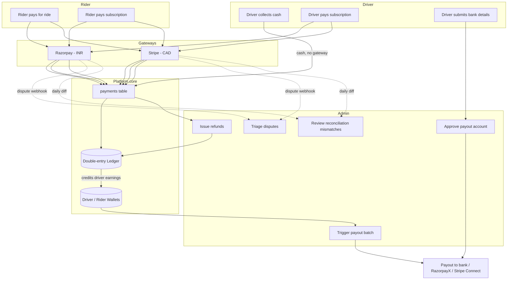
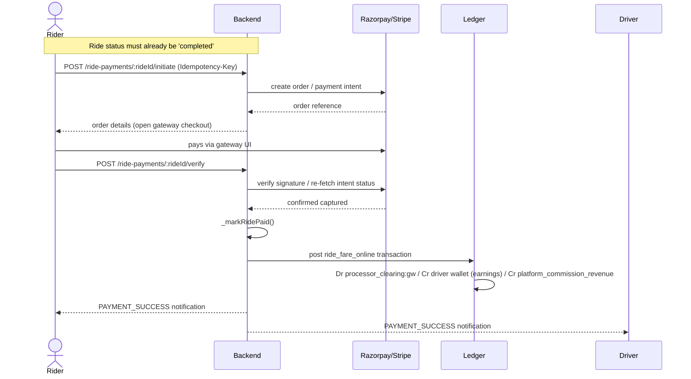
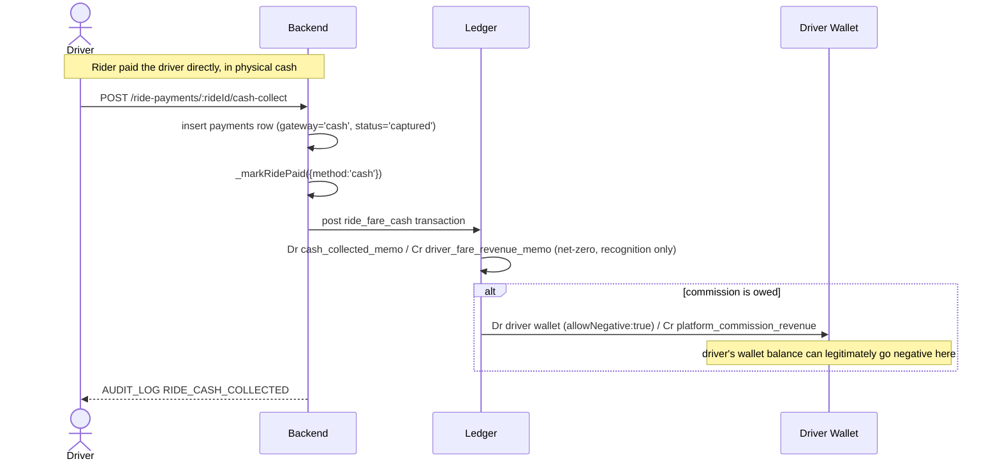
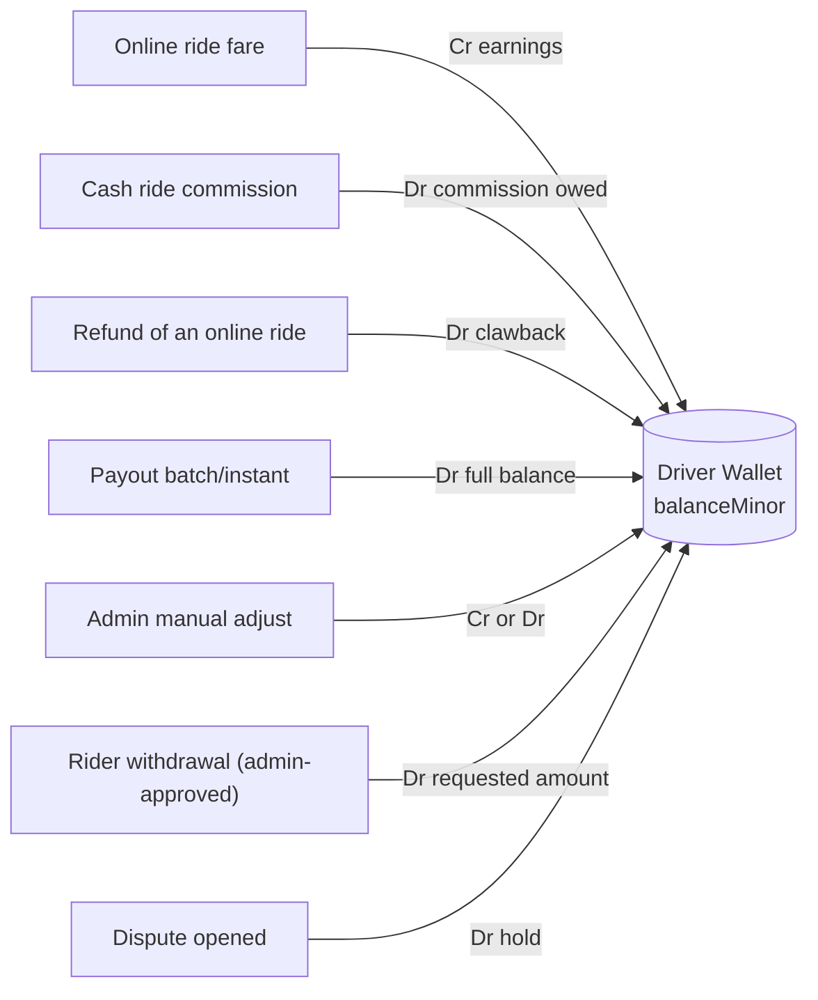
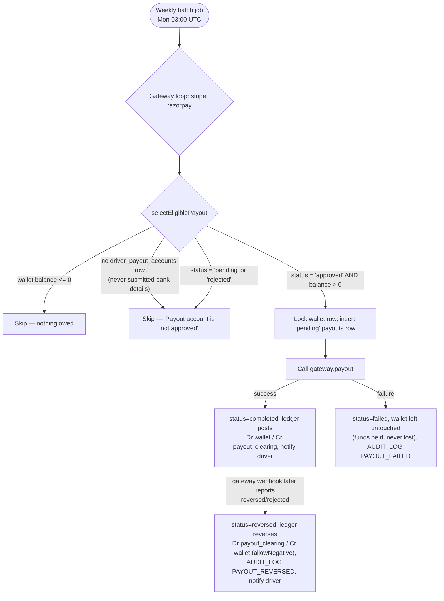
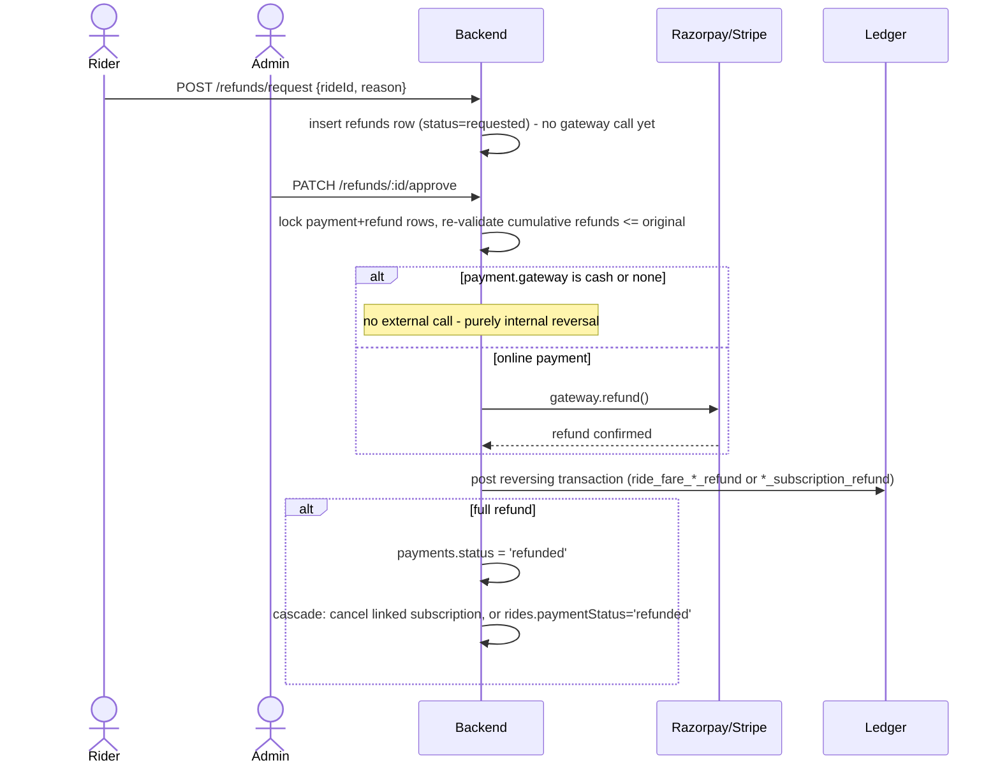
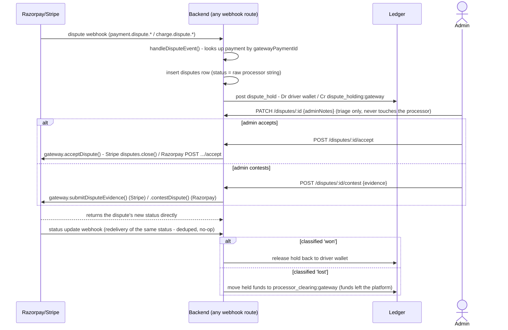
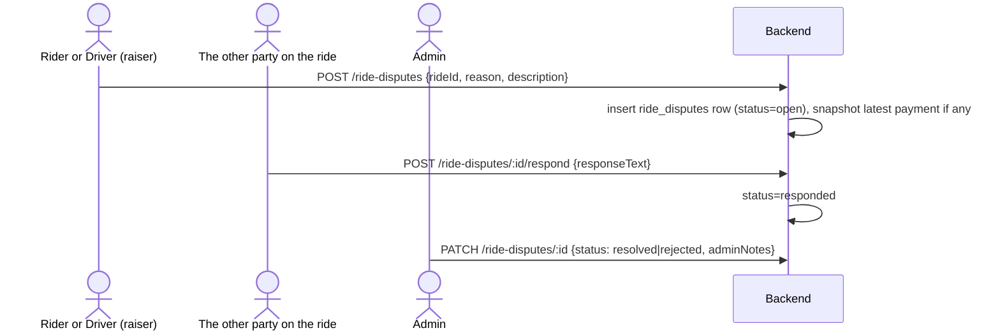
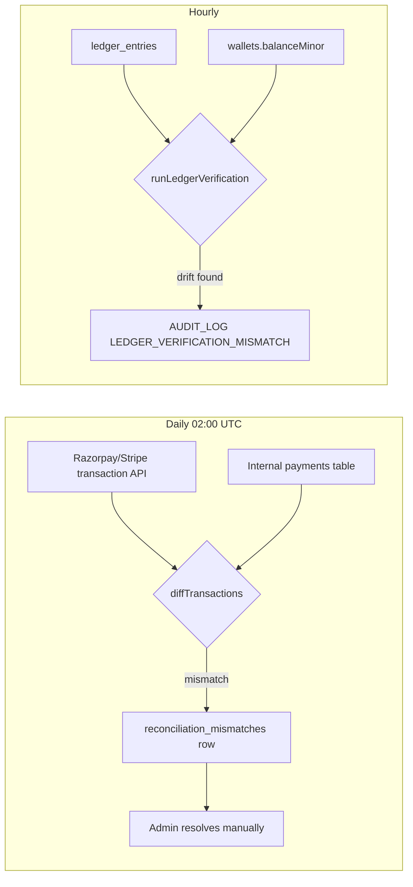
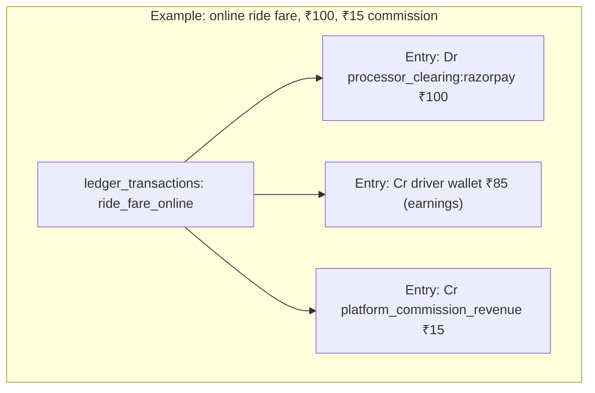

# Payment System — Complete Overview

This document explains **what actually happens today** in the codebase around money:
who can do what, how a rupee moves from a rider's phone to a driver's bank account,
how cash rides are handled, what happens if a driver never adds bank details, and how
wallets / refunds / payouts / disputes / reconciliation / ledger fit together.

It reflects the code as implemented in `backend/src/modules/{payment,ride-payment,
subscription,rider-subscription,wallet,payout,payout-account,bank-account,refund,
dispute,reconciliation,ledger,commission}` and `backend/drizzle/schema/*.js`. Where
something is a stub, manual-only, or has a known gap, it is called out explicitly —
this is not aspirational documentation.

> **Business model reminder**: this platform is *subscription-first* — drivers pay a
> recurring fee for the right to accept rides, they are not charged per-ride commission
> in the traditional sense. However, the code **also** layers a per-ride commission on
> top (see [Commission](#commission-not-just-subscription)), so both mechanisms are
> live simultaneously.

---

## 1. Roles — who can touch money

There is no fine-grained permission system — three flat role gates
(`authenticateRider`, `authenticateDriver`, `authenticateAdmin`) live in
`src/middleware/authenticate.js` and are applied per-route.

| Capability | Rider | Driver | Admin |
|---|---|---|---|
| Pay for a ride (online) | ✅ initiate/verify | — | — |
| Collect a ride payment in cash | — | ✅ mark cash collected | — |
| Pay for own subscription | — | ✅ (driver plans) | — |
| Pay for own subscription (rider side) | ✅ (rider plans) | — | — |
| View own wallet balance | ✅ `GET /wallets/me` | ✅ `GET /wallets/me` | ✅ any wallet |
| Top up own wallet | ✅ initiate/verify (own gateway order) | ✅ initiate/verify (own gateway order) | ✅ manual credit/debit adjustment |
| Withdraw from own wallet | ✅ `POST /wallets/me/withdraw/request` — creates a `requested` row, admin approval debits the ledger (no gateway call, manually wired) | — (use payout instead) | ✅ approve/reject requests |
| Submit bank details for payout | — | ✅ | ✅ on driver's behalf |
| Trigger / view own payout | — | ✅ `POST /payouts/me/instant`, `GET /payouts/mine` (still requires an admin-approved payout account) | ✅ instant + batch |
| Request a refund | ✅ `POST /refunds/request` — creates a `requested` row, admin approval still executes the real gateway refund | — | ✅ approve/reject requests, or issue an instant refund directly |
| Raise/respond to a dispute | ✅ ride/payment complaint ticket (`ride-disputes`), not the processor chargeback below | ✅ ride/payment complaint ticket (`ride-disputes`) | ✅ triage notes on processor chargebacks, plus accept/contest with the processor directly; resolves complaint tickets |
| View ledger / reconciliation | — | — | ✅ read-only |

**Key point to internalize**: this used to be a strictly "admin-mediated money" design —
every wallet adjustment, refund, and payout decision passed through an admin, with no
rider/driver self-service outside of "pay for the thing I'm using." That's no longer
fully true: riders and drivers can now view/top up their own wallet, a driver can
self-trigger their own payout (still gated on an admin-approved payout account — see
§7), a rider can *request* a refund (still admin-approved before any gateway call
happens — see §8), and a rider can *request* a wallet withdrawal (still admin-approved,
and never a gateway call — riders have no payout rail, so the admin wires the money
manually — see §6). The one genuinely new concept is `ride-disputes` (§9a): a
rider/driver complaint ticket against a ride, entirely separate from the processor
chargeback `disputes` table, which remains admin-triage-only.

---

## 2. The big picture

Everything ultimately posts through **one function**: `ledger.service.js`'s
`postTransaction()` — the code comment literally calls it *"the only way anything
writes to the ledger."* Wallet balances (`wallets.balanceMinor`) are a read-optimized
cache that the ledger keeps in sync automatically; the ledger itself (`ledger_entries`)
is the source of truth.

---

## 3. How a ride payment actually happens

### 3a. Online payment (card/UPI/wallet via Razorpay or Stripe)

Currency decides the gateway: `INR → Razorpay`, `CAD → Stripe`
(`payment.service.js` `CURRENCY_GATEWAY` map). If the gateway's API keys aren't
configured in `.env`, the system doesn't error — it silently falls into **dev mode**
and marks the ride paid without touching a real payment processor. This is why you can
run the whole app locally without Razorpay/Stripe keys.

In parallel, **both gateways also send a webhook** — `POST
/ride-payments/webhook/razorpay` for `payment.captured` events (HMAC-SHA256 of the raw
request body against `RAZORPAY_WEBHOOK_SECRET`), and `POST
/ride-payments/webhook/stripe` for `payment_intent.succeeded` events (verified via
Stripe's SDK against `STRIPE_WEBHOOK_SECRET`). Both are a backstop in case the rider's
`/verify` call never lands (app killed, network drop, etc.) — the webhook and the
client verify race safely because ride-payment activation is idempotent
(`_markRidePaid` no-ops once `rides.paymentStatus = 'paid'`). Both routes dispatch
through the same gateway-agnostic `processWebhookEvent()` in `ride-payment.service.js`
via the `ride_payment` domain handler in `webhook-processing.job.js`.

### 3b. Cash payment — "how does the system handle it?"

This is the part that confuses people because **no money actually moves through the
platform**, yet the ride still needs to be marked paid and the driver still owes
commission (subscription doesn't waive per-ride commission, it just changes the rate —
see §4). The system's answer: a **driver self-report + a net-zero "memo" ledger
posting**, plus a *real* wallet debit for whatever commission is owed.

**In plain terms**: cash never touches the platform's bank account, so the "cash
collected" and "cash revenue" memo entries cancel each other out (net zero, purely for
bookkeeping/reporting visibility). But the platform's **commission** on that ride is
real money the driver owes the platform — since it wasn't collected online, it's
deducted straight from the driver's wallet balance. If the driver takes a lot of cash
rides without enough online-ride earnings to offset it, **their wallet balance can go
negative** (`allowNegative: true` is set intentionally for this case) — it becomes a
debt that reduces their next payout, or that an admin has to chase separately.

There's no cash-collection confirmation from the rider's side — it's entirely a
driver self-report with no independent verification built in today.

---

## 4. Commission — not just subscription

`commission.service.js` resolves a rate (`commission_rules`, exact vehicle-type →
country → global fallback) **at settlement time**, not at ride-request time — because
a driver's subscription can lapse mid-ride. It reads `drivers.subscriptionStatus`
*fresh* when the ride payment settles, applies `subscriberRate` or
`nonSubscriberRate` accordingly, and stamps the full breakdown
(`{bookingFeeMinor, rate, commissionMinor, driverEarningsMinor}`) into
`rides.fareSnapshot.commission` for auditability. This is the same commission
calculation used for both online and cash rides (§3a/§3b) — only *how* it's collected
differs.

---

## 5. Driver & rider subscriptions

Structurally the same online-payment flow as §3a, just against `subscriptions` /
`rider_subscriptions` instead of a ride:

- `POST /subscriptions/initiate` → `POST /subscriptions/verify` (driver), same pattern
  for `rider-subscription.routes.js` (rider).
- Unlike ride payments, **both** domains have webhook routes for **both** gateways
  (`/subscriptions/webhook/razorpay` and `/subscriptions/webhook/stripe`).
- Activation is idempotency-keyed on the gateway order ID (`_activateSubscriptionIdempotent`)
  so a race between the client's `/verify` call and the async webhook can't double-activate.
- On activation: any existing active subscription is expired, the new one is inserted,
  `drivers.subscriptionStatus` flips to `'active'`, and a ledger transaction posts
  Dr `processor_clearing:<gateway>` / Cr `platform_revenue:driver_subscriptions`.
- A daily BullMQ job (`expireOverdueSubscriptions`, midnight) expires lapsed
  subscriptions, flips `subscriptionStatus='expired'`, and **forces the driver
  offline** (`isOnline=false`).
- Optional tax rules (`fare-rules`/`tax` config) get added on top of `priceMinor` at
  checkout.

---

## 6. Wallets

Schema: `wallets` (one row per driver *or* per rider — never both, `balanceMinor` as
an integer in minor currency units) + `wallet_transactions` (append-only audit trail,
`credit`/`debit`, snapshot of `balanceAfterMinor`).

- **Drivers get a wallet lazily** — created automatically the first time money needs
  to move through it (first ride earning, first commission debit, first `GET
  /wallets/me` call, etc.).
- **Riders also get a wallet lazily now** — `GET /wallets/me` and the top-up endpoints
  (`wallet.service.js getMyWallet`/`initiateWalletTopup`) auto-create a zero-balance
  wallet the same way the driver side always has. Admins can still explicitly credit
  one first (goodwill credit, refund routed to wallet); that no longer matters for
  whether the rider *can* see/use a wallet.
- **Self-service top-up**: `POST /wallets/me/topup/initiate` (Idempotency-Key
  required) → `POST /wallets/me/topup/verify`, same two-step shape as ride payments
  and subscriptions (`wallet.service.js`). Dev mode (no gateway keys configured for
  the owner's currency) credits immediately on initiate, same as everywhere else in
  this codebase. Ledger posting is Dr `processor_clearing:<gateway>` / Cr the wallet —
  no commission split, since a top-up isn't a fare.
- The **direct ways to touch a wallet balance** are self-service top-up (above),
  `POST /wallets/:ownerType/:ownerId/adjust` (admin-only), and — for riders — a
  self-service **withdrawal request**: `POST /wallets/me/withdraw/request
  { amountMinor, reason }` inserts a `wallet_withdrawals` row (`status='requested'`),
  requires the rider already has bank/UPI details on file (`rider-bank-accounts.js`),
  and blocks a second open request per wallet. An admin then calls `PATCH
  /wallets/withdrawals/:id/approve` or `.../reject { rejectionReason }`
  (`wallet.service.js`). Unlike a driver payout, approval never calls a gateway —
  riders have no payout rail (§7 is driver-only) — so the admin manually wires the
  money to the bank/UPI/wallet details on file and approval just posts the ledger
  debit (Dr the wallet / Cr a `wallet_withdrawal_clearing` system account) and marks
  the request `completed`. `GET /wallets/me/withdrawals` lets the rider track their own
  requests. Everything else touching a wallet balance is a side-effect of a ledger
  posting (ride earnings, refunds, payouts, dispute holds).
- Wallet balance is a **cache**: every ledger entry posted against a wallet-type ledger
  account automatically updates `wallets.balanceMinor` and inserts a matching
  `wallet_transactions` row, under a row lock, inside `postTransaction()`. If you ever
  see the wallet balance and the ledger disagree, that's exactly what
  `ledger-verification.job.js` checks for hourly (§7).

---

## 7. Driver payouts — "how does the driver actually get money?"

This is the area with the most nuance, so it's worth being precise about what's real
vs. what's stubbed.

### Step 1 — Driver submits bank details

`PUT /api/v1/driver/bank-details` (driver-authenticated). What happens depends on
gateway:

- **Razorpay path (India)**: raw bank account number/IFSC are AES-256-GCM encrypted
  and stored in `driver_bank_accounts`. The backend also calls RazorpayX to create/
  refresh a **Contact** + **Fund Account** on the driver's behalf.
- **Stripe path (Canada)**: the backend **never touches the driver's raw bank
  details**. Instead it creates a Stripe Connect Express account and redirects the
  driver to Stripe's own hosted onboarding UI (`payout-account.service.js
  startStripeOnboarding`). Stripe's `account.updated` webhook only syncs
  `stripeDetailsSubmitted`/`stripePayoutsEnabled` flags — it does **not** auto-approve
  the driver for payouts.

Either way, submitting/resubmitting bank details always resets the driver's
`driver_payout_accounts.status` back to `'pending'` — same "re-verify on every edit"
convention used for driver document uploads.

### Step 2 — Admin approval gate (mandatory, no exceptions)

`driver_payout_accounts.status` is `'pending' | 'approved' | 'rejected'`. An admin must
explicitly call `PATCH /payout-accounts/:id/verify` to flip it to `'approved'` before
**any** payout can ever be attempted for that driver — this is enforced in code
(`selectEligiblePayout`), not just documented as a policy. This gate applies equally
whether the payout is admin-triggered or driver-self-triggered (below) — a driver
calling their own instant-payout endpoint before their account is approved gets the
same `422 'Payout account is not approved'` an admin would.

### Driver self-service

`POST /payouts/me/instant` (driver-authenticated, Idempotency-Key required) and `GET
/payouts/mine` let a driver trigger and view their own payouts without an admin in the
loop — `payout.routes.js` just calls the same `initiateInstantPayout`/`listPayouts`
functions the admin routes use, scoped to `request.user.id`. No new eligibility rules:
same approved-payout-account + positive-balance + gateway-supports-payouts checks as
every other payout path.

### Step 3 — Payout execution

**Async reversal**: `POST /payouts/webhook/razorpay` (RazorpayX `payout.processed`/
`payout.reversed`/`payout.rejected`) and `POST /payouts/webhook/stripe` (Stripe
`transfer.reversed`) catch the case where a payout that returned success synchronously
later bounces on the processor's side. Both dispatch through the `payout` domain in
`webhook-processing.job.js` to `processPayoutStatusWebhook()` in `payout.service.js`,
which looks up the `payouts` row by `gatewayPayoutId` and, if it was `completed` and the
gateway now reports a reversal/rejection, posts a reversing ledger transaction (Dr
`payout_clearing:<gateway>` / Cr the driver's wallet, `allowNegative: true` — same
clawback pattern as a refund or cash-commission debit) and flips the row to `reversed`.

**Answering "what if a driver never adds bank details?"** directly: their
`drivers.js` schema record has **no bank fields at all** (bank data lives entirely in
the separate `driver_bank_accounts`/`driver_payout_accounts` tables). If those rows
don't exist, `selectEligiblePayout` returns `{eligible: false, reason: 'Payout account
is not approved'}` and the driver is silently skipped in every batch run, forever —
their wallet balance just keeps accumulating (or going negative from cash commission)
until they submit bank details and get admin-approved. There is no reminder/nudge
system built for this today.

### Known gaps in payouts (be aware of these before relying on this system)

1. **RazorpayX contact/payout integration is explicitly unverified** against a live
   account per in-code comments — the request/response *shapes* used for Contacts, Fund
   Accounts, Payouts, and now Disputes accept/contest all follow Razorpay's public REST
   docs but have never been exercised against a real (even test-mode) account. One real
   bug in this area *was* found and fixed without needing a live account, though: every
   call through the `razorpay` npm package (not just the RazorpayX ones — orders,
   refunds, reconciliation reads, all of it) shares one internal error normalizer
   (`razorpay/dist/api.js`) that throws a plain `{statusCode, error: {description}}`
   object with **no `.message` property** on any API failure. The app's global error
   handler reads `error.message`, so every one of these calls would previously surface
   as a message-less `{"SUCCESS":false}` on failure, hiding the actual Razorpay-reported
   reason. `razorpay.gateway.js`'s `normalizeRazorpayApiError()` (wrapping every SDK/raw
   call via an internal `_call()` helper) fixes this — confirmed by reading the installed
   package's source directly, not a live-account concern.
2. **Stripe Connect onboarding redirect targets are still backend placeholder
   acknowledgement routes by default** — there's no driver mobile-app screen to send
   the driver back into yet (only a rider app exists per this repo's structure), so this
   can't be fully closed without one existing. What *is* fixed: the URLs are no longer
   hardcoded — `DRIVER_APP_ONBOARDING_RETURN_URL`/`DRIVER_APP_ONBOARDING_REFRESH_URL`
   (`payout-account.service.js` `startStripeOnboarding`) let a deployment point these at
   a real driver-app deep link the moment one exists, with no code change; unset, the
   backend's own placeholder routes are used exactly as before.

---

## 8. Refunds

**Admin-instant, or rider-request + admin-approval** — there are now two entry points
into the same reversal logic, both implemented in `refund.service.js`:

- **Admin-instant** (`POST /refunds`, unchanged from before): an admin picks any
  `paymentId` and amount and it executes immediately.
- **Rider-request** (`POST /refunds/request { rideId, reason }`): a rider can only
  request a refund for their *own* ride's latest payment, for the full remaining
  refundable amount — no partial-amount input, no gateway call yet. This inserts a
  `refunds` row with `status='requested'`. An admin must then call `PATCH
  /refunds/:id/approve` (re-validates the amount against the *current* already-refunded
  total, then runs the exact same gateway-call + ledger-reversal logic as the instant
  path) or `PATCH /refunds/:id/reject { rejectionReason }`. `GET /refunds/mine` lets
  the rider track their own requests. The gateway is deliberately never called until an
  admin approves — this preserves the admin-mediated-money control for the one
  self-service path that moves real money back out of the platform.

Reversal specifics: a cash-ride refund reverses the memo pair; an online-ride refund
debits the driver's wallet (they already got credited the fare, now they owe it back —
`allowNegative: true` applies) and credits back the processor-clearing account; a
subscription refund debits the relevant `platform_revenue:*` account. These are
identical regardless of which entry point (admin-instant vs rider-request-approved)
triggered them — both funnel through the same `_executeRefund` helper.

---

## 9. Disputes (chargebacks)

The system never *auto*-resolves a dispute, but an admin can now push a decision **to**
the processor instead of only leaving triage notes — accept (concede) it, or contest it
with evidence.

Both actions funnel through the same `_applyProcessorDisputeUpdate()` helper
(`dispute.service.js`) that the webhook path's resolution logic uses — whichever
status the gateway call returns is classified and resolved the same way a webhook-driven
status change already was, so there's no separate "admin resolution" code path to keep in
sync. A subsequent webhook redelivery of the same final status is a no-op (existing
`existing.status === status` guard), and the ledger post itself is idempotency-keyed, so
there's no risk of double-resolving if the processor's webhook and the admin's direct call
both land.

> ⚠️ **Gap**: Razorpay's dispute webhook payload/status enum is explicitly flagged in
> code as **unverified against a live dispute** — `classifyDisputeStatus` now does an
> exact (case-insensitive) match against each gateway's documented status enum rather
> than a substring test, but the Razorpay side of that enum (`open` / `under_review` /
> `won` / `lost` / `closed` / `action_required`) is taken from Razorpay's public API
> docs, not a live payload sample. The new accept/contest calls inherit the same
> caveat on the Razorpay side: `acceptDispute`/`contestDispute` go through the same raw
> `api.post()` escape hatch as the RazorpayX payout code (the installed `razorpay`
> package doesn't expose a Disputes resource), following Razorpay's documented
> `POST /disputes/:id/accept` / `.../contest` contract but not exercised against a live
> dispute. Stripe's side (`disputes.close()` / `disputes.update(..., {submit: true})`)
> is a normal typed SDK call, not a caveat.

---

## 9a. Ride disputes (rider/driver complaint tickets)

Not to be confused with §9 above — `ride_disputes` (`ride-dispute.service.js`,
`ride-dispute.routes.js`) is a lightweight complaint-ticket system for a rider or
driver to flag a specific ride ("overcharged", "driver never showed", etc.). It has no
processor involvement, no webhook, and no ledger/money side effects of its own.

Key constraints enforced in `ride-dispute.service.js`: only the ride's rider or driver
can raise or respond; a raiser can't respond to their own ticket; only one open ticket
per (ride, raiser) at a time; `GET /ride-disputes/mine` scopes to rides the caller was
actually on. If an admin agrees a complaint warrants money moving, they act through the
existing refund-request-approval (§8) or wallet-adjust (§6) endpoints separately — this
module never touches those itself.

A push notification fires at every stage via `publishNotification()`
(`notification-events.js`): `RIDE_DISPUTE_RAISED` to the *other* party when a ticket is
opened, `RIDE_DISPUTE_RESPONDED` to the raiser when they respond, `RIDE_DISPUTE_RESOLVED`
to both raiser and responder when an admin closes it out.

---

## 10. Reconciliation

Two independent, complementary checks — neither one auto-corrects anything, both only
flag discrepancies for a human:

1. **Gateway reconciliation** (daily, 02:00 UTC, `reconciliation.job.js`) — pulls
   yesterday's captured payments from Razorpay/Stripe's own API and diffs them against
   our internal `payments` table for that window. Flags `missing_internal` (they have
   it, we don't), `missing_external` (we have it, they don't), `amount_mismatch`, and
   `duplicate_internal`. Writes a `reconciliation_runs` row + any
   `reconciliation_mismatches` rows; admin resolves each one manually
   (`resolved`/`ignored`) via `PATCH /reconciliation/mismatches/:id`.
2. **Ledger verification** (hourly, `ledger-verification.job.js`) — a pure internal
   consistency audit: re-derives whether any ledger transaction is unbalanced, and
   whether any wallet's cached `balanceMinor` has drifted from what the ledger entries
   actually sum to. Publishes an `AUDIT_LOG` event if anything's off.

**Why mismatches are never auto-corrected, on purpose**: none of the four finding types
have a safe automatic fix. `missing_internal` would require guessing which
ride/subscription/wallet an unmatched gateway payment belongs to; `missing_external`
could just as easily be a reconciliation-window edge case as a real problem;
`amount_mismatch` can't be fixed by editing `payments.amountMinor` alone — the ledger
entries were derived from `ride.finalFareMinor`/plan price at the time, not from that
column, so a real fix means re-deriving commission splits; `duplicate_internal` gives no
reliable signal for which of the two rows is the "real" one to keep. Auto-correcting
financial discrepancies without human review is a known anti-pattern — it risks masking
the underlying bug instead of catching it. What *did* get built to make the human review
step less likely to be neglected: every mismatch gets a `severity` (`low`/`medium`/`high`)
computed by `assessMismatchSeverity()` — a pure triage heuristic based on amount-at-risk
(and `duplicate_internal` is always at least `medium`, since it signals a bug in our own
system regardless of amount) — filterable via `GET
/reconciliation/mismatches?severity=high`. And every run that finds any mismatches
emails every active admin a summary (`reconciliation.service.js` `_alertAdmins` —
bypasses the normal driver/rider-scoped `publishNotification()` pipeline since admins
aren't a userType it resolves contacts for; best-effort, never fails the run itself).

---

## 11. Ledger — the accounting source of truth

Real **double-entry bookkeeping**, three tables:

- `ledger_accounts` — either a `system` account (fixed codes like
  `processor_clearing:razorpay`, `platform_commission_revenue`, `cash_collected_memo`,
  `driver_fare_revenue_memo`, `platform_revenue:driver_subscriptions`,
  `payout_clearing:<gateway>`, `dispute_holding:<gateway>`, `wallet_adjustment_expense`)
  or a `wallet` account (one per `wallets` row, created lazily).
- `ledger_transactions` — one row per business event, tagged with a `businessType`
  (`ride_fare_online`, `ride_fare_cash`, `ride_commission_cash`, `*_refund` variants,
  `driver_subscription_charge`, `rider_subscription_charge`, `wallet_admin_adjustment`,
  `driver_payout`, `dispute_hold`, `dispute_won`, `dispute_lost`, ...) and a unique
  `idempotencyKey` so the same event can never post twice.
- `ledger_entries` — append-only debit/credit lines. **Never updated or deleted** —
  corrections are always new reversing transactions, never edits to history.

Every write goes through `postTransaction()`, which:
1. Validates the entries balance per-currency (debits == credits, ≥ 2 entries).
2. Enforces the idempotency key (safely handles a race via Postgres's unique-constraint
   error).
3. Automatically mirrors any entry against a wallet account into
   `wallets.balanceMinor` (row-locked) + a `wallet_transactions` row — this is *why*
   wallets never need manual syncing.

---

## 12. Direct answers to the specific confusions raised

**1. How does a driver actually get money into their account?**
Money doesn't move to the driver in real time as rides complete — it accumulates as a
balance in their internal wallet (§6). Getting it into an actual bank account requires:
(a) driver submits bank details, (b) an admin manually approves the payout account,
(c) either the weekly automated batch (both gateways) or an admin's manual/instant
trigger executes an external payout that debits the wallet and credits their real bank
account/Stripe balance.

**2. If a rider pays cash, how does the system handle it?**
The driver self-reports the cash collection via an app action
(`POST /ride-payments/:rideId/cash-collect`). No money passes through the platform, so
the ledger posts a net-zero "memo" pair purely for revenue visibility/reporting. But if
the platform is owed commission on that ride, that commission *is* real money — it's
deducted directly from the driver's wallet balance (which can go negative), effectively
becoming a debt that's settled out of future online-ride earnings or chased down
separately by an admin.

**3. If a driver never adds bank details, what happens?**
Nothing bad happens automatically — no penalty, no notification loop built today. They
simply never appear as eligible in `selectEligiblePayout`, so every payout batch run
(and every instant-payout admin attempt) skips them with reason "Payout account is not
approved." Their earnings keep accumulating in their wallet indefinitely until bank
details are submitted and admin-approved.

**4. How do wallets, refunds, payouts, disputes, reconciliation, and the ledger fit
together?**
The **ledger is the one source of truth** for every money movement in the system.
Wallets are a derived, always-in-sync cache of the ledger for driver/rider balances.
Refunds, payouts, and dispute holds are all just specific *kinds* of ledger
transactions with their own reversal/hold semantics — they don't have separate
"pots of money," they're bookkeeping operations against the same accounts. Gateway
reconciliation and hourly ledger verification are the two audit layers that make sure
(a) our internal records match what Razorpay/Stripe actually processed externally, and
(b) our own ledger and wallet cache never silently drift apart internally. None of the
audit layers auto-correct anything — every mismatch surfaces to an admin to resolve by
hand.

---

## 13. Summary of known stubs / gaps (don't design against these as if they're solid)

| Area | Gap |
|---|---|
| Payouts | RazorpayX Contacts/Fund Accounts/Payouts integration unverified against a live account (error-message propagation for all Razorpay SDK calls was audited and fixed — see §7) |
| Disputes (processor) | Razorpay dispute webhook/accept/contest payload+status shape unverified against a live account (status enum taken from public docs, not a live sample) |
| Payout onboarding | Stripe Connect onboarding redirect targets default to backend placeholder routes (configurable via env now, but no driver app exists yet to point them at) |

 https://claude.ai/code/artifact/e8cb1773-de02-4c57-93c7-6fc92d3f67c1