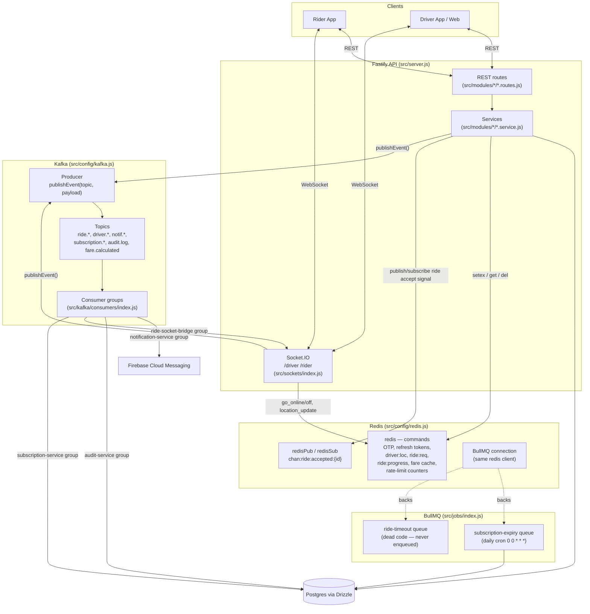
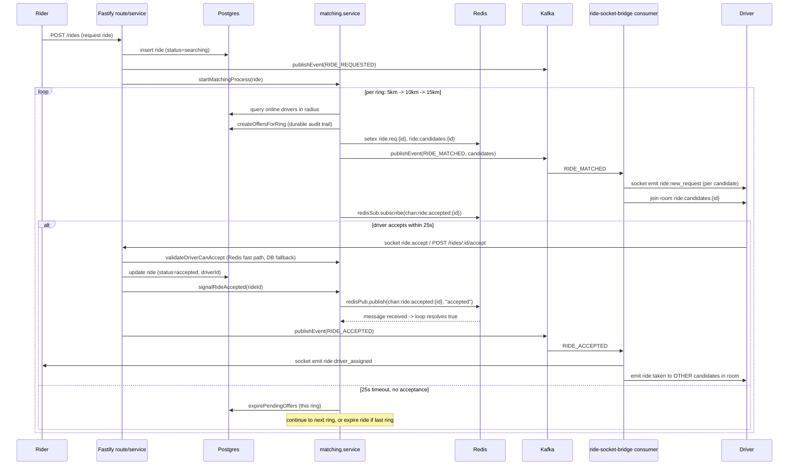
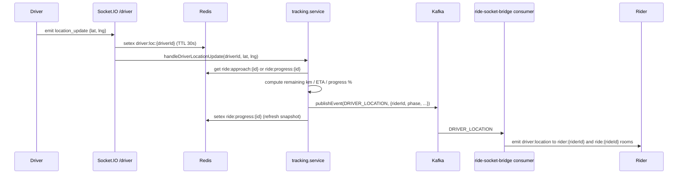
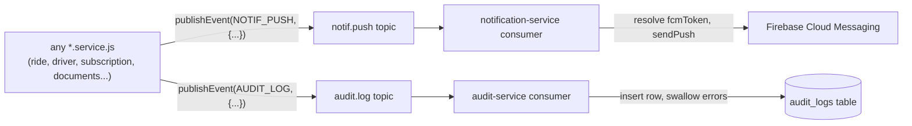

# Redis, Kafka & BullMQ — Architecture Overview

How the three async/messaging pieces fit together in `backend/`, what each one is
actually used for in this codebase, and how a request flows through all of them
on a real ride. All file paths below are relative to `backend/`.

## The one-sentence version

- **Redis** = fast shared state (live driver GPS, OTPs, refresh tokens, ride
  offer cache) + a pub/sub instant-signal channel + the BullMQ backing store.
- **Kafka** = the durable event bus between modules — a service publishes
  "something happened," and unrelated consumers (notifications, audit log,
  the Socket.IO bridge) react independently.
- **BullMQ** = scheduled/background jobs that aren't triggered by a live
  request — currently just the daily subscription-expiry sweep.

None of these talk to the mobile app directly. **Socket.IO** is the only thing
with a live connection to drivers/riders; Kafka consumers push into it.

## System diagram



## Redis — shared fast state (`src/config/redis.js`)

Three `ioredis` clients, all pointed at the same `REDIS_URL`:

| Client | Purpose |
|---|---|
| `redis` | Regular commands (get/set/setex/del) — also handed to `@fastify/rate-limit` and to BullMQ as its `connection` |
| `redisPub` | Dedicated publisher — **must not** run regular commands |
| `redisSub` | Dedicated subscriber — **must not** run regular commands |

All keys are centralized in `REDIS_KEYS` (`src/config/redis.js:19`):

| Key | TTL | Written by | Read by |
|---|---|---|---|
| `driver:loc:{id}` | 30s | `go_online`/`location_update` sockets | `tracking.service.getRideTrackingState`, matching |
| `driver:ride:{id}` | 7200s | ride accept flow | `ride.service.handleDriverLocationUpdate` (decides approach vs trip phase) |
| `ride:req:{id}` | ring window +10s | `matching.service` per ring | `matching.validateDriverCanAccept` fast path |
| `ride:candidates:{id}` | ring window +10s | `matching.service` per ring | Socket.IO ride-socket-bridge consumer (joins drivers to the room) |
| `ride:progress:{id}` | 7200s | `tracking.initTripTracking` / `updateTripProgress` | `tracking.getRideTrackingState` (REST `/track`) |
| `ride:approach:{id}` | 3600s | `tracking.computeApproachRoute` | `tracking.updateApproachProgress`, REST `/track` |
| `ride:status:{id}` *(ad-hoc, not in `REDIS_KEYS`)* | 10s | `ride.service.handleDriverLocationUpdate` | same function, on the next location ping — avoids a DB read on every ~4s GPS update |
| `otp:*` (code/attempts/lock/resend/sendcount) | 300–3600s | `utils/otp.js`, `utils/emailOtp.js` | same, on verify |
| `refresh:{userId}:{deviceId}` | 30d | login/refresh routes | JWT refresh flow, device-scoped so revoking one device doesn't log out others |
| `fare:{key}` | 120s | `fare.service` | fare-quote endpoint (avoid recompute per request) |
| `chan:ride:accepted:{rideId}` | n/a (pub/sub) | `matching.signalRideAccepted` / `signalRideCancelled` | `matching._runMatchingRings` (`waitForAcceptanceSignal`) |

Redis is also the **rate-limit store** (`src/plugins/index.js`, `@fastify/rate-limit`
registered with `redis`, 100 req/min per IP) and the **BullMQ connection** —
BullMQ stores its queues/jobs as Redis data structures under the hood, so it
needs no separate infrastructure.

**Not used for:** Socket.IO scaling. There is no `@socket.io/redis-adapter` in
`package.json`, so Socket.IO runs on its default in-memory adapter — rooms and
broadcasts only work correctly within a single Node process. Kafka is what
actually does the cross-process fan-out job in this design (see below); if the
API is ever horizontally scaled, Socket.IO itself would need a Redis adapter
too, since two instances can't currently see each other's connected sockets.

## Kafka — the event bus (`src/config/kafka.js`, `src/kafka/`)

A single producer (`getProducer()`, lazily connected) is shared by every module
via `publishEvent(topic, payload, key)`. Topics (`TOPICS` enum,
`src/config/kafka.js:14`):

```
ride.requested        driver.location            notif.push
ride.matched          driver.status_changed*      notif.sms†
ride.accepted         driver.registration_submitted*
ride.started          fare.calculated‡
ride.completed        payment.success‡             subscription.activated
ride.cancelled        payment.failed‡               subscription.expired
ride.timeout‡                                       subscription.cancelled‡
                                                      audit.log
```
`*` published, but no consumer currently subscribes (documented extension
points — e.g. an admin live-status dashboard). `†` has a consumer subscribed
but nothing publishes to it (SMS notifications aren't wired up yet). `‡`
defined in the enum but never published anywhere in the codebase today —
`ride.timeout` is dead because matching handles ring timeouts with an in-process
`setTimeout` + Redis pub/sub instead; `payment.*`/`subscription.cancelled`
are dead because the payment/subscription modules update Postgres directly
without going through Kafka for those events; `fare.calculated` is dead
because fare quotes are cached in Redis and returned synchronously, not
broadcast.

Producers are spread across almost every service module (`ride.service.js`,
`matching.service.js`, `driver.service.js`, `tracking.service.js`,
`subscription.service.js`, `documents.service.js`, `zone.service.js`,
`fare-rules.service.js`, `vehicle-type.service.js`, `sockets/index.js`) — the
pattern is "do the DB write, then fire an event describing what happened."

Four consumer groups run in-process, started together by
`startAllConsumers()` (`src/kafka/consumers/index.js`), called once from
`server.js` at boot:

| Consumer group | Subscribes to | Does |
|---|---|---|
| `notification-service` | `notif.push`, `notif.sms` | Resolves FCM token (from payload or DB), calls `sendPush` (Firebase) |
| `audit-service` | `audit.log` | Inserts a row into `audit_logs`; swallows errors so audit never crashes the pipeline |
| `ride-socket-bridge` | `ride.matched`, `ride.accepted`, `ride.started`, `ride.completed`, `ride.cancelled`, `driver.location` | Translates Kafka events into Socket.IO emits to the right driver/rider rooms — this is **the only bridge** between the event bus and live sockets |
| `subscription-service` | `subscription.activated`, `subscription.expired` | Currently just logs; documented extension point for CRM/analytics/Slack hooks |

`driver.status_changed` and `driver.registration_submitted` are published (by
`sockets/index.js` and `driver.service.js`) but no consumer group subscribes
to either today — they're write-only events, presumably reserved for a future
admin live-status view or registration-review dashboard.

Kafka is not used for driver location *storage* (that's Redis) — it's used to
**fan out** each location ping to whichever rider is subscribed, without the
publisher needing to know who's listening or which server holds the socket.

## BullMQ — background/scheduled jobs (`src/jobs/index.js`)

Two queues, both backed by the shared `redis` client:

| Queue | Trigger | Worker does |
|---|---|---|
| `subscription-expiry` | Repeatable job, `0 0 * * *` (midnight daily), (re)scheduled by `scheduleSubscriptionExpiry()` at boot | Calls `expireOverdueSubscriptions()` — marks lapsed driver subscriptions as expired in Postgres |
| `ride-timeout` | **Nothing.** `rideTimeoutQueue` is exported and a worker is registered, but a repo-wide search finds zero calls to `.add()` on it — it is fully dead code today, not just idle | Would log a timeout check if ever triggered; matching's own 25s-per-ring timer (`ACCEPT_TIMEOUT_MS` in `matching.service.js`, via `setTimeout` + Redis pub/sub) already handles ride timeout end-to-end without it |

`startJobs()` is called once at boot from `server.js`, after Kafka consumers.
Both failures are logged but non-fatal in dev (`app.log.warn`), so a missing
Redis/Kafka connection doesn't block local development.

## Why matching uses Redis pub/sub instead of Kafka

`matching.service.js` needs an **instant** "a driver accepted" signal to abort
its 25-second wait loop early — Kafka's consumer-group polling latency is
unnecessary overhead for a same-process, sub-second signal. So:

- `signalRideAccepted(rideId)` / `signalRideCancelled(rideId)` → `redisPub.publish(chan:ride:accepted:{id}, ...)`
- `waitForAcceptanceSignal()` → `redisSub.subscribe` + `Promise` that resolves on message or timeout

Kafka is still used *in parallel* for the "broadcast this new ride to N
candidate drivers' phones" part (`RIDE_MATCHED`), because that needs to reach
sockets that might be on a different server process — pub/sub here is
strictly for the tight matching-loop's internal control signal, not for
reaching clients.

## End-to-end flow: a ride request



## End-to-end flow: live driver location during a trip



## End-to-end flow: notification + audit fan-out

Almost every state-changing service call does the same two things after its
DB write — this is the most common Kafka pattern in the codebase:



The audit consumer never throws back into the pipeline — a bad audit insert
is logged and dropped rather than blocking the event or crashing the
consumer, since audit is best-effort observability, not a correctness
requirement.

## End-to-end flow: subscription expiry (the one flow that touches all three)

This is the only place BullMQ, Kafka, and Redis all participate in a single
chain — though notably it does **not** push a live Socket.IO event to the
driver; the driver only finds out via the FCM push (or the next time their
app hits a status endpoint).

1. At boot, `startJobs()` schedules a repeatable BullMQ job (`0 0 * * *`) on
   queue `subscription-expiry`.
2. At midnight, the worker calls `expireOverdueSubscriptions()` — marks
   overdue `subscriptions` rows expired and sets the driver's
   `subscriptionStatus`/`isOnline` directly in Postgres (it does **not**
   clear the driver's `driver:loc:{id}` Redis key or force-disconnect their
   socket — those clean up naturally via the 30s TTL / next disconnect).
3. Publishes `subscription.expired` + `notif.push` to Kafka per affected driver.
4. `subscription-service` consumer logs the event (stub, no action yet).
5. `notification-service` consumer resolves the driver's `fcmToken` and sends
   an FCM push telling them their subscription lapsed.

## Boot order (`src/server.js`)

1. `registerPlugins(app)` — includes rate-limit plugin wired to `redis`
2. Routes registered, `app.ready()`
3. `initSocketIO(app.server, app)` — sets up `/driver` and `/rider` namespaces
4. `redisPub.connect()`, `redisSub.connect()` (the main `redis` client uses `lazyConnect` and connects on first command)
5. `startAllConsumers()` — all 4 Kafka consumer groups, non-fatal if it throws
6. `startJobs()` — schedules the BullMQ subscription-expiry cron, non-fatal if it throws
7. `app.listen()`

Kafka and BullMQ failures are caught and logged as warnings rather than
crashing startup, so local dev works without Kafka/Zookeeper running if you
only need REST + Postgres + Redis.
