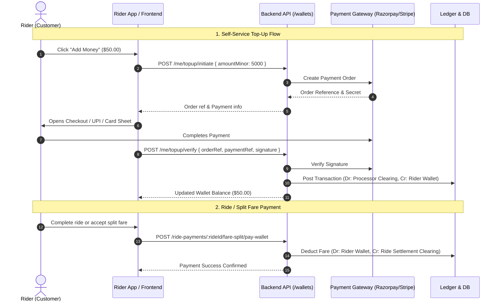
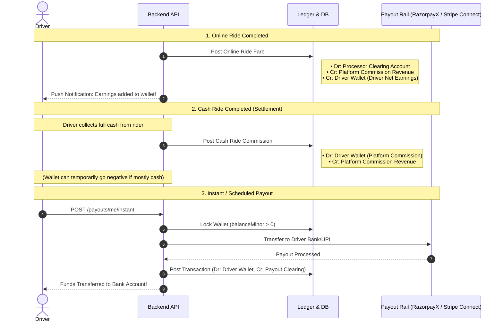

# Wallet System Architecture & Operational Guide

This document provides a comprehensive technical overview and operational guide for the **Wallet System** in the ride-sharing platform, explaining how it works under the hood for **Customers (Riders)**, **Drivers**, and **Admins**.

---

## 1. System Overview & Core Architecture

The wallet system is a **fintech-grade, double-entry ledger-backed virtual balance management system**. It manages balances, credits, debits, holds, adjustments, and payouts for both riders and drivers.

```
                   ┌─────────────────────────────────────────┐
                   │          Platform Double-Entry          │
                   │             General Ledger              │
                   │       (ledger_transactions / entries)   │
                   └────────────────────┬────────────────────┘
                                        │ Post Transaction
                                        ▼
                  ┌───────────────────────────────────────────┐
                  │          Wallets & Balance Sync           │
                  │   - wallets (balance_minor, currency)     │
                  │   - wallet_transactions (append-only log) │
                  └──────────────┬─────────────────────┬──────┘
                                 │                     │
                ┌────────────────┴───────────┐         └─────────────────────────┐
                ▼                            ▼                                   ▼
     ┌──────────────────────┐    ┌──────────────────────┐           ┌──────────────────────┐
     │   Customer (Rider)   │    │   Driver Partner     │           │   Admin Operations   │
     ├──────────────────────┤    ├──────────────────────┤           ├──────────────────────┤
     │ • Top-ups (Razorpay/ │    │ • Online Fare Credit │           │ • Global Wallet View │
     │   Stripe)            │    │ • Cash Commission Dr │           │ • Manual Adjustments │
     │ • Ride / Split Pay   │    │ • Automated Payouts  │           │ • Withdrawal Review  │
     │ • Referral Bonuses   │    │ • Instant Cash-Out   │           │ • Ledger Auditing    │
     │ • Manual Cash-out    │    │ • Refund Clawbacks   │           │ • Audit Logs & Alerts│
     └──────────────────────┘    └──────────────────────┘           └──────────────────────┘
```

### Core Design Principles:
1. **Double-Entry Ledger Backing**: Every wallet movement is mirrored in the platform general ledger (`ledger_entries`), ensuring zero-sum accounting (`Debits == Credits`).
2. **Amounts in Minor Units**: All monetary amounts are stored as integers representing minor units (`balanceMinor`, e.g., paise for `INR`, cents for `USD`) to eliminate floating-point rounding errors.
3. **Strict Concurrency Control**: Operations use PostgreSQL row-level locking (`SELECT ... FOR UPDATE`) and unique `Idempotency-Key` tracking to prevent double-spending, race conditions, or duplicate credits.
4. **Polymorphic Ownership**: The `wallets` table uses polymorphic columns (`driverId` OR `riderId`), guaranteeing exactly one wallet per user per country currency.
5. **Auditing & Notification Triggers**: All wallet actions emit events to **Kafka** (`AUDIT_LOG`) and publish real-time notifications via webhooks/sockets.

---

## 2. Database Schema Representation

### 2.1 `wallets`
Stores the current cached balance and status of each driver/rider wallet.
- `id` (UUID, Primary Key)
- `driver_id` (UUID, Unique, Nullable) - Links to `drivers.id`
- `rider_id` (UUID, Unique, Nullable) - Links to `users.id`
- `balance_minor` (Integer, Default: 0) - Current balance in lowest denomination
- `currency_code` (VARCHAR(3)) - e.g., 'INR', 'USD', 'EUR'
- `status` (VARCHAR(20), Default: 'active') - `active` or `frozen`
- `created_at`, `updated_at` (Timestamps)

### 2.2 `wallet_transactions`
An immutable, append-only transaction ledger log for user statements and transaction history.
- `id` (UUID, Primary Key)
- `wallet_id` (UUID, Foreign Key -> `wallets.id`)
- `type` (`credit` | `debit`)
- `amount_minor` (Integer)
- `balance_after_minor` (Integer) - Wallet balance snapshot immediately after entry
- `currency_code` (VARCHAR(3))
- `reason` (VARCHAR(50)) - e.g., `wallet_topup`, `ride_fare_wallet`, `ride_earnings`, `ride_commission_cash`, `payout_instant`, `admin_adjustment`, `referral_bonus`
- `reference_type` (`ride`, `wallet`, `wallet_withdrawal`, `payout`, `manual`)
- `reference_id` (UUID, Nullable)
- `description` (Text, Nullable)
- `created_by` (UUID, Nullable, Admin ID if manual)
- `created_at` (Timestamp)

### 2.3 `wallet_withdrawals`
Tracks customer-initiated cash-out requests.
- `id` (UUID, Primary Key)
- `wallet_id` (UUID, Foreign Key -> `wallets.id`)
- `owner_type` (`rider`)
- `owner_id` (UUID)
- `amount_minor` (Integer)
- `currency_code` (VARCHAR(3))
- `reason` (Text)
- `status` (`requested` | `processing` | `completed` | `rejected` | `failed`)
- `rejection_reason` (Text, Nullable)
- `reviewed_by_id` (UUID, Admin ID)
- `reviewed_at` (Timestamp, Nullable)

---

## 3. How Wallet Works for Customers (Riders)

Customers use their wallet as a digital prepaid balance to pay for rides, split fares with friends, receive promotional/referral rewards, and withdraw remaining funds.



### Rider Features Breakdown:
1. **Auto-Provisioning**:
   - Calling `GET /api/v1/wallets/me` creates a wallet on-demand with zero balance in the rider's country currency if none exists.
2. **Wallet Top-Up**:
   - **Initiate (`POST /me/topup/initiate`)**: Validates amount, checks currency gateway, creates an order on Razorpay/Stripe, records a `payments` table attempt in state `created`.
   - **Verify & Credit (`POST /me/topup/verify`)**: Validates gateway HMAC signature, posts a balanced ledger transaction debiting the processor clearing account and crediting the rider's wallet, updates `payments` to `captured`, and sends a push notification.
3. **Paying for Rides / Split Fares**:
   - `payFareSplitWithWallet` verifies sufficient balance (`balanceMinor >= payAmountMinor`), posts a ledger entry debiting the rider's wallet, and sets `paymentStatus = 'paid'` on the ride split.
4. **Referral Rewards & Promotions**:
   - Referrers and referees receive direct wallet credits (`reason: 'referral_bonus'`) upon meeting ride milestones.
5. **Withdrawal / Cash-Out Request**:
   - If a customer wants their remaining wallet balance back into their bank account or UPI ID:
     - Must have bank/UPI details registered on file (`rider_bank_accounts`).
     - Rider requests cash-out via `POST /me/withdraw/request`.
     - Admin reviews and performs the wire/UPI transfer, then approves via `PATCH /withdrawals/:id/approve` to deduct the wallet balance.

---

## 4. How Wallet Works for Drivers

Drivers use their wallet as an **operating earnings and settlement account**. All ride revenues, commission deductions, platform adjustments, and payouts pass through this wallet.



### Driver Features Breakdown:
1. **Online Ride Earnings Credit**:
   - When a rider completes an online payment for a ride (Credit Card, UPI, Wallet, NetBanking), the platform takes its platform commission and automatically **credits the driver's net earnings to the driver's wallet** (`reason: 'ride_earnings'`).
2. **Cash Ride Commission Settlement (Negative Balance Support)**:
   - When a ride is paid in **Cash**, the driver receives 100% of the fare directly in hand from the passenger.
   - The platform then **debits the driver's wallet** for the platform commission fee (`reason: 'ride_commission_cash'`).
   - If a driver does mostly cash rides and has not accumulated online earnings, their wallet balance is **allowed to go negative** (`allowNegative: true`), recording that the driver owes the commission to the platform. The negative balance is automatically recovered when they complete future online rides or top up their account.
3. **Automated & Instant Driver Payouts**:
   - Drivers with registered payout accounts (bank account / IFSC, UPI ID, or Stripe Connected Account) can trigger an instant payout via `POST /api/v1/payouts/me/instant` or receive scheduled batch payouts.
   - The system locks the wallet, initiates the gateway payout transfer, debits the driver's wallet balance, and writes to the ledger.
   - **Reversal Safety**: If a payout fails or is reversed by the banking network, the system triggers a payout reversal transaction, safely crediting the funds back to the driver's wallet balance.
4. **Refund Clawbacks & Dispute Deductions**:
   - If a ride is disputed or refunded due to driver fault, the driver's earnings for that ride are debited from their wallet via `refund.service.js`.

---

## 5. Summary Table: Customer vs. Driver Wallet Comparison

| Dimension | Customer (Rider) Wallet | Driver Partner Wallet |
| :--- | :--- | :--- |
| **Primary Purpose** | Prepaid balance for ride payments & split fares | Operating earnings accumulator & commission settlement |
| **Primary Money In (Credits)** | • Gateway Top-up (Cards, UPI, NetBanking)<br/>• Referral bonuses<br/>• Promotional credits<br/>• Admin goodwill credit | • Online ride earnings (Fare minus platform commission)<br/>• Referral/driver incentives<br/>• Payout failure reversals<br/>• Admin bonuses |
| **Primary Money Out (Debits)** | • Ride fare payments<br/>• Split-fare payments<br/>• Manual withdrawal to bank/UPI | • Cash ride platform commission deductions<br/>• Instant & batch bank payouts (RazorpayX / Stripe)<br/>• Fare refund clawbacks / dispute penalties |
| **Can Go Negative?** | **No** (Strictly non-negative; transactions fail on insufficient funds) | **Yes** (`allowNegative: true` for cash commission deductions and refund adjustments) |
| **Payout / Withdrawal Rail** | Manual review flow (`wallet_withdrawals` table reviewed by Admin) | Direct automated gateway payout rail (RazorpayX / Stripe Connect) |
| **Default Balance Creation** | Created on demand with `0.00` balance in user's country currency | Created on demand with `0.00` balance in driver's country currency |

---

## 6. Complete API Reference

### 6.1 Rider & Driver Self-Service Endpoints (`/api/v1/wallets`)

| Method | Endpoint | Auth Role | Description |
| :--- | :--- | :--- | :--- |
| `GET` | `/me` | Rider / Driver | Retrieves current wallet balance, currency, and status (auto-creates if missing). |
| `GET` | `/me/transactions` | Rider / Driver | Paginated list of wallet transaction history. |
| `POST` | `/me/topup/initiate` | Rider / Driver | Initiates payment gateway top-up order. Requires `Idempotency-Key` header. |
| `POST` | `/me/topup/verify` | Rider / Driver | Verifies payment gateway signature and credits wallet balance. |
| `POST` | `/me/withdraw/request` | Rider Only | Submits a request to withdraw wallet balance to registered bank/UPI account. |
| `GET` | `/me/withdrawals` | Rider Only | Paginated list of rider's withdrawal requests and their current status. |

### 6.2 Admin Control Endpoints (`/api/v1/wallets`)

| Method | Endpoint | Auth Role | Description |
| :--- | :--- | :--- | :--- |
| `GET` | `/` | Admin | Global list of driver and rider wallets with search, country, state, and city filters. |
| `GET` | `/driver/:driverId` | Admin | Fetches or creates wallet for a specific driver. |
| `GET` | `/rider/:riderId` | Admin | Fetches wallet for a specific rider. |
| `GET` | `/:walletId/transactions` | Admin | View transaction history for any specific wallet. |
| `POST` | `/driver/:driverId/adjust` | Admin | Manual credit/debit adjustment on a driver wallet with audit reason. |
| `POST` | `/rider/:riderId/adjust` | Admin | Manual credit/debit adjustment on a rider wallet with audit reason. |
| `GET` | `/withdrawals` | Admin | List all pending/processed rider withdrawal requests. |
| `PATCH` | `/withdrawals/:id/approve` | Admin | Approves a rider withdrawal request, debits wallet balance, and writes to ledger. |
| `PATCH` | `/withdrawals/:id/reject` | Admin | Rejects a rider withdrawal request with a specified reason. |

---

## 7. Security, Idempotency & Failure Handling

1. **Idempotency**:
   - `POST /me/topup/initiate` uses the `Idempotency-Key` HTTP header. Re-transmissions return the existing payment order instead of creating duplicate orders.
   - Ledger transactions enforce database-level unique keys (`idempotency_key`), preventing duplicate credits on retries.
2. **Row Locking (`FOR UPDATE`)**:
   - All balance updates, withdrawals, and payouts lock the respective `wallets` or `wallet_withdrawals` row inside a database transaction to prevent race conditions during concurrent requests.
3. **Audit Trail**:
   - Every financial balance adjustment, top-up, and withdrawal writes to the Kafka `AUDIT_LOG` topic with the actor ID, entity IDs, before/after amounts, and metadata.
