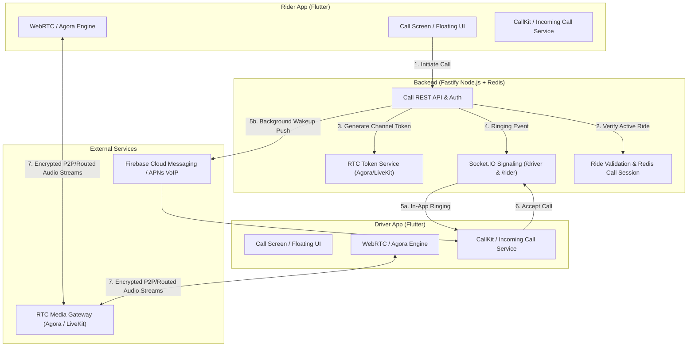
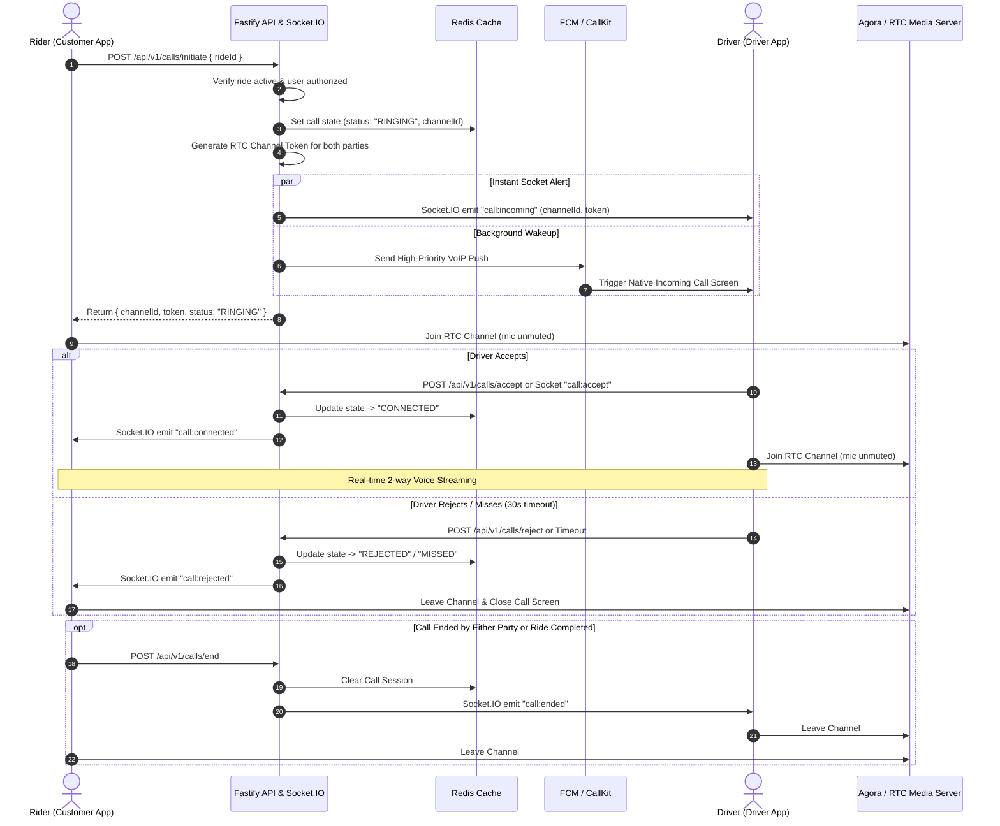

Listed directory ridesharing
Listed directory app
Listed directory ride_share_driver
Listed directory src
Listed directory modules
Listed directory sockets
Viewed index.js:1-60

To implement rider-driver calling in your ridesharing platform, you have two industry-standard approaches depending on your business requirements:

1. **In-App VoIP Calling (Recommended - WebRTC / Agora / LiveKit):**
   - Direct audio call over the internet inside the Flutter apps.
   - 100% privacy (phone numbers never exposed), zero per-minute telecom carrier costs (only minimal WebRTC bandwidth costs), and works internationally.
2. **PSTN Number Masking / Virtual Proxy Calling (Twilio / Exotel / Plivo):**
   - Standard cellular phone calls routed through a temporary proxy phone number.
   - Works when users have no active internet connection, but charges per-minute telecom rates and requires purchasing virtual numbers.

---

### System Architecture (In-App VoIP Calling)



---

### Core Components Breakdown

#### 1. Backend Service (`backend_v2`)
* **Ride Validation**: Verifies that the caller and receiver have an active ride (`ACCEPTED`, `ARRIVING`, `ARRIVED`, `IN_PROGRESS`). Blocks calls if the ride has not started or has already completed.
* **Call Session Management (Redis)**:
  - Tracks call state: `INITIATED`, `RINGING`, `CONNECTED`, `ENDED`, `MISSED`, `REJECTED`.
  - Sets a 30–45 second ringing timeout in Redis.
* **Token Generator**:
  - Generates dynamic, short-lived RTC tokens (e.g., Agora RTC Token / LiveKit Access Token) tied to a unique `channel_id` (e.g., `call_${rideId}_${timestamp}`).
* **Signaling Engine (Socket.IO)**:
  - Uses your existing `/driver` and `/rider` Socket.IO namespaces to pass instant call events:
    - `call:incoming`
    - `call:accepted`
    - `call:rejected`
    - `call:ended`
    - `call:busy`

#### 2. Push Notification & Background Wakeup
* **Why it is needed**: When the driver or rider's screen is locked or the app is in the background, WebSockets might be suspended.
* **Android**: High-priority FCM data message triggering full-screen incoming call notification.
* **iOS**: APNs VoIP Push (PushKit) triggering native **CallKit** (the native iOS calling screen).

#### 3. Flutter Mobile Apps (`ride_share_driver` & `ride_sharing_customer`)
* **`flutter_callkit_incoming`**: Displays native incoming call screen (works even when locked or in background).
* **RTC SDK (`agora_rtc_engine` or `livekit_client`)**: Manages microphone capture, acoustic echo cancellation (AEC), noise suppression, and speakerphone switching.
* **Call Overlay / In-Ride Widget**: Keeps the active call accessible while the driver continues navigating on the map.

---

### Step-by-Step Call Lifecycle



---

### Security, Privacy & Business Rules

1. **Number Masking & Zero Data Leak**: Neither driver nor rider sees each other's phone number. Communication is tied strictly to `channel_id` generated per ride.
2. **Auto-Termination on Ride Completion**: When the driver clicks **"Complete Ride"** or the ride is cancelled, the backend emits `call:ended` to kill any active call sessions immediately.
3. **Rate Limiting**: Prevent spamming call requests (e.g., maximum 3 call attempts per minute).
4. **Call Detail Records (CDR)**: Store call duration, status (answered/missed/rejected), and timestamps in the database for analytics and safety audit.

---

### Technology Stack & Packages Needed

| Layer | Recommended Library / Tool | Purpose |
| :--- | :--- | :--- |
| **Backend RTC Token** | `agora-access-token` / `livekit-server-sdk` | Generates secure channel join tokens |
| **Backend Signaling** | Existing Socket.IO (`/driver`, `/rider`) | Real-time call negotiation events |
| **Flutter Native Calling** | `flutter_callkit_incoming` | Native locked-screen ringing UI (iOS CallKit & Android FullScreenIntent) |
| **Flutter Audio / RTC** | `agora_rtc_engine` or `livekit_client` | Low latency peer audio streaming, echo cancellation |
| **Flutter Permissions** | `permission_handler` | Microphone & notification runtime permissions |

---

### Suggested Next Steps

If you'd like to proceed with implementing this, we can:
1. **Create the Backend Call Module**: Add `backend_v2/src/modules/call/` with call session endpoints, token generation, and socket handlers.
2. **Add Push & Notification Config**: Configure background VoIP/Incoming Call payloads in FCM/APNs.
3. **Implement Flutter Calling UI & Audio Engine**: Integrate CallKit and RTC engine in both `ride_share_driver` and `ride_sharing_customer`.

Let me know if you would like to proceed with **In-App VoIP (Agora/LiveKit)** or **PSTN Virtual Number Masking (Twilio)**, and we can begin the implementation plan!


To implement in-app voice calling between riders and drivers, here is the exact checklist of everything you need:

---

### 1. Third-Party Accounts & Credentials

1. **Agora Account (Recommended for audio streaming)**
   * Sign up at [Agora.io](https://www.agora.io/) (Free tier gives **10,000 free minutes every month**).
   * From Agora Console, get:
     * `AGORA_APP_ID`
     * `AGORA_APP_CERTIFICATE` (Used on the backend to generate secure RTC tokens).
2. **Firebase Cloud Messaging (FCM)**
   * Service Account JSON key (already used in your notification service).
   * Needed to wake up Android devices when the app is in the background or killed.
3. **Apple Developer Account (For iOS apps)**
   * APNs VoIP Certificate (PushKit) to trigger the native iOS incoming call screen when the iPhone is locked.

---

### 2. Backend Requirements (`backend_v2`)

#### A. Packages to Install
```bash
npm install agora-token
```

#### B. Environment Variables (`.env`)
```env
AGORA_APP_ID=your_agora_app_id
AGORA_APP_CERTIFICATE=your_agora_app_certificate
```

#### C. Database Table (`call_logs`)
Create a table in PostgreSQL/Drizzle to track call history:
* `id` (UUID)
* `ride_id` (UUID - references rides)
* `caller_id` (UUID)
* `receiver_id` (UUID)
* `caller_role` ('RIDER' | 'DRIVER')
* `status` ('INITIATED', 'MISSED', 'REJECTED', 'COMPLETED', 'BUSY')
* `duration_seconds` (Integer)
* `started_at`, `ended_at`

#### D. API Endpoints & Sockets to Build
* `POST /api/v1/calls/initiate`: Verifies active ride, creates channel ID, generates Agora token, and alerts receiver.
* `POST /api/v1/calls/accept`: Updates call status to `CONNECTED`.
* `POST /api/v1/calls/reject`: Cancels ringing, notifies caller.
* `POST /api/v1/calls/end`: Ends audio session, logs duration, frees channel.
* Socket.IO events (`call:incoming`, `call:accepted`, `call:rejected`, `call:ended`).

---

### 3. Flutter Apps Requirements (`ride_share_driver` & `ride_sharing_customer`)

#### A. Flutter Packages (`pubspec.yaml`)
Add these dependencies to both driver and customer apps:
```yaml
dependencies:
  agora_rtc_engine: ^6.3.0          # Handles audio streaming, mute, speaker
  flutter_callkit_incoming: ^2.0.4  # Native incoming call screen on lock screen
  permission_handler: ^11.3.0       # Requests microphone permission
```

#### B. Android Configuration (`AndroidManifest.xml`)
Required permissions for background ringing and audio:
```xml
<uses-permission android:name="android.permission.RECORD_AUDIO" />
<uses-permission android:name="android.permission.MODIFY_AUDIO_SETTINGS" />
<uses-permission android:name="android.permission.USE_FULL_SCREEN_INTENT" />
<uses-permission android:name="android.permission.VIBRATE" />
<uses-permission android:name="android.permission.WAKE_LOCK" />
```

#### C. iOS Configuration (`Info.plist` & Capabilities)
1. In `Info.plist`:
   ```xml
   <key>NSMicrophoneUsageDescription</key>
   <string>We need microphone access so you can call your driver/rider.</string>
   ```
2. Enable Xcode Background Modes:
   * **Voice over IP**
   * **Audio, AirPlay, and Picture in Picture**

---

### 4. UI Screens & Components to Build in Flutter

1. **Call Button on Active Ride Screen**:
   * A call icon on the trip sheet (enabled only while ride is active: *Accepted, Arriving, or In Progress*).
2. **Outgoing Call Dialing Screen**:
   * Displays "Calling driver / rider...", timer, and a red "End Call" button.
3. **Incoming Call Native Screen (`flutter_callkit_incoming`)**:
   * Shows driver/rider name with green **Accept** and red **Decline** buttons (works even if phone is locked).
4. **Active In-Call Floating Widget / Bottom Bar**:
   * **Mute / Unmute Microphone** button.
   * **Speakerphone On / Off** toggle.
   * **End Call** button.
   * Allows the driver to keep navigating on the Google Map while speaking hands-free.

---

### Summary of What You Need to Do First:

1. **Create an Agora account** and grab your `App ID` and `App Certificate`.
2. Let me know once you have the credentials, and we can start by setting up the **Backend Call Module (`backend_v2`)** first!