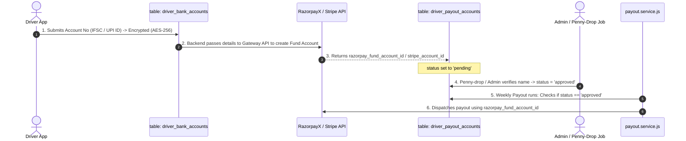

Viewed driver-bank-accounts.js:1-30
Viewed bank-account.service.js:1-65

In **backend_v2**, both tables are part of the driver payout system, but they handle two completely different layers:

* **`driver_bank_accounts`**: Stores the driver’s **raw banking details (PII)** entered in the mobile app (encrypted with AES-256-GCM).
* **`driver_payout_accounts`**: Stores the **payment processor identifier and compliance approval state** (RazorpayX Fund Account ID / Stripe Connect ID).

---

### Comparison Table

| Feature / Responsibility | `driver_bank_accounts` | `driver_payout_accounts` |
| :--- | :--- | :--- |
| **Layer** | **Internal Data Layer** (Driver-facing) | **Payment Gateway & Compliance Layer** (Processor-facing) |
| **Who Enters It?** | The driver (via mobile app during onboarding) | Generated by the backend from Razorpay/Stripe APIs |
| **What Data is Stored?** | • `bankName` • `accountHolderName` • `accountNumberEnc` *(AES-256 encrypted)* • `accountNumberLast4` *(e.g. `1234`)* • `routingCode` *(IFSC / SWIFT)* • `upiId` *(VPA)* | • `gateway` *(`razorpay` or `stripe`)* • `razorpayContactId` • `razorpayFundAccountId` • `razorpayFundAccountType` *(`bank_account` or `vpa`)* • `stripeAccountId` |
| **Security & Compliance** | Strict PII protection. Raw account numbers are envelope-encrypted and never logged or exposed via API. | Tokenized gateway handles. No sensitive bank numbers stored here. |
| **Approval / KYC Gate** | `isVerified: boolean` | `status: 'pending' \| 'approved' \| 'rejected'`, `verifiedBy` (Admin UUID), `verifiedAt`, `rejectionReason` |
| **Used By** | Driver profile screens (to show: *"HDFC Bank ending in 1234"*) | [payout.service.js](file:///c:/Users/SUBRATA%20PRAMANIK/Documents/GitHub/ridesharing/backend_v2/src/modules/payout/payout.service.js) when executing automated weekly batch payouts or instant withdrawals. |

---

### How They Work Together (The Payout Flow)

---

### Why Are They Separated?

1. **Security & Data Isolation (PCI / Banking Regulations):**
   * If a system needs to know *where* to send money, it only needs the tokenized `razorpay_fund_account_id` from `driver_payout_accounts`. It never needs to decrypt the raw `accountNumberEnc`.
2. **Multi-Gateway Support:**
   * In India, RazorpayX uses Contact + Fund Accounts.
   * In North America / Europe, Stripe Connect uses `stripeAccountId` (where Stripe hosts its own bank onboarding).
   * Having `driver_payout_accounts` allows the platform to support different payment processors without altering how driver bank details are captured.
3. **Re-Verification Safety Gate:**
   * If a driver edits their bank account in the app, `driver_bank_accounts` updates the encrypted number, and the linked `driver_payout_accounts` row automatically flips back to `'pending'`. Payouts are safely paused until the new account is verified.