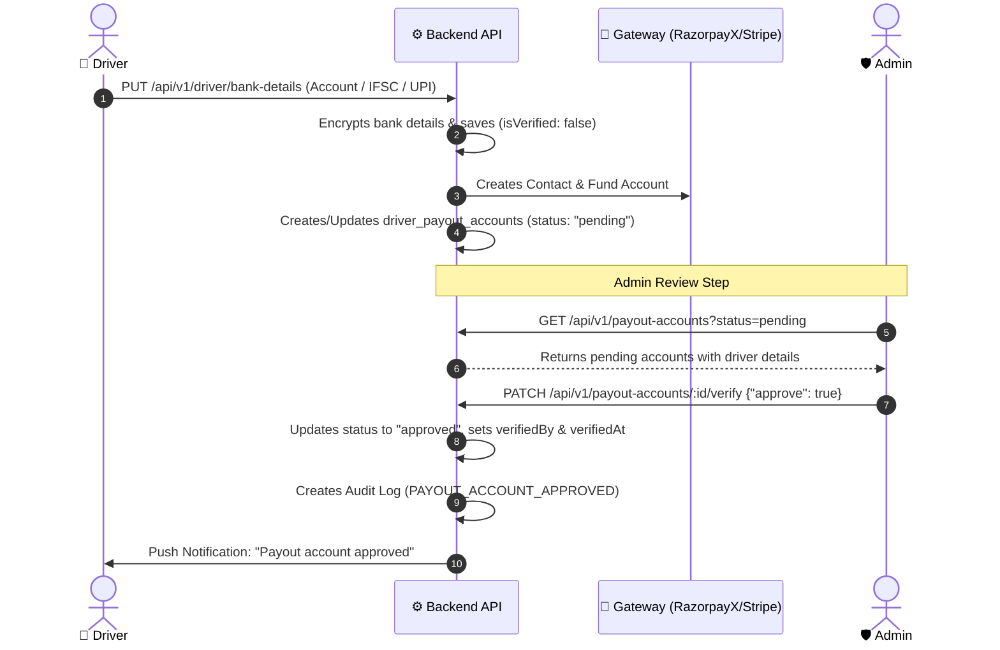
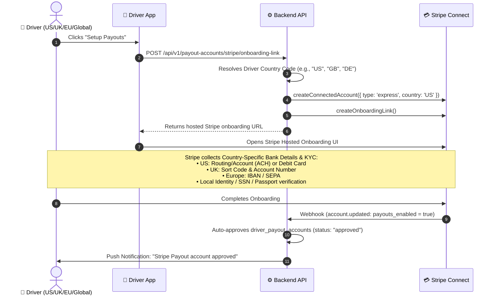

Viewed bank-account.service.js:1-100
Viewed bank-account.routes.js:1-74
Viewed payout-account.routes.js:1-62
Viewed payout-account.service.js:110-134

When a driver adds their bank or UPI details, the status is initially set to **`pending` / `isVerified = false`** for security and fraud prevention. 

Here is the complete lifecycle of how it moves to **`approved` / `verified`**:

---

### 🔄 The Bank Account Verification Flow



---

### 1. 🚖 Step 1: Driver Submits Bank Details
- **Endpoint**: `PUT /api/v1/driver/bank-details`
- **What Happens**:
  1. The bank details (account number, IFSC/routing code, UPI ID) are encrypted and stored in `driver_bank_accounts`.
  2. If Razorpay is configured, a **RazorpayX Contact** and **Fund Account** are created.
  3. A linked record in `driver_payout_accounts` is created with **`status: "pending"`**.

---

### 2. 🛡️ Step 2: Admin Views Pending Payout Accounts
- **Endpoint**: `GET /api/v1/payout-accounts?status=pending`
- **Auth**: Admin (`authenticateAdmin`)
- **Returns**: A paginated list of all driver payout accounts waiting for review, along with:
  - Driver Name, Phone, Email
  - Bank Name & Masked Account (`accountNumberLast4`)
  - UPI ID
  - Current Status (`pending`)

---

### 3. ✅ Step 3: Admin Approves / Verifies the Account
- **Endpoint**: `PATCH /api/v1/payout-accounts/:id/verify`
- **Auth**: Admin (`authenticateAdmin`)
- **Request Body (Approve)**:
  ```json
  {
    "approve": true
  }
  ```
- **Request Body (Reject)**:
  ```json
  {
    "approve": false,
    "rejectionReason": "Invalid IFSC code or name mismatch with Govt ID"
  }
  ```

---

### 4. 🔔 What Happens Upon Approval
When the admin approves the account via [verifyPayoutAccount()](file:///c:/Users/SUBRATA%20PRAMANIK/Documents/GitHub/ridesharing/backend_v2/src/modules/payout-account/payout-account.service.js#L112-L133):
1. `driver_payout_accounts.status` changes to **`"approved"`**.
2. `verifiedBy` (Admin's user ID) and `verifiedAt` (timestamp) are saved.
3. An audit log is published (`TOPICS.AUDIT_LOG`).
4. A push notification is sent to the driver:
   > *"Payout account approved — You can now receive payouts."*
5. The driver can now be included in batch payout runs (`POST /api/v1/payouts/batch/razorpay`).

Viewed payout-account.service.js:110-133


### Short Answer: **NO, you do NOT need real money or real ₹1 in Razorpay Test Mode.**

In Razorpay **Test Mode**, Razorpay **simulates** the entire Penny Drop and UPI validation flow without touching real bank accounts or spending real money.

---

### 🔍 How It Works in Test Mode vs Production

| Feature | 🧪 Razorpay Test Mode | 🚀 Razorpay Live / Production |
| :--- | :--- | :--- |
| **Real Money Deducted?** | ❌ **No** (₹0 spent) | ✅ Yes (₹1 penny drop + Razorpay API fee ~₹1.50) |
| **Real Bank / NPCI Hit?** | ❌ **No** (Simulated mock response) | ✅ Yes (Live IMPS/NPCI network call) |
| **Account Balance Needed?** | ❌ **No** balance needed in RazorpayX | ✅ Must maintain balance in RazorpayX account |
| **Returned Registered Name** | Returns simulated name (e.g. `"Gaurav Kumar"` or the name provided) | Returns actual name registered with the Driver's Bank |
| **API Endpoints Used** | Exact same API endpoint (`/v1/fund_accounts/validations`) | Exact same API endpoint |

---

### 🛠️ How Razorpay Fund Account Validation (Penny Drop) API Works

Whether for a **Bank Account** or a **UPI ID**, Razorpay uses the Fund Account Validation API:

#### 1. API Call:
```http
POST https://api.razorpay.com/v1/fund_accounts/validations
Authorization: Basic <KEY_ID>:<KEY_SECRET>
Content-Type: application/json

{
  "account_number": "7878780080316310", // Platform RazorpayX Account
  "fund_account": {
    "id": "fa_00000000000001"           // The Fund Account created for the driver
  },
  "amount": 100,                        // 100 paise = ₹1.00 (ignored in test mode)
  "currency": "INR",
  "notes": {
    "driverId": "drv_12345"
  }
}
```

#### 2. Response Returned by Razorpay:
```json
{
  "id": "fav_00000000000001",
  "entity": "fund_account.validation",
  "fund_account": {
    "id": "fa_00000000000001",
    "account_type": "bank_account"
  },
  "status": "completed",
  "results": {
    "account_status": "active",
    "registered_name": "SUBRATA PRAMANIK"
  }
}
```

---

### 🧪 Razorpay Test Data to Test Different Scenarios

In Test Mode, you can test both success and failure scenarios using Razorpay's test parameters:

1. **Successful Validation (`active`)**:
   - Use any valid IFSC (e.g., `HDFC0000053`, `SBIN0000001`, `UTIB0000001`) and any 9–18 digit account number.
   - Razorpay returns `results.account_status = "active"` and `results.registered_name`.
2. **Invalid / Blocked Account (`invalid`)**:
   - Razorpay test accounts with specific numbers simulate failures so you can test error handling and admin rejections.

---

### 💡 Recommendation for Your Backend

When you integrate this feature into your codebase:
1. **In Test / Dev mode**: You can trigger the Razorpay API directly using your test keys, or let the service mock the response if `RAZORPAY_KEY_ID` is not yet configured.
2. **Fuzzy Name Matching**: Compare `results.registered_name` with `driver.name`. If the match score is high ($\ge 80\%$), automatically set `driver_payout_accounts.status = 'approved'`. Otherwise, leave it as `'pending'` for admin review.


Viewed stripe.gateway.js:1-100
Viewed stripe.gateway.js:130-215

For drivers **outside India** (such as USA, UK, Europe, Canada, Australia, etc.), the backend uses **Stripe Connect Express**. 

Unlike India (where the backend collects raw account numbers and calls Razorpay Penny Drop), Stripe provides a **fully-hosted, compliant global KYC & bank verification architecture**.

---

### 🌐 How Stripe Connect Works for International Drivers



---

### 🔍 Key Capabilities for International Drivers

#### 1. 🛡️ Zero PCI/PII Liability on Your Servers
- Your backend **never touches or stores raw international bank account numbers, IBANs, or SSNs**.
- Stripe securely stores and tokenizes all banking data according to local financial regulations.

#### 2. 🌍 Localized Bank Rails for Every Country
When the driver opens the onboarding link, Stripe automatically adapts to their country:
| Country / Region | Local Bank Rail Supported | Verification Method |
| :--- | :--- | :--- |
| **United States (US)** | ACH (Routing + Account) / Instant Debit Card | Instant Bank Login (Plaid/Financial Connections) or Micro-deposits |
| **United Kingdom (UK)** | BACS / Faster Payments (Sort code + Account) | UK Bank verification |
| **European Union (EU)** | SEPA (IBAN + BIC) | European banking verification |
| **Canada (CA)** | EFT (Transit + Institution + Account) | Canadian clearing verification |
| **Australia (AU)** | BECS (BSB + Account Number) | Australian banking verification |

#### 3. 🧪 Stripe Test Mode for Global Testing
In Stripe **Test Mode**:
- You can test any country (e.g. `country: "US"`, `country: "GB"`).
- Stripe provides **pre-filled test bank accounts** and a **"Use test info"** button on the hosted onboarding page.
- Clicking "Complete" in Stripe test mode instantly sends the `account.updated` webhook (`payouts_enabled = true`) to your backend and **auto-approves** the driver account.

---

### 💵 How Payouts Are Dispatched
When you run automated or batch payouts for international drivers:
- **Endpoint**: `POST /api/v1/payouts/batch/stripe`
- **Method**: The backend executes `client.transfers.create({ destination: stripeAccountId, amount, currency })`.
- Stripe automatically converts/settles the funds directly into the driver's local currency and deposits it into their linked bank account.

### Short Answer: **NO, you do not need any additional code changes for Stripe.**

Everything needed for Stripe Connect onboarding, bank verification, webhook handling, and payouts is **already implemented and wired up in your backend**.

---

### ✅ What is Already Implemented in Your Backend

1. **Stripe Connect Express Onboarding** ([`payout-account.service.js`](file:///c:/Users/SUBRATA%20PRAMANIK/Documents/GitHub/ridesharing/backend_v2/src/modules/payout-account/payout-account.service.js)):
   - `POST /api/v1/payout-accounts/stripe/onboarding-link` creates the Stripe connected account and generates the hosted KYC/bank link.
2. **Auto-Approval on Webhook** ([`payout-account.service.js:L62-L86`](file:///c:/Users/SUBRATA%20PRAMANIK/Documents/GitHub/ridesharing/backend_v2/src/modules/payout-account/payout-account.service.js#L62-L86)):
   - When Stripe completes the driver's bank/identity verification, `POST /api/v1/payout-accounts/webhook/stripe` automatically updates `driver_payout_accounts.status = 'approved'`, logs an audit event, and sends a push notification.
3. **Automated Batch Payouts** ([`payout.service.js`](file:///c:/Users/SUBRATA%20PRAMANIK/Documents/GitHub/ridesharing/backend_v2/src/modules/payout/payout.service.js)):
   - `POST /api/v1/payouts/batch/stripe` automatically transfers earnings directly to the driver's connected account.

---

### ⚙️ What You Need to Configure (Environment Only)

To test or go live with Stripe, you only need to ensure these environment variables are set in your `.env` file:

```env
# Stripe Configuration (Test or Live)
STRIPE_SECRET_KEY=sk_test_...
STRIPE_PUBLISHABLE_KEY=pk_test_...
STRIPE_WEBHOOK_SECRET=whsec_...
STRIPE_CONNECT_WEBHOOK_SECRET=whsec_...

# Optional Driver App redirect URLs after Stripe onboarding completes
DRIVER_APP_ONBOARDING_RETURN_URL=https://your-domain.com/stripe/onboarding-return
DRIVER_APP_ONBOARDING_REFRESH_URL=https://your-domain.com/stripe/onboarding-refresh
```

### 📱 How the Mobile App Uses It
1. Driver taps **"Setup Payouts"** in the driver app.
2. App calls `POST /api/v1/payout-accounts/stripe/onboarding-link`.
3. App opens the returned `url` in an in-app browser / Custom Tab.
4. When the driver completes the setup, Stripe sends the webhook and the driver's payout account becomes **`approved`** automatically.