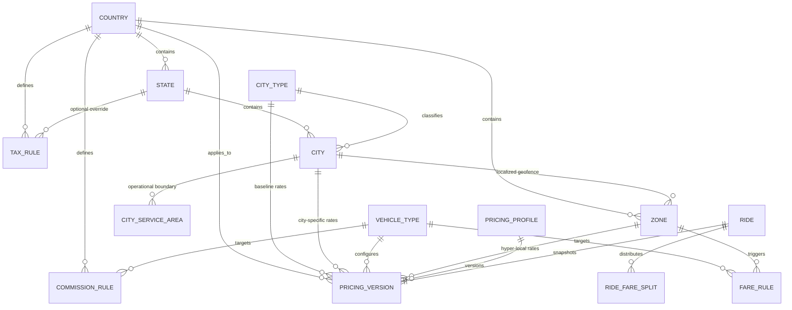
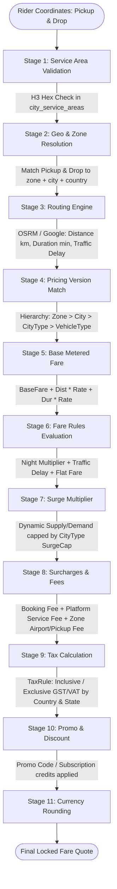
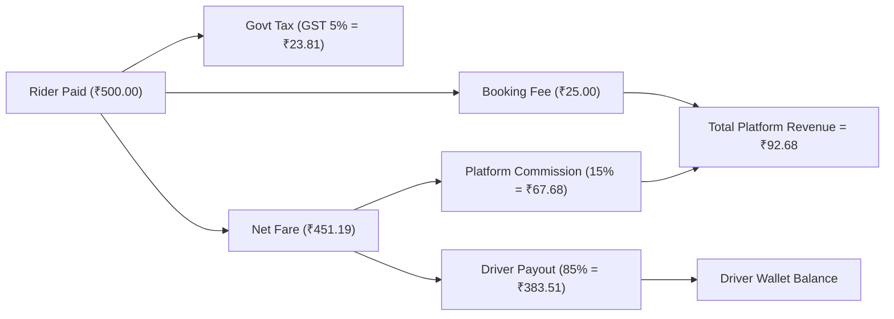

Searched for "calculateFare"
Viewed fare.service.js:1-43
Viewed fare.engine.js:1-78
Searched for "commissionRules"
Viewed commission.service.js:1-60
Viewed pricing-versions.js:1-34
Viewed tax-rules.js:1-20

Below is the **Architecture, Entity Relationship, and Lifecycle Cost Flow** showing how `city`, `city_type`, `city_service_area`, `zone`, `fare_rules`, `tax_rules`, `commission_rules`, and `pricing_versions` interact.

---

### 1. Entity Relationship (ER) Diagram

---

### 2. The 11-Stage Fare Calculation Pipeline

When a rider searches for a cab or confirms a booking, the **`FareEngine`** executes in this exact sequence:

---

### 3. Core Component Roles & Relationships

| Entity | Purpose & Core Responsibility | Relation to Fare & Cost |
| :--- | :--- | :--- |
| **`country`** | Global root setting currency code, dial code, and default `roundingIncrementMinor`. | Determines monetary precision and default pricing fallback. |
| **`state`** | Provincial division between country and cities. | Allows state-level tax stacking (e.g. SGST + CGST, HST/PST). |
| **`city_type`** | Economic tiers (e.g. `TIER_1_METRO`, `TIER_2`, `RURAL`). | Sets **`costIndex` multiplier**, **`defaultSurgeCap`** (e.g. max 3.0x), and whether waiting fees apply. |
| **`city_service_area`** | GeoJSON polygon + H3 hex cells defining where the app legally operates. | **Gatekeeper**: If pickup or drop is outside active service boundaries, rides are blocked before calculation. |
| **`zone`** | High-demand/special geofences (e.g. *Airport*, *Tech Park*, *Downtown*). | Injects localized **`multiplier`** and fixed surcharges (**`airportFeeMinor`**, **`pickupFeeMinor`**, **`dropoffFeeMinor`**). |
| **`pricing_version`** | Versioned rate card containing `baseFareMinor`, `perKmRateMinor`, `perMinRateMinor`, `minFareMinor`, `bookingFeeMinor`, `serviceFeeMinor`. | Defines the foundational distance/time pricing curve for any combination of Vehicle + City + Zone. |
| **`fare_rules`** | Dynamic contextual multipliers (`time`, `traffic`, `zone`). | Handles night-time surcharges (e.g. 1.25x between 23:00–05:00) and traffic congestion delays. |
| **`tax_rules`** | Government tax rates (`rate`, `isInclusive`, `appliesTo`). | Computes GST/VAT on the fare or booking fee, stacked by Country and State. |
| **`commission_rules`** | Revenue sharing split (`subscriberRate`, `nonSubscriberRate`, `bookingFeeMinor`). | Splits the completed ride payment between **Platform Revenue** and **Driver Wallet Payout**. |

---

### 4. Mathematical Cost Flow Equation

$$\text{Metered Fare} = \max\Big(\text{BaseFare} + (\text{Distance}_{\text{km}} \times \text{PerKmRate}) + (\text{Duration}_{\text{min}} \times \text{PerMinRate}),\; \text{MinFare}\Big)$$

$$\text{Subtotal} = \text{Metered Fare} \times \text{ZoneMultiplier} \times \text{FareRuleMultiplier} \times \min(\text{Surge}, \text{CityTypeSurgeCap})$$

$$\text{Pre-Tax Fare} = \text{Subtotal} + \text{BookingFee} + \text{ServiceFee} + \text{AirportFee} + \text{PickupFee} + \text{DropoffFee}$$

$$\text{Gross Fare} = \text{Pre-Tax Fare} + \sum \text{Taxes} - \text{PromoDiscount}$$

$$\text{Final Fare} = \text{Round}(\text{Gross Fare}, \text{CountryRoundingIncrement})$$

---

### 5. Post-Trip Commission & Driver Earnings Split

When the trip ends and payment is settled:

1. **Booking Fee** is deducted off the top to the platform.
2. **Commission Rate** (e.g. `15%` for regular drivers, `0%` or `5%` for subscribed drivers) applies to the remaining balance.
3. **Driver Wallet** is credited immediately with Driver Net Earnings.