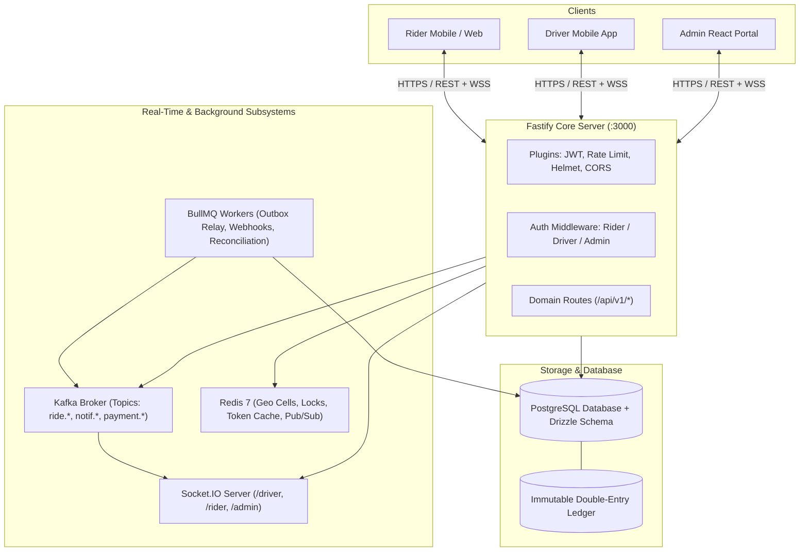
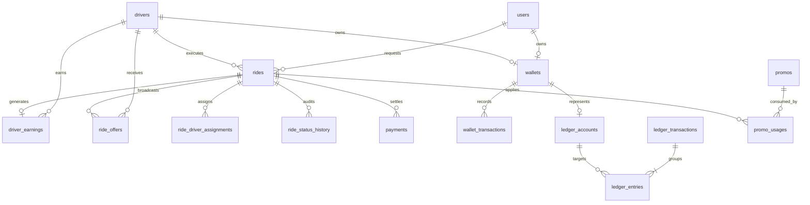
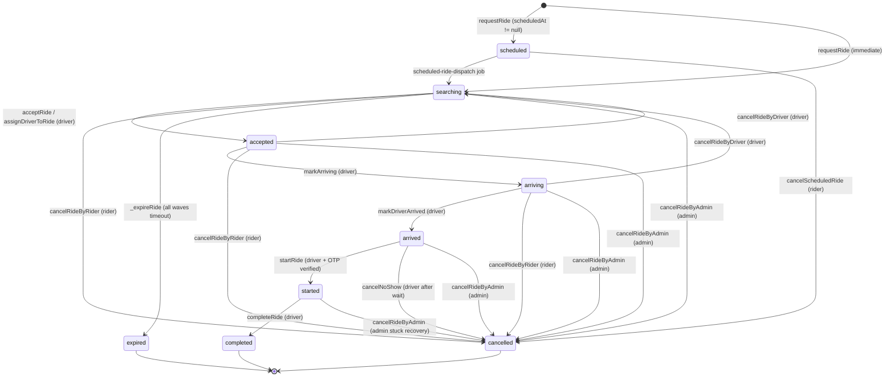
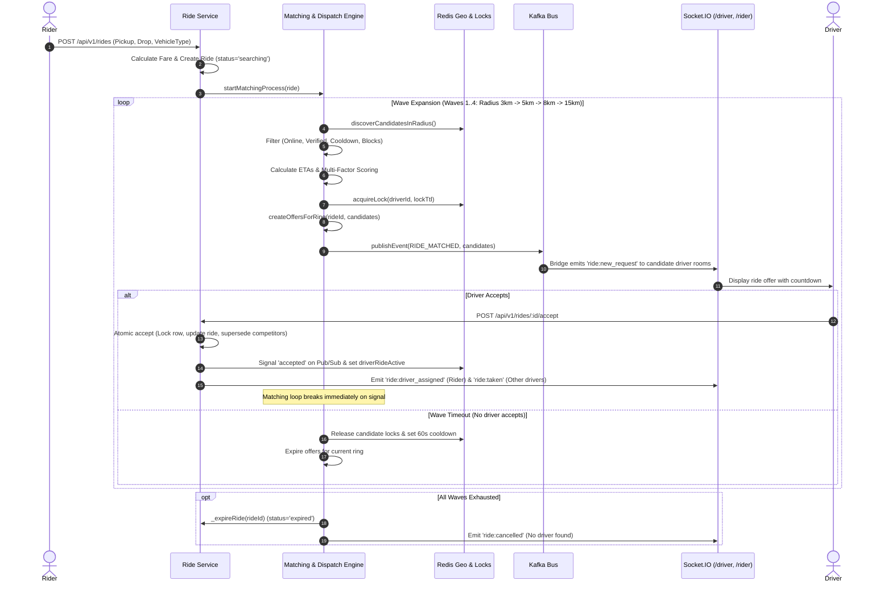
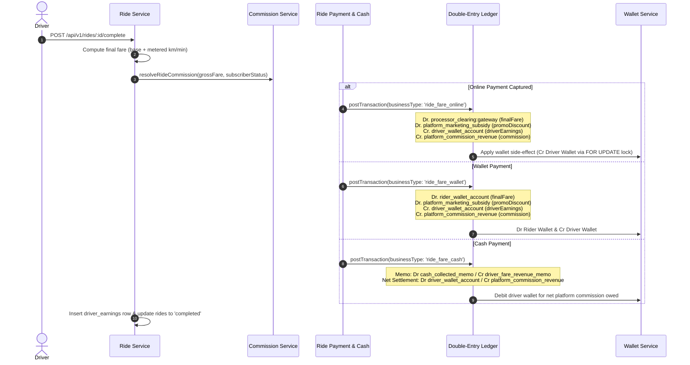

Listed directory ridesharing
Viewed CLAUDE.md:1-102
Listed directory backend_v2
Listed directory backend
Listed directory schema
Listed directory src
Listed directory modules
Listed directory config
Viewed server.js:1-195
Listed directory ride
Viewed ride.routes.js:1-254
Viewed ride.service.js:1-150
Viewed ride.service.js:151-350
Viewed ride.service.js:351-550
Viewed ride_offer.service.js:1-191
Viewed ride.service.js:551-850
Viewed ride.service.js:851-1050
Viewed ride-payment.service.js:1-739
Viewed ledger.service.js:1-250
Viewed wallet.service.js:1-451
Listed directory matching
Viewed matching.service.js:1-250
Viewed matching.service.js:251-386
Viewed dispatch-wave.service.js:1-199
Viewed assignment.service.js:1-233
Viewed fare.service.js:1-43
Listed directory fare
Listed directory engine
Viewed fare.engine.js:1-78
Viewed promo.service.js:1-250
Viewed promo-usages.js:1-14
Viewed rides.js:1-63
Viewed ride_offers.js:1-47
Viewed payments.js:1-33
Viewed ledger-accounts.js:1-24
Viewed ledger-transactions.js:1-17
Viewed ledger-entries.js:1-19
Viewed authenticate.js:1-47
Viewed kafka.js:1-64
Viewed index.js:1-321
Viewed index.js:1-430
Listed directory jobs
Viewed outbox-relay.job.js:1-131
Searched for "enqueueEvent"
Viewed auth.service.js:1-200
Viewed admin.routes.js:1-101
Listed directory test

# Complete Architectural & Engineering Audit: RideShare Platform

---

## 1. SYSTEM OVERVIEW

The application is structured as a **modular backend system** built on **Node.js, Fastify, Drizzle ORM (PostgreSQL), Redis, Apache Kafka, Socket.IO, and BullMQ**.

### Core Architecture Characteristics
1. **Application Framework**: Fastify with structured domain modules ([`src/modules/*`](file:///c:/Users/SUBRATA%20PRAMANIK/Documents/GitHub/ridesharing/backend_v2/src/modules)), unified JSON response envelopes ([`src/utils/response.js`](file:///c:/Users/SUBRATA%20PRAMANIK/Documents/GitHub/ridesharing/backend_v2/src/utils/response.js)), and `@fastify/jwt` authentication.
2. **Persistence Layer**: PostgreSQL with Drizzle ORM ([`drizzle/schema/*`](file:///c:/Users/SUBRATA%20PRAMANIK/Documents/GitHub/ridesharing/backend_v2/drizzle/schema/index.js)) defining 100 domain tables and relations.
3. **Real-Time Layer**: Socket.IO namespaces (`/driver`, `/rider`, `/admin`) attached to Fastify's HTTP server instance ([`src/sockets/index.js`](file:///c:/Users/SUBRATA%20PRAMANIK/Documents/GitHub/ridesharing/backend_v2/src/sockets/index.js)).
4. **Event Bus & Queues**: KafkaJS for decoupled domain events ([`src/config/kafka.js`](file:///c:/Users/SUBRATA%20PRAMANIK/Documents/GitHub/ridesharing/backend_v2/src/config/kafka.js)) and BullMQ for scheduled/background jobs ([`src/jobs/*`](file:///c:/Users/SUBRATA%20PRAMANIK/Documents/GitHub/ridesharing/backend_v2/src/jobs/index.js)).
5. **State Caching & Locking**: Redis 7 managing driver geospatial availability index, per-driver offer locks, active ride sessions, rate limiting, and pub/sub signaling.

---

## 2. MODULE MAP

| Module | Primary Responsibility | Key Files | Core Flow Status |
| :--- | :--- | :--- | :--- |
| **Auth & Users** | Rider OTP, Driver mobile auth & device sessions, Admin auth, JWT issuance | [`auth.routes.js`](file:///c:/Users/SUBRATA%20PRAMANIK/Documents/GitHub/ridesharing/backend_v2/src/modules/auth/auth.routes.js), [`auth.service.js`](file:///c:/Users/SUBRATA%20PRAMANIK/Documents/GitHub/ridesharing/backend_v2/src/modules/auth/auth.service.js) | **Active (P0)** |
| **Ride Lifecycle** | Ride request, state transitions, ratings, cancellation, receipts | [`ride.routes.js`](file:///c:/Users/SUBRATA%20PRAMANIK/Documents/GitHub/ridesharing/backend_v2/src/modules/ride/ride.routes.js), [`ride.service.js`](file:///c:/Users/SUBRATA%20PRAMANIK/Documents/GitHub/ridesharing/backend_v2/src/modules/ride/ride.service.js) | **Active (P0)** |
| **Matching & Dispatch** | Spatial discovery, candidate filtering, scoring, wave dispatch, driver assignment | [`matching.service.js`](file:///c:/Users/SUBRATA%20PRAMANIK/Documents/GitHub/ridesharing/backend_v2/src/modules/matching/matching.service.js), [`dispatch-wave.service.js`](file:///c:/Users/SUBRATA%20PRAMANIK/Documents/GitHub/ridesharing/backend_v2/src/modules/matching/dispatch-wave.service.js), [`assignment.service.js`](file:///c:/Users/SUBRATA%20PRAMANIK/Documents/GitHub/ridesharing/backend_v2/src/modules/matching/assignment.service.js) | **Active (P0)** |
| **Fare Engine** | 11-stage fare pipeline (base, metered distance/time, surge, promo, tax, rounding) | [`fare.engine.js`](file:///c:/Users/SUBRATA%20PRAMANIK/Documents/GitHub/ridesharing/backend_v2/src/modules/fare/engine/fare.engine.js), [`fare.service.js`](file:///c:/Users/SUBRATA%20PRAMANIK/Documents/GitHub/ridesharing/backend_v2/src/modules/fare/fare.service.js) | **Active (P1)** |
| **Payments & Cash** | Payment orders, webhook verification, cash collection auditing, allocations | [`ride-payment.service.js`](file:///c:/Users/SUBRATA%20PRAMANIK/Documents/GitHub/ridesharing/backend_v2/src/modules/ride-payment/ride-payment.service.js), [`payment.service.js`](file:///c:/Users/SUBRATA%20PRAMANIK/Documents/GitHub/ridesharing/backend_v2/src/modules/payment/payment.service.js), [`cash.service.js`](file:///c:/Users/SUBRATA%20PRAMANIK/Documents/GitHub/ridesharing/backend_v2/src/modules/cash/cash.service.js) | **Active (P1)** |
| **Wallet** | Rider & driver wallets, top-ups, withdrawal requests, admin adjustments | [`wallet.routes.js`](file:///c:/Users/SUBRATA%20PRAMANIK/Documents/GitHub/ridesharing/backend_v2/src/modules/wallet/wallet.routes.js), [`wallet.service.js`](file:///c:/Users/SUBRATA%20PRAMANIK/Documents/GitHub/ridesharing/backend_v2/src/modules/wallet/wallet.service.js) | **Active (P1)** |
| **Ledger (Accounting)** | Universal double-entry journal, chart of accounts, balance invariants | [`ledger.routes.js`](file:///c:/Users/SUBRATA%20PRAMANIK/Documents/GitHub/ridesharing/backend_v2/src/modules/ledger/ledger.routes.js), [`ledger.service.js`](file:///c:/Users/SUBRATA%20PRAMANIK/Documents/GitHub/ridesharing/backend_v2/src/modules/ledger/ledger.service.js) | **Active (P1)** |
| **Promos & Referrals** | Coupon validation, usage quotas, referral codes and onboarding rewards | [`promo.routes.js`](file:///c:/Users/SUBRATA%20PRAMANIK/Documents/GitHub/ridesharing/backend_v2/src/modules/promo/promo.routes.js), [`promo.service.js`](file:///c:/Users/SUBRATA%20PRAMANIK/Documents/GitHub/ridesharing/backend_v2/src/modules/promo/promo.service.js) | **Active (P1)** |
| **Commission & Earnings** | Resolution of commission rules, driver gross/net earnings, platform subsidy | [`commission.service.js`](file:///c:/Users/SUBRATA%20PRAMANIK/Documents/GitHub/ridesharing/backend_v2/src/modules/commission/commission.service.js) | **Active (P1)** |
| **Notifications** | Push (FCM), SMS (Twilio), Email delivery, multi-channel templates | [`notification.service.js`](file:///c:/Users/SUBRATA%20PRAMANIK/Documents/GitHub/ridesharing/backend_v2/src/modules/notification/notification.service.js), [`notification-events.js`](file:///c:/Users/SUBRATA%20PRAMANIK/Documents/GitHub/ridesharing/backend_v2/src/modules/notification/notification-events.js) | **Active (P2)** |
| **Tracking & GPS** | Driver approach and on-trip location routing, live coordinates via Redis/Sockets | [`tracking.service.js`](file:///c:/Users/SUBRATA%20PRAMANIK/Documents/GitHub/ridesharing/backend_v2/src/modules/tracking/tracking.service.js), [`gps-ping.service.js`](file:///c:/Users/SUBRATA%20PRAMANIK/Documents/GitHub/ridesharing/backend_v2/src/modules/trip-gps/gps-ping.service.js) | **Active (P2)** |
| **Subscriptions** | Driver zero-commission subscriptions, plan management, gateway billing | [`subscription.routes.js`](file:///c:/Users/SUBRATA%20PRAMANIK/Documents/GitHub/ridesharing/backend_v2/src/modules/subscription/subscription.routes.js), [`subscription.service.js`](file:///c:/Users/SUBRATA%20PRAMANIK/Documents/GitHub/ridesharing/backend_v2/src/modules/subscription/subscription.service.js) | **Active (P3)** |
| **Driver Onboarding & Docs** | Multi-step dynamic questionnaires, document uploads, admin approvals | [`onboarding.service.js`](file:///c:/Users/SUBRATA%20PRAMANIK/Documents/GitHub/ridesharing/backend_v2/src/modules/onboarding/onboarding.service.js), [`documents.service.js`](file:///c:/Users/SUBRATA%20PRAMANIK/Documents/GitHub/ridesharing/backend_v2/src/modules/documents/documents.service.js) | **Active (P0)** |
| **Payouts & Accounts** | Driver bank details, payout batch aggregation, transfer triggers | [`payout.routes.js`](file:///c:/Users/SUBRATA%20PRAMANIK/Documents/GitHub/ridesharing/backend_v2/src/modules/payout/payout.routes.js), [`payout.service.js`](file:///c:/Users/SUBRATA%20PRAMANIK/Documents/GitHub/ridesharing/backend_v2/src/modules/payout/payout.service.js) | **Active (P1)** |
| **Auxiliary Modules** | Disputes, SOS/Emergency, Saved Places, Moderation, Lost Items, Airport Queues | Various under [`src/modules/*`](file:///c:/Users/SUBRATA%20PRAMANIK/Documents/GitHub/ridesharing/backend_v2/src/modules) | **Partially Implemented (P3)** |

---

## 3. DATABASE MAP

### Table Relationships and Integrity Audit
1. **Core Ride Entities**:
   - `rides`: Central aggregate table linking `rider_id` (users), `driver_id` (drivers), `vehicle_type_id`, `country_id`.
   - `ride_offers`: Broadcast audit tracking offer deliveries to drivers per ring/wave. Foreign keys to `rides` and `drivers`.
   - `ride_driver_assignments`: Record of finalized assignment.
   - `ride_status_history`: Immutable status transitions timeline.
2. **Financial & Accounting Subsystem**:
   - `payments`: Records gateway attempts and captured payments linked to `ride_id` or `wallet_id`.
   - `wallets`: Stores current scalar balance (`balance_minor`), linked 1:1 with `users` or `drivers`.
   - `wallet_transactions`: Audit log of wallet movements.
   - `ledger_accounts`: Chart of accounts with unique `(code, currency_code)` constraint or `wallet_id` mapping.
   - `ledger_transactions`: Journal transaction grouping balanced entries with unique `idempotency_key`.
   - `ledger_entries`: Append-only debit and credit legs.
   - `driver_earnings`: Driver take-home net fare, gross fare, platform commission, tips, and settlement status.
3. **Discount & Campaign Subsystem**:
   - `promos`: Configuration rules (percentage, flat amount, max discount, global quota, user quota).
   - `promo_usages`: Tracking table of promo applications per ride and user.

---

## 4. RIDE LIFECYCLE (STATE MACHINE)

### Transition Rule Audit Matrix

| Transition | Initiator | Validation & Atomicity | Invariant Guarantee |
| :--- | :--- | :--- | :--- |
| `[*] -> searching` | Rider | Checks no active ongoing ride (`accepted`, `arriving`, `arrived`, `started`). | Max 1 active ride per rider. |
| `searching -> accepted` | Driver | Checks driver availability, checks offer validity, assigns row atomically. | **Only 1 driver can win assignment.** |
| `accepted -> arriving` | Driver | Verifies current status is `accepted` and caller is assigned `driver_id`. | Valid driver progression. |
| `arriving -> arrived` | Driver | Verifies current status is `accepted` or `arriving` and caller is assigned driver. | Starts waiting timer. |
| `arrived -> started` | Driver | Requires caller to submit 4-digit `startOtp` matching `rides.startOtp`. | Confirms physical passenger boarding. |
| `started -> completed` | Driver | Verifies ride status is `started` and caller is assigned driver. Recalculates final fare based on actual duration. | Finalizes fare and triggers financial settlements. |
| `* -> cancelled` | Rider / Driver / Admin | Restricts rider cancellation to `searching`, `accepted`, `arriving`. Driver cancellation resets ride to `searching` for rematch. | Finished/started trips cannot be cancelled by rider. |

---

## 5. DRIVER DISPATCH FLOW

---

## 6. FINANCIAL FLOW

---

## 7. CRITICAL FINDINGS (AUDIT TABLE)

| Severity | Module | File | Problem | Why | Fix |
| :---: | :--- | :--- | :--- | :--- | :--- |
| **P0** | **Ride** | [`ride.service.js:460-488`](file:///c:/Users/SUBRATA%20PRAMANIK/Documents/GitHub/ridesharing/backend_v2/src/modules/ride/ride.service.js#L460-L488) | `acceptRide` is executed outside a DB transaction; offers and rides table updates are non-atomic. | Two concurrent drivers accepting simultaneously can both pass `acceptOffer`, leading to dual accepted offers or race conditions. | Wrap in `db.transaction`, acquire PostgreSQL `FOR UPDATE` row locks on both `rides` and `drivers`, or route directly to [`assignment.service.js:assignDriverToRide`](file:///c:/Users/SUBRATA%20PRAMANIK/Documents/GitHub/ridesharing/backend_v2/src/modules/matching/assignment.service.js#L46). |
| **P0** | **Matching** | [`matching.service.js:183`](file:///c:/Users/SUBRATA%20PRAMANIK/Documents/GitHub/ridesharing/backend_v2/src/modules/matching/matching.service.js#L183) | `ReferenceError: dispatchJobId is not defined` when updating `dispatchJobs` if ride state changes before wave starts. | Code references undeclared variable `dispatchJobId` instead of `dispatchJob.id` (destructured at L111). Throws uncaught exception and crashes matching pipeline. | Replace `dispatchJobId` with `dispatchJob.id`. |
| **P0** | **Matching** | [`dispatch-wave.service.js:71-78`](file:///c:/Users/SUBRATA%20PRAMANIK/Documents/GitHub/ridesharing/backend_v2/src/modules/matching/dispatch-wave.service.js#L71-L78) | Memory leak and dangling event listeners in `waitForAcceptanceSignal`. | `redisSub.on('message', ...)` listener is registered on every wave of every ride but never removed upon resolution or timeout. Exceeds MaxListeners and leaks memory under load. | Use `redisSub.once` or explicitly call `redisSub.removeListener('message', handler)` upon timeout/settlement. |
| **P0** | **Promo** | [`promo-usages.js`](file:///c:/Users/SUBRATA%20PRAMANIK/Documents/GitHub/ridesharing/backend_v2/drizzle/schema/promo-usages.js), [`promo.service.js:182`](file:///c:/Users/SUBRATA%20PRAMANIK/Documents/GitHub/ridesharing/backend_v2/src/modules/promo/promo.service.js#L182) | Missing unique constraint on `promo_usages (promo_id, ride_id)`. | Retrying ride completion or settlement can insert duplicate `promo_usages` and double-increment `promos.usedCount`. | Add unique composite index on `(promo_id, ride_id)` and use `onConflictDoNothing` on insert. |
| **P1** | **Database** | [`drizzle/schema/rides.js`](file:///c:/Users/SUBRATA%20PRAMANIK/Documents/GitHub/ridesharing/backend_v2/drizzle/schema/rides.js), [`drizzle/schema/ride_offers.js`](file:///c:/Users/SUBRATA%20PRAMANIK/Documents/GitHub/ridesharing/backend_v2/drizzle/schema/ride_offers.js), [`drizzle/schema/payments.js`](file:///c:/Users/SUBRATA%20PRAMANIK/Documents/GitHub/ridesharing/backend_v2/drizzle/schema/payments.js) | Critical tables lack database indexes on query filtering columns (`status`, `rider_id`, `driver_id`, `created_at`). | High-traffic queries (`WHERE rider_id = ? AND status IN (...)`, `WHERE driver_id = ?`) perform sequential table scans, degrading DB performance as rows grow. | Add composite indexes: `(rider_id, status)`, `(driver_id, status)`, `(ride_id, status)`, `(status, created_at)`. |
| **P1** | **Outbox** | [`ride.service.js`](file:///c:/Users/SUBRATA%20PRAMANIK/Documents/GitHub/ridesharing/backend_v2/src/modules/ride/ride.service.js), [`ride-payment.service.js`](file:///c:/Users/SUBRATA%20PRAMANIK/Documents/GitHub/ridesharing/backend_v2/src/modules/ride-payment/ride-payment.service.js) | Direct `publishEvent()` calls across ride lifecycle and payment flows bypass transactional outbox. | If Kafka is temporarily unreachable during DB write, the business event is lost, leaving notifications/sockets out of sync. | Enqueue events via `outboxEvents` table inside the database transaction so domain state and event emission are atomic. |
| **P1** | **Auth** | [`auth.service.js:38-55`](file:///c:/Users/SUBRATA%20PRAMANIK/Documents/GitHub/ridesharing/backend_v2/src/modules/auth/auth.service.js#L38-L55) | Suffix phone lookup `like(drivers.phone, '%...' + last10)` in `findDriverByPhone`. | 1) Leading `%` causes full-table scans. 2) Two drivers in different countries with identical last-10 digits can collide, authenticating the wrong driver. | Enforce strict E.164 phone normalization across all inputs and rely only on exact `phone = normalizedPhone` queries. |
| **P1** | **Sockets** | [`sockets/index.js:318-322`](file:///c:/Users/SUBRATA%20PRAMANIK/Documents/GitHub/ridesharing/backend_v2/src/sockets/index.js#L318-L322) | In dev mode, unauthenticated `/admin` socket connections are automatically granted admin access (`admin-local`). | Exposing the dev server or running tests on local network allows any client to connect to `/admin` and join `admin:dashboard`. | Require valid JWT even in non-production, or gate strictly behind explicit test mocks. |
| **P2** | **Tracking** | [`ride.service.js:826-848`](file:///c:/Users/SUBRATA%20PRAMANIK/Documents/GitHub/ridesharing/backend_v2/src/modules/ride/ride.service.js#L826-L848) | Fare recalculation on completion uses server clock time delta rather than verified GPS timestamps or distance. | If driver's device loses connection or delays completion API call, elapsed time continues ticking, inflating the passenger's metered time charge. | Cap elapsed duration against GPS ping timestamps or maximum estimated route duration tolerance. |

---

## 8. CONCURRENCY RISKS

1. **Dual Driver Acceptance Race Condition**:
   - *Scenario*: Two drivers receive offers for the same ride in Wave 1. Driver A and Driver B submit acceptance simultaneously.
   - *Current Risk*: In [`ride.service.js:460-488`](file:///c:/Users/SUBRATA%20PRAMANIK/Documents/GitHub/ridesharing/backend_v2/src/modules/ride/ride.service.js#L460-L488), `acceptOffer()` is invoked without a surrounding DB transaction or row lock.
   - *Fix*: Route all acceptances through [`assignment.service.js:assignDriverToRide`](file:///c:/Users/SUBRATA%20PRAMANIK/Documents/GitHub/ridesharing/backend_v2/src/modules/matching/assignment.service.js#L46) which executes `SELECT ... FOR UPDATE` on `rides` and `drivers` inside an atomic transaction.
2. **Concurrent Wallet Debits / Double Spend**:
   - *Scenario*: Rider has 500 minor units. Two simultaneous requests attempt to spend 400 minor units each.
   - *Status*: The ledger service ([`ledger.service.js:169`](file:///c:/Users/SUBRATA%20PRAMANIK/Documents/GitHub/ridesharing/backend_v2/src/modules/ledger/ledger.service.js#L169)) correctly acquires `tx.select().from(wallets)...for('update')` and checks `balanceMinor + delta >= 0`. This is concurrency-safe.
3. **Concurrent Promo Redemptions**:
   - *Scenario*: Rider applies the same promo code across two concurrent ride bookings.
   - *Current Risk*: `promo_usages` check in [`promo.service.js:81`](file:///c:/Users/SUBRATA%20PRAMANIK/Documents/GitHub/ridesharing/backend_v2/src/modules/promo/promo.service.js#L81) is a read before insert without a unique constraint.
   - *Fix*: Add a unique database constraint on `promo_usages(promo_id, ride_id)` and lock the user's active ride during booking.

---

## 9. DATA INTEGRITY RISKS

1. **Missing Database Indexes**:
   - Tables [`rides`](file:///c:/Users/SUBRATA%20PRAMANIK/Documents/GitHub/ridesharing/backend_v2/drizzle/schema/rides.js), [`ride_offers`](file:///c:/Users/SUBRATA%20PRAMANIK/Documents/GitHub/ridesharing/backend_v2/drizzle/schema/ride_offers.js), and [`payments`](file:///c:/Users/SUBRATA%20PRAMANIK/Documents/GitHub/ridesharing/backend_v2/drizzle/schema/payments.js) have foreign keys declared but lack corresponding B-tree indexes on foreign key and status columns.
   - In PostgreSQL, foreign keys without indexes cause full-table locks during cascaded checks or slow lookups.
2. **Referential Integrity for Ride Passengers**:
   - [`ride_passengers`](file:///c:/Users/SUBRATA%20PRAMANIK/Documents/GitHub/ridesharing/backend_v2/drizzle/schema/ride-passengers.js) references `ride_id`. Need index on `ride_passengers(ride_id)`.
3. **Floating-Point vs Minor Integer Units**:
   - All monetary fields in `fareSnapshot`, `payments`, `wallets`, `driver_earnings`, and `ledger_entries` correctly use `integer` representing minor currency units (cents/paise). This prevents floating point drift.

---

## 10. FINANCIAL RISKS

1. **Double-Entry Ledger Balancing Invariant**:
   - Audited [`ledger.service.js:validateBalancedEntries`](file:///c:/Users/SUBRATA%20PRAMANIK/Documents/GitHub/ridesharing/backend_v2/src/modules/ledger/ledger.service.js#L14): Ensures $\sum \text{Debits} - \sum \text{Credits} = 0$ for each currency before any journal entry is persisted.
   - Verification: [`ledger-verification.job.js`](file:///c:/Users/SUBRATA%20PRAMANIK/Documents/GitHub/ridesharing/backend_v2/src/jobs/ledger-verification.job.js) runs periodically to verify system-wide invariants.
2. **Promo Subsidy Isolation**:
   - Platform marketing discounts are debited against `platform_marketing_subsidy` expense account rather than reducing driver's gross earnings. Drivers receive their full gross share minus platform commission.
3. **Cash Commission Negative Balance Drift**:
   - On cash trips, the driver collects 100% of the fare from passenger in cash. The platform commission is debited against driver's wallet (setting `allowNegative: true`).
   - If a driver never takes online trips or tops up their wallet, their negative balance accumulates indefinitely. A maximum negative balance threshold must gate driver online availability in matching.

---

## 11. SECURITY RISKS

1. **IDOR on Ride Receipt & Details**:
   - Audited [`ride.routes.js:68`](file:///c:/Users/SUBRATA%20PRAMANIK/Documents/GitHub/ridesharing/backend_v2/src/modules/ride/ride.routes.js#L68) `GET /api/v1/rides/:id`: Calls `getRideById(request.params.id)`.
   - In [`ride.service.js:getRideById`](file:///c:/Users/SUBRATA%20PRAMANIK/Documents/GitHub/ridesharing/backend_v2/src/modules/ride/ride.service.js), access should verify that `request.user.id` matches either `riderId`, `driverId`, or user is an `admin`.
2. **Start OTP Leakage**:
   - The 4-digit ride `startOtp` is generated on acceptance and stored on `rides.startOtp`.
   - `stripOtp()` helper in [`ride.service.js:42`](file:///c:/Users/SUBRATA%20PRAMANIK/Documents/GitHub/ridesharing/backend_v2/src/modules/ride/ride.service.js#L42) correctly strips `startOtp` from driver-facing responses so only the rider sees the verification OTP.
3. **Webhook HMAC Validation**:
   - Razorpay/Stripe webhooks in [`ride-payment.service.js:144`](file:///c:/Users/SUBRATA%20PRAMANIK/Documents/GitHub/ridesharing/backend_v2/src/modules/ride-payment/ride-payment.service.js#L144) enforce raw payload HMAC signature verification before queuing for processing.

---

## 12. PERFORMANCE RISKS

1. **Matching Loop Redis Listener Leak**:
   - Problem: Registering `redisSub.on('message', ...)` on every wave without unbinding creates $N$ listeners over time.
   - Impact: Node.js process warning, memory growth, CPU spikes.
   - Fix: Clean up listener on promise settlement.
2. **Full Table Scans on Driver Availability**:
   - Spatial querying combines Redis Geo coordinates + H3 indexing. However, checking `drivers.isOnline`, `drivers.subscriptionStatus`, and `drivers.vehicleTypeId` in candidate filtering requires indexed columns.
3. **Kafka Partitioning**:
   - Partition key in [`config/kafka.js:56`](file:///c:/Users/SUBRATA%20PRAMANIK/Documents/GitHub/ridesharing/backend_v2/src/config/kafka.js#L56) defaults to `payload.id || Date.now()`.
   - Should consistently partition by `rideId` for ride topics and `driverId` for driver location topics to guarantee strict sequential message ordering per aggregate.

---

## 13. ARCHITECTURAL RISKS

1. **Dual Implementation of Ride Acceptance**:
   - `ride.service.js` has a standalone `acceptRide()` implementation, while `assignment.service.js` has `assignDriverToRide()`.
   - Having two diverging acceptance implementations increases maintenance overhead and leads to bypassing transactional safety checks.
2. **Partial Transactional Outbox Adoption**:
   - Outbox infrastructure is built in [`outbox-relay.job.js`](file:///c:/Users/SUBRATA%20PRAMANIK/Documents/GitHub/ridesharing/backend_v2/src/jobs/outbox-relay.job.js) and [`drizzle/schema/outbox-events.js`](file:///c:/Users/SUBRATA%20PRAMANIK/Documents/GitHub/ridesharing/backend_v2/drizzle/schema/outbox-events.js), but only 2 modules use it while others publish directly to Kafka.

---

## 14. RECOMMENDED CHANGES & IMPLEMENTATION PHASES

```mermaid
gantt
    title Remediation Roadmap
    dateFormat  X
    axisFormat %d
    section Phase 1: Critical Correctness & Bugs
    Fix dispatchJobId undefined reference in matching :0, 1
    Fix Redis Sub message listener leak in dispatch wave :0, 1
    Unify ride acceptance with atomic row locks & transactions :1, 2
    section Phase 2: Data Integrity & Schema Hardening
    Add database indexes to rides, offers, payments :2, 3
    Add unique constraint to promo_usages :2, 3
    Normalize driver phone lookups (remove leading % wildcard) :3, 4
    section Phase 3: Financial & Ledger Hardening
    Audit and enforce outbox pattern across all state transitions :4, 5
    Gate cash driver availability on negative wallet balance threshold :5, 6
    section Phase 4: Observability & Automated Testing
    Add comprehensive race-condition test suites :6, 7
```

### Phase 1 — Critical Fixes (P0)
1. **Fix `matching.service.js` variable error**: Fix `dispatchJobId` reference to `dispatchJob.id` (L183).
2. **Fix Redis Pub/Sub memory leak**: Fix `waitForAcceptanceSignal` in `dispatch-wave.service.js` to ensure listeners are detached when resolved or timed out.
3. **Unify atomic acceptance**: Route `app.post('/api/v1/rides/:id/accept')` to use `assignDriverToRide` with PostgreSQL `FOR UPDATE` transaction semantics.

### Phase 2 — Reliability & Integrity Hardening (P1)
1. **Database Index Migrations**: Add indexes on `rides(rider_id, status)`, `rides(driver_id, status)`, `ride_offers(ride_id, status)`, `payments(ride_id, status)`, `payments(gateway_order_id)`.
2. **Promo Idempotency Constraint**: Add unique composite constraint on `promo_usages(promo_id, ride_id)`.
3. **Phone Match Normalization**: Replace substring/wildcard driver phone queries with strict E.164 index lookups.

### Phase 3 — Financial Hardening (P1)
1. **Transactional Outbox Integration**: Ensure all ride lifecycle state transitions write outbox records within the same DB transaction that updates `rides.status`.
2. **Negative Balance Enforcement**: Enforce maximum allowed negative balance limit on driver wallets before allowing them to go online for cash trips.

### Phase 4 — Performance & Security (P2)
1. **IDOR Hardening**: Add explicit rider/driver ownership validation on `GET /api/v1/rides/:id`.
2. **Dev Socket Auth Gating**: Remove automatic admin bypass in development environment for Socket.IO `/admin` namespace.

---

## 15. TEST PLAN

### 1. Concurrent Driver Acceptance Test
- **Test**: Dispatch 1 ride with 2 candidate drivers. Simulate simultaneous HTTP `POST /api/v1/rides/:id/accept` requests from Driver A and Driver B.
- **Assertion**: Exactly 1 driver wins assignment (HTTP 200); the other receives HTTP 409 Conflict. Database reflects exactly 1 `accepted` offer, 1 `superseded` offer, and 1 assignment record.

### 2. Promo Abuse & Double Usage Test
- **Test**: Rider attempts to complete 2 trips simultaneously using a 1-time promo code, or repeats completion API call.
- **Assertion**: Second invocation is rejected or blocked by unique constraint; `promos.usedCount` increments by exactly 1.

### 3. Double-Spend Wallet Debit Test
- **Test**: Rider wallet has ₹500. Execute two concurrent `payRideWithWallet` transactions of ₹400.
- **Assertion**: Exactly one payment succeeds; second payment fails with insufficient balance. Debits balance equals credits on the ledger.

### 4. Matching Pipeline Resilience Test
- **Test**: Request a ride where no drivers accept across all 4 waves.
- **Assertion**: Ride transitions gracefully to `expired`, dispatch job marked `exhausted`, locks released in Redis, and rider notified via socket. No unhandled errors thrown.

---

## Next Steps

Following our change policy, I am ready to implement these fixes in logical, verified steps:
1. **Step 1**: Fix critical P0 matching and acceptance bugs (`matching.service.js` variable error, `dispatch-wave.service.js` listener leak, and atomic acceptance transaction).
2. **Step 2**: Add missing schema indexes and unique constraints in Drizzle schema.
3. **Step 3**: Run the test suite and verify all API endpoints and invariants.

Please confirm if you would like me to proceed with Step 1.