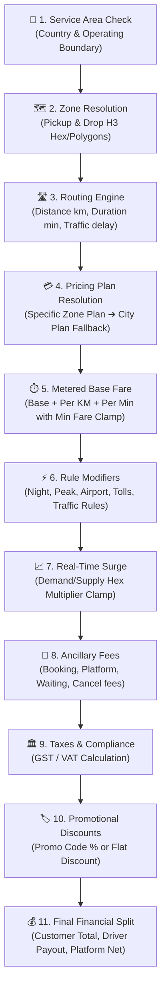

# 🚗 Enterprise Fare Pricing Engine — Operational & Client Configuration Guide

> **Confidential & Proprietary** | Mobility & Ride-Hailing Platform Documentation  
> **Target Audience:** Platform Owners, City Operations Managers, Admin Team, Business Analysts, and Enterprise Clients.

---

## 📌 1. Executive Overview

The platform uses a **version-controlled, 11-stage modular Fare Calculation Engine** designed to provide 100% deterministic, audit-compliant, and mathematically transparent fare quotes.

Every fare calculation follows a strict sequential pipeline from GPS coordinates to the final passenger price, driver earnings, and tax invoices.

---

## ⚙️ 2. What Clients / Operations Teams Need to Configure

To launch a city or adjust live fares, the operations team configures settings across **7 core modules** in the Admin Portal (**Fare Rules** section).

### 📋 Configuration Checklist Matrix

| Step | Portal Section | What to Configure | Why It Matters |
| :---: | :--- | :--- | :--- |
| **1** | **Geography & Fleet** | • Countries & Currencies • Cities & City Types (Tier-1, Tier-2) • Geofenced Zones (Airports, Tech Hubs) • Vehicle Types (Bike, Auto, Sedan, SUV) | Determines where service is available and which vehicle categories can operate. |
| **2** | **Pricing Plans & Rate Cards** | • Plan Name & Scope (City-wide or Zone-specific) • Base Fare (₹ / minor units) • Minimum Fare (₹) • Per-KM Distance Rate (₹/km) • Per-Min Time Rate (₹/min) • Free Waiting Minutes (e.g. 3 mins) • Waiting Rate per min (₹/min) • Platform & Booking Fees | The core rate card used for metered fare calculation. All plans are **version-controlled (`v1`, `v2`, etc.)** for zero-downtime updates. |
| **3** | **Night & Peak Rules** | • Start & End Time (e.g., 23:00 to 05:00) • Days of Week (e.g., Mon-Sun or Weekends) • Value Type: `multiplier` (e.g., 1.25x) or `fixed` (e.g., +₹50) | Automatically applies scheduled surcharges for unsociable hours or high-traffic morning/evening peak slots. |
| **4** | **Airport & Toll Rules** | • Airport Pickup Fee (e.g., ₹100) • Airport Drop Fee (e.g., ₹60) • Inter-Zone Toll charges (Bridge/Highway toll) | Charges extra fees when crossing specific toll corridors or entering airport terminal zones. |
| **5** | **Surge & Demand Curves** | • Minimum Surge Multiplier Floor (e.g., 1.00x) • Maximum Surge Multiplier Cap (e.g., 3.00x) • Supply/Demand Sensitivity Curves | Protects passengers from excessive price spikes while maintaining driver liquidity during high-demand events. |
| **6** | **Taxes & Statutory Levies** | • Country/City Tax Rule (e.g., 5.00% GST on transportation) • Tax Type (`percentage` or `fixed`) | Automatically splits base fare from statutory taxes for invoicing and legal compliance. |
| **7** | **Promos & Discounts** | • Promo Code (e.g., `WELCOME50`) • Discount % or Flat Amount (e.g., 50% off up to ₹100) • Usage limit per user & total budget | Deducted transparently from the rider total without affecting driver base earnings. |

---

## 🧮 3. Step-by-Step Fare Formula & Calculation

The fare engine uses the following exact formula:

$$\text{Metered Fare} = \max\Big(\text{Base Fare} + (\text{Distance km} \times \text{Per KM Rate}) + (\text{Duration min} \times \text{Per Min Rate}),\; \text{Minimum Fare}\Big)$$

$$\text{Subtotal} = \Big(\text{Metered Fare} \times \text{Rule Multiplier} \times \text{Surge Multiplier}\Big) + \text{Night Surcharge} + \text{Peak Surcharge}$$

$$\text{Gross Total} = \text{Subtotal} + \text{Booking Fee} + \text{Airport Fee} + \text{Toll Fee} + \text{Waiting Fee}$$

$$\text{Final Payable Amount} = \text{Gross Total} + \text{Tax (GST)} - \text{Promo Discount}$$

---

## 💡 4. Concrete Real-World Examples

### 🟢 Example A: Standard Daytime City Trip (Sedan)
* **Route:** Salt Lake Sector V &rarr; Park Street (12.0 km, 30 mins)
* **Vehicle:** Sedan | **Time:** 14:30 (Daytime, No Surge, No Tolls)

| Parameter | Configuration | Calculated Amount |
| :--- | :--- | :--- |
| **Base Fare** | ₹50.00 | ₹50.00 |
| **Distance Rate** | ₹14.00 / km &times; 12 km | ₹168.00 |
| **Time Rate** | ₹1.50 / min &times; 30 min | ₹45.00 |
| **Metered Subtotal** | (₹50 + ₹168 + ₹45 = ₹263) &gt; Min Fare ₹70 | ₹263.00 |
| **Surge / Peak / Night** | 1.00x (None) | ₹0.00 |
| **Booking & Platform Fee** | ₹10.00 + ₹5.00 | ₹15.00 |
| **Tax (GST 5%)** | 5% on ₹278 | ₹13.90 |
| **Final Passenger Fare** | **₹291.90 &rarr; Rounded: ₹292.00** | **₹292.00** |

---

### 🔴 Example B: Peak Rain Rush + Airport Drop (SUV)
* **Route:** Howrah Station &rarr; CCU Airport Terminal (18.5 km, 45 mins, 10 min traffic delay)
* **Vehicle:** SUV | **Time:** 19:30 (Evening Peak 1.20x, Rain Surge 1.50x, Airport Drop Fee ₹60, Toll ₹45)

| Parameter | Configuration | Calculated Amount |
| :--- | :--- | :--- |
| **Base Fare** | ₹100.00 | ₹100.00 |
| **Distance Rate** | ₹20.00 / km &times; 18.5 km | ₹370.00 |
| **Time Rate** | ₹2.50 / min &times; 45 min | ₹112.50 |
| **Metered Base** | ₹100 + ₹370 + ₹112.50 | ₹582.50 |
| **Peak Multiplier** | 1.20x | +₹116.50 |
| **Dynamic Surge** | 1.50x | +₹291.25 |
| **Airport Drop Fee** | Configured in Airport Rules | +₹60.00 |
| **Toll Fee** | Flyover / Bridge Crossing | +₹45.00 |
| **Booking Fee** | Fixed | +₹20.00 |
| **Subtotal before Tax** | Sum of all line items | ₹1,225.25 |
| **Tax (GST 5%)** | 5% on taxable amount | ₹61.26 |
| **Final Passenger Fare** | **₹1,286.51 &rarr; Rounded: ₹1,287.00** | **₹1,287.00** |

---

## 🛡️ 5. Operational Best Practices & FAQ

### Q1: How does the system handle pricing changes without breaking active trips?
> **Answer (Immutable Versioning):** Whenever you update a rate card, you can choose to deploy it as a **New Version (`v2`, `v3`)**. Existing trips locked into a quote continue with their agreed version, while all new bookings immediately resolve the new active version.

### Q2: What happens if a city has both a "City-wide" plan and a "Zone-specific" plan?
> **Answer (Hierarchical Priority):**
> 1. **Priority 1 (Highest):** Zone-specific pricing plan (e.g. Airport Zone, Special Economic Zone).
> 2. **Priority 2 (Fallback):** City-wide pricing plan.
> 3. **Priority 3 (Safety Guard):** Returns a clear HTTP 422 if no plan is configured, preventing false/free ride quotes.

### Q3: How are Driver Earnings and Platform Commissions calculated?
> **Answer:**
> * Driver Net Payout = $(\text{Metered Fare} \times \text{Surge}) + \text{Toll} + \text{Waiting Fee} - \text{Platform Commission}$.
> * Incentives and promo discounts are compensated by the platform and do not diminish driver earnings.

---

## 📑 6. Quick Admin Navigation Cheat-Sheet

* **To change Base Fares or Per-KM rates:** Go to `Fare Rules` &rarr; `Pricing Plans` &rarr; Click **Edit Plan** on the desired row.
* **To add Night or Weekend surcharges:** Go to `Fare Rules` &rarr; `Night & Peak Rules` &rarr; Click **Add Rule**.
* **To set Airport parking/terminal pickup fees:** Go to `Fare Rules` &rarr; `Airport Rules` &rarr; Add pickup/drop rates.
* **To test any route before deploying live:** Go to `Fare Rules` &rarr; `Fare Simulator` &rarr; Enter pickup/drop coordinates and inspect the full 11-stage breakdown in real time.
