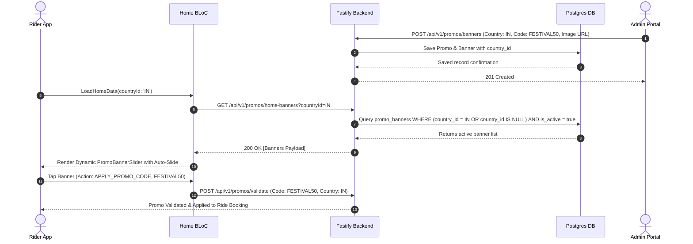

# Full-Stack Country-Independent Promo System Architecture & Implementation Plan

## 1. Executive Summary & Audit of Existing Promo Implementation

### 1.1 Overview
This document specifies the complete full-stack architecture, database models, REST APIs, state management, and UI implementations required to transform the current promo section on the Customer Mobile App (`ride_sharing_customer`) into a dynamic, country-independent, server-driven promotional platform managed via the Admin Portal (`portal`) and served by the Node.js backend (`backend_v2`).

---

### 1.2 Audit of Existing Implementations

#### Customer Mobile App (`ride_sharing_customer`)
- **Location**: `lib/features/home/presentation/pages/home_page.dart` (`_buildPromoBanner()` widget)
- **Current State**:
  - `_buildPromoBanner()` widget returns an `AspectRatio` containing an auto-sliding `PageView.builder` timer.
  - **Hardcoded local assets**: `assets/promo-banners/promo-1.png`, `promo-2.png`, `promo-3.png`.
  - **Hardcoded routes**: `/promo-codes`, `/select-location`, `/profile`.
  - **Limitations**: Lacks backend connection, dynamic CDN image loading, country/region scoping, local currency symbol formatting, and promo auto-claiming logic.

#### Backend (`backend_v2`)
- **Location**: 
  - `src/modules/promo/promo.service.js`
  - `src/modules/promo/promo.routes.js`
  - `drizzle/schema/promos.js`
- **Current State**:
  - Table `promos` supports basic fields (`countryId`, `cityId`, `vehicleTypeId`, `discountType`, `discountValue`, `minFareMinor`, `maxDiscountMinor`, `perUserLimit`, `isFirstRideOnly`, `validFrom`, `validUntil`, `isActive`).
  - Implements `/available` and `/validate` endpoints for riders.
- **Missing Capabilities**:
  - No database entity or table (`promo_banners`) for home page banner placement and sequence control.
  - Lacks dynamic target actions (`APPLY_PROMO_CODE`, `NAVIGATE_ROUTE`, `OPEN_URL`), custom aspect ratios, or display ordering (`displayOrder`).
  - No automated currency code / symbol aggregation per country in banner feeds.

#### Admin Portal (`portal`)
- **Location**: `src/features/promos`
- **Current State**:
  - Basic CRUD for promo codes with `countryId` and `cityId` dropdown filters.
- **Missing Capabilities**:
  - No dedicated Banner Management UI tab.
  - Lacks live device banner preview simulator.
  - Lacks multi-currency discount visualization per country.

---

## 2. Country Independence Architecture

The promotional system must support global operations across multiple countries with distinct currencies, localized minimum fare constraints, and regional promo rules.

```
                  ┌──────────────────────────────────────────┐
                  │          Customer Device Context         │
                  │ (Selected Country / GPS / Account Loc)   │
                  └────────────────────┬─────────────────────┘
                                       │
                                       ▼
                  ┌──────────────────────────────────────────┐
                  │    GET /api/v1/promos/home-banners       │
                  │    Header: X-Country-Code / Query      │
                  └────────────────────┬─────────────────────┘
                                       │
                                       ▼
┌───────────────────────────────────────────────────────────────────────────┐
│                          Backend Matching Engine                          │
│                                                                           │
│  1. Match active promos where (country_id = TargetCountry OR country_id IS NULL) │
│  2. Match active cities where (city_id = TargetCity OR city_id IS NULL)   │
│  3. Attach country metadata (currencyCode, currencySymbol, decimalDigits) │
│  4. Sort by display_order ASC, created_at DESC                            │
└────────────────────────────────────┬──────────────────────────────────────┘
                                     │
                                     ▼
                  ┌──────────────────────────────────────────┐
                  │   Dynamic Responsive Promo JSON Feed     │
                  │   with localized currency string formats │
                  └──────────────────────────────────────────┘
```

### Core Principles of Country Independence:
1. **Hierarchical Scoping**:
   - **Global Level** (`country_id IS NULL`): Valid globally across all active regions.
   - **Country Level** (`country_id = '...'`): Scoped to a specific sovereign region (e.g., India 20% OFF Independence Day Special).
   - **City/Zone Level** (`city_id = '...'`): Targeted campaign for specific metropolitan areas (e.g., London Heathrow Flat Discount).
2. **Currency Unit Normalization**:
   - All monetary values (`discountValue`, `minFareMinor`, `maxDiscountMinor`) are stored in **minor units** (cents/paise) alongside standard ISO currency codes (`USD`, `INR`, `EUR`, `AED`, etc.).
   - Frontend formats display strings dynamically using local currency symbols retrieved from backend metadata (`$`, `₹`, `€`, `AED`).
3. **Locale & Timezone-Aware Expiry**:
   - Timestamps stored in UTC (`validFrom`, `validUntil`).
   - Customer app converts timestamps into local device timezone formatting.

---

## 3. Database Schema & Backend API Extensions (`backend_v2`)

### 3.1 New Drizzle Schema: `promo_banners`

Create `backend_v2/drizzle/schema/promo_banners.js`:

```javascript
import { pgTable, uuid, varchar, text, integer, boolean, timestamp } from 'drizzle-orm/pg-core';
import { countries } from './countries.js';
import { cities } from './cities.js';
import { promos } from './promos.js';

export const promoBanners = pgTable('promo_banners', {
  id: uuid('id').primaryKey().defaultRandom(),
  title: varchar('title', { length: 150 }).notNull(),
  subtitle: text('subtitle'),
  imageUrl: text('image_url').notNull(),
  mobileBannerUrl: text('mobile_banner_url'),
  
  // Dynamic Action Router
  actionType: varchar('action_type', { length: 50 }).notNull().default('APPLY_PROMO_CODE'), 
  // Enum: 'APPLY_PROMO_CODE', 'NAVIGATE_ROUTE', 'OPEN_URL', 'SELECT_LOCATION'
  actionValue: text('action_value'), // Code (e.g., WELCOME50), App Route ('/select-location'), or URL
  
  promoId: uuid('promo_id').references(() => promos.id, { onDelete: 'set null' }),
  
  // Regional Scoping
  countryId: uuid('country_id').references(() => countries.id, { onDelete: 'cascade' }),
  cityId: uuid('city_id').references(() => cities.id, { onDelete: 'cascade' }),
  
  // Sequence & Schedule
  displayOrder: integer('display_order').default(0).notNull(),
  isActive: boolean('is_active').default(true).notNull(),
  validFrom: timestamp('valid_from').defaultNow().notNull(),
  validUntil: timestamp('valid_until'),
  
  createdAt: timestamp('created_at').defaultNow().notNull(),
  updatedAt: timestamp('updated_at').defaultNow().notNull(),
});
```

---

### 3.2 REST API Specification

#### 1. Customer Endpoint — Get Home Banners
- **GET** `/api/v1/promos/home-banners`
- **Query Parameters**: `countryId` (UUID, optional), `cityId` (UUID, optional)
- **Response**:
```json
{
  "success": true,
  "data": [
    {
      "id": "b1a2c3d4-e5f6-7890-abcd-1234567890ab",
      "title": "50% OFF First 3 Rides",
      "subtitle": "Use code WELCOME50 for instant savings",
      "imageUrl": "https://cdn.rideshare.com/banners/in_welcome.png",
      "actionType": "APPLY_PROMO_CODE",
      "actionValue": "WELCOME50",
      "promo": {
        "id": "p1a2c3d4-...",
        "code": "WELCOME50",
        "discountType": "percentage",
        "discountValue": 50,
        "maxDiscountMinor": 10000,
        "minFareMinor": 5000,
        "formattedMaxDiscount": "₹100.00",
        "formattedMinFare": "₹50.00"
      },
      "country": {
        "id": "c1a2c3d4-...",
        "isoCode": "IN",
        "currencyCode": "INR",
        "currencySymbol": "₹"
      }
    }
  ]
}
```

#### 2. Admin Portal Banner Endpoints
- `GET /api/v1/promos/banners` — List all banners with filters (`countryId`, `isActive`).
- `POST /api/v1/promos/banners` — Create a banner with target action & country scoping.
- `PATCH /api/v1/promos/banners/:id` — Update banner details or toggle active status.
- `DELETE /api/v1/promos/banners/:id` — Delete promo banner.

---

## 4. Mobile Customer App Implementation (`ride_sharing_customer`)

### 4.1 Data & Domain Structure

```
lib/features/home/
├── data/
│   ├── datasources/home_remote_datasource.dart
│   ├── models/promo_banner_model.dart
│   └── repositories/home_repository_impl.dart
├── domain/
│   ├── entities/promo_banner_entity.dart
│   ├── repositories/home_repository.dart
│   └── usecases/get_home_banners_usecase.dart
└── presentation/
    ├── bloc/home_bloc.dart (Updated with HomeBannersLoaded)
    └── widgets/promo_banner_slider.dart
```

---

### 4.2 Data Model: `PromoBannerModel`

`lib/features/home/data/models/promo_banner_model.dart`:
```dart
import '../../domain/entities/promo_banner_entity.dart';

class PromoBannerModel extends PromoBannerEntity {
  const PromoBannerModel({
    required super.id,
    required super.title,
    super.subtitle,
    required super.imageUrl,
    required super.actionType,
    super.actionValue,
    super.promoCode,
    super.currencySymbol,
    super.formattedDiscount,
  });

  factory PromoBannerModel.fromJson(Map<String, dynamic> json) {
    final promo = json['promo'] as Map<String, dynamic>?;
    final country = json['country'] as Map<String, dynamic>?;

    return PromoBannerModel(
      id: json['id'] ?? '',
      title: json['title'] ?? '',
      subtitle: json['subtitle'],
      imageUrl: json['imageUrl'] ?? '',
      actionType: json['actionType'] ?? 'APPLY_PROMO_CODE',
      actionValue: json['actionValue'],
      promoCode: promo?['code'],
      currencySymbol: country?['currencySymbol'] ?? '\$',
      formattedDiscount: promo?['formattedMaxDiscount'],
    );
  }
}
```

---

### 4.3 Refactored Home Page Widget (`promo_banner_slider.dart`)

Replace the hardcoded static `_buildPromoBanner()` widget in `home_page.dart` with a dedicated dynamic widget:

```dart
import 'dart:async';
import 'package:flutter/material.dart';
import 'package:go_router/go_router.dart';
import 'package:cached_network_image/cached_network_image.dart';
import '../../domain/entities/promo_banner_entity.dart';
import '../../../../core/widgets/custom_toast.dart';

class PromoBannerSlider extends StatefulWidget {
  final List<PromoBannerEntity> banners;
  final Function(String code)? onApplyPromo;

  const PromoBannerSlider({
    super.key,
    required this.banners,
    this.onApplyPromo,
  });

  @override
  State<PromoBannerSlider> createState() => _PromoBannerSliderState();
}

class _PromoBannerSliderState extends State<PromoBannerSlider> {
  late final PageController _pageController;
  int _activePromoPage = 0;
  Timer? _promoTimer;
  static const int _infiniteMultiplier = 1000;
  late int _currentPageIndex;

  @override
  void initState() {
    super.initState();
    if (widget.banners.isNotEmpty) {
      _currentPageIndex = (_infiniteMultiplier ~/ 2) * widget.banners.length;
      _pageController = PageController(initialPage: _currentPageIndex);
      _activePromoPage = _currentPageIndex % widget.banners.length;
      _startPromoAutoSlide();
    }
  }

  void _startPromoAutoSlide() {
    _promoTimer?.cancel();
    if (widget.banners.length <= 1) return;
    _promoTimer = Timer.periodic(const Duration(seconds: 4), (timer) {
      if (!_pageController.hasClients) return;
      _currentPageIndex++;
      _pageController.animateToPage(
        _currentPageIndex,
        duration: const Duration(milliseconds: 650),
        curve: Curves.easeInOutCubic,
      );
    });
  }

  @override
  void dispose() {
    _promoTimer?.cancel();
    if (widget.banners.isNotEmpty) {
      _pageController.dispose();
    }
    super.dispose();
  }

  void _handleBannerTap(BuildContext context, PromoBannerEntity banner) {
    switch (banner.actionType) {
      case 'APPLY_PROMO_CODE':
        if (banner.actionValue != null && banner.actionValue!.isNotEmpty) {
          if (widget.onApplyPromo != null) {
            widget.onApplyPromo!(banner.actionValue!);
          } else {
            context.push('/promo-codes', extra: {'code': banner.actionValue});
          }
          CustomToast.show(context, 'Promo Code Selected: ${banner.actionValue}');
        } else {
          context.push('/promo-codes');
        }
        break;

      case 'NAVIGATE_ROUTE':
        if (banner.actionValue != null && banner.actionValue!.startsWith('/')) {
          context.push(banner.actionValue!);
        } else {
          context.push('/select-location');
        }
        break;

      case 'SELECT_LOCATION':
        context.push('/select-location');
        break;

      default:
        context.push('/promo-codes');
        break;
    }
  }

  @override
  Widget build(BuildContext context) {
    if (widget.banners.isEmpty) {
      return const SizedBox.shrink();
    }

    return AspectRatio(
      aspectRatio: 2.15,
      child: Stack(
        alignment: Alignment.bottomCenter,
        children: [
          PageView.builder(
            controller: _pageController,
            onPageChanged: (index) {
              _currentPageIndex = index;
              setState(() {
                _activePromoPage = index % widget.banners.length;
              });
            },
            itemBuilder: (context, index) {
              final banner = widget.banners[index % widget.banners.length];
              return InkWell(
                onTap: () => _handleBannerTap(context, banner),
                borderRadius: BorderRadius.circular(20),
                child: Container(
                  margin: const EdgeInsets.symmetric(horizontal: 2),
                  decoration: BoxDecoration(
                    borderRadius: BorderRadius.circular(20),
                    boxShadow: [
                      BoxShadow(
                        color: Colors.black.withOpacity(0.06),
                        blurRadius: 10,
                        offset: const Offset(0, 4),
                      ),
                    ],
                  ),
                  child: ClipRRect(
                    borderRadius: BorderRadius.circular(20),
                    child: CachedNetworkImage(
                      imageUrl: banner.imageUrl,
                      width: double.infinity,
                      fit: BoxFit.cover,
                      placeholder: (context, url) => Container(
                        color: const Color(0xFFF1F5F9),
                        child: const Center(
                          child: CircularProgressIndicator(strokeWidth: 2),
                        ),
                      ),
                      errorWidget: (context, url, error) => Image.asset(
                        'assets/promo-banners/promo-1.png',
                        fit: BoxFit.cover,
                      ),
                    ),
                  ),
                ),
              );
            },
          ),
          if (widget.banners.length > 1)
            Positioned(
              bottom: 12,
              child: Row(
                mainAxisSize: MainAxisSize.min,
                children: List.generate(
                  widget.banners.length,
                  (index) => Padding(
                    padding: const EdgeInsets.symmetric(horizontal: 3),
                    child: GestureDetector(
                      onTap: () {
                        final currentGroup =
                            _currentPageIndex - (_currentPageIndex % widget.banners.length);
                        final targetIndex = currentGroup + index;
                        _pageController.animateToPage(
                          targetIndex,
                          duration: const Duration(milliseconds: 350),
                          curve: Curves.easeInOut,
                        );
                      },
                      child: AnimatedContainer(
                        duration: const Duration(milliseconds: 250),
                        width: _activePromoPage == index ? 18 : 6,
                        height: 6,
                        decoration: BoxDecoration(
                          color: _activePromoPage == index
                              ? const Color(0xFF009048)
                              : Colors.white.withOpacity(0.7),
                          borderRadius: BorderRadius.circular(3),
                        ),
                      ),
                    ),
                  ),
                ),
              ),
            ),
        ],
      ),
    );
  }
}
```

---

## 5. Admin Portal Implementation (`portal`)

### 5.1 Portal Interface & Banner Manager Tab

In `portal/src/features/promos`, extend the existing Promo feature to include a **Promo Banners Manager** with dynamic country filter and live app preview:

```
┌──────────────────────────────────────────────────────────────────────────────────────────┐
│  Admin Portal: Promo & Banner Management                                                │
├──────────────────────────────────────────────────────────────┬───────────────────────────┤
│ Banner Configuration Form                                    │ Live Phone App Preview    │
│                                                              │ ┌───────────────────────┐ │
│ 1. Select Country: [ India (INR - ₹)              ▼ ]       │ │  Where are you going? │ │
│ 2. Banner Title:  [ Festival Special Discount     ]       │ │ ┌───────────────────┐ │ │
│ 3. Image URL:     [ https://cdn.../banner.png     ]       │ │ │ 50% OFF RIDES     │ │ │
│ 4. Target Action: [ APPLY_PROMO_CODE              ▼ ]       │ │ │ Use Code: FESTIVAL│ │ │
│ 5. Promo Code:    [ FESTIVAL50                    ]       │ │ └───────────────────┘ │ │
│ 6. Display Order: [ 1                             ]       │ │   o  •  o             │ │
│                                                              │ └───────────────────────┘ │
│ [ Cancel ]                                [ Save Banner ]    │ Mobile Customer View      │
└──────────────────────────────────────────────────────────────┴───────────────────────────┘
```

#### Key Capabilities:
1. **Country Filter Dropdown**: Allows filtering promotions and banners by country (`IN`, `US`, `AE`, `GB`, etc.) or creating global promotions.
2. **Multi-Currency Preview**: Automatically formats minimum fares and maximum discount caps into regional currency symbols (e.g. `$5.00` vs `₹50.00` vs `AED 20.00`).
3. **Target Action Selector**: Maps banner taps to actions (`APPLY_PROMO_CODE`, `NAVIGATE_ROUTE`, `SELECT_LOCATION`).

---

## 6. End-to-End Sequence Diagram



---

## 7. Implementation Action Plan & Checklist

- [ ] **Phase 1: Database & Backend Services (`backend_v2`)**
  - [ ] Add `promo_banners` schema definition in `drizzle/schema/promo_banners.js`.
  - [ ] Execute database migration.
  - [ ] Implement `GET /api/v1/promos/home-banners` route and service logic with country filtering.
  - [ ] Implement Admin CRUD endpoints for `/api/v1/promos/banners`.

- [ ] **Phase 2: Mobile App Integration (`ride_sharing_customer`)**
  - [ ] Add `PromoBannerModel` and update `HomeRemoteDataSource`.
  - [ ] Update `HomeBloc` state and events to fetch live banners.
  - [ ] Replace static `_buildPromoBanner()` with dynamic `PromoBannerSlider` widget.
  - [ ] Test promo code auto-filling and validation on ride selection.

- [ ] **Phase 3: Admin Portal UI (`portal`)**
  - [ ] Create `BannerList` and `BannerFormDialog` components in `portal/src/features/promos`.
  - [ ] Add country selector and dynamic currency formatting preview.
  - [ ] Add preview simulator for iOS/Android home screen banner layout.

---

## 8. Verification & Testing Matrix

| Test Case | Scenario | Expected Result |
| :--- | :--- | :--- |
| **TC-01** | Fetch banners with `countryId = IN` | Only IN-specific and Global banners are returned with `₹` currency symbols. |
| **TC-02** | Fetch banners with `countryId = US` | Only US-specific and Global banners are returned with `$` currency symbols. |
| **TC-03** | Tap banner with `APPLY_PROMO_CODE` | Code is validated automatically and applied to current booking flow. |
| **TC-04** | Expired Promo Banner | Banners past `validUntil` timestamp are automatically omitted from home feed. |
| **TC-05** | Image Loading Network Fallback | If CDN fails or image fails to load, local asset fallback renders smoothly without UI breakage. |
