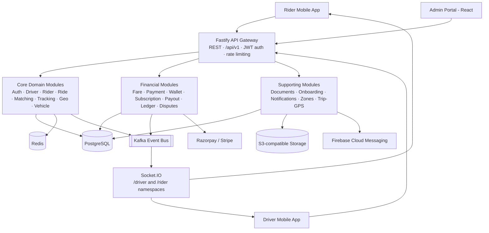
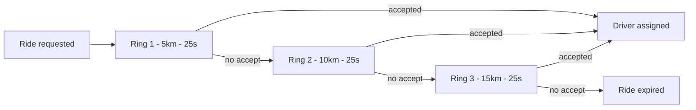

# RideShare Platform — Complete Functional Specification

### Backend API & Admin Portal

| Field | Value |
|---|---|
| Version | 1.0 |
| Status | Final Draft |
| Date | 29 July 2026 |
| Classification | Internal — Engineering & Product |

## Purpose & Scope

This document is the complete functional specification for the RideShare platform's two engineering-owned surfaces: the Node.js/Fastify backend API and the React admin portal. It describes what the system does — every module's purpose, the actors who use it, its full set of endpoints, and the business rules and workflows that govern its behavior — for a product, engineering, QA, and operations audience. The Flutter rider mobile app and driver mobile app are out of scope for this revision; this document covers the backend and portal only, as requested.

## How to Read This Document

- Section 3 (Backend) is organized into Core Domain, Financial & Payments, and Supporting modules — matching how the codebase itself is organized.
- Section 4 (Portal) is organized by navigation item, in the order an admin sees them in the sidebar.
- Every module/feature section follows the same structure: Purpose, Actors, Endpoints (or Screens/Actions for the portal), Business Rules, and Data Entities — so any two sections can be compared directly.

## Table of Contents

1. [Introduction](#1--introduction)
2. [System Overview & Architecture](#2--system-overview--architecture)
3. [Backend Functional Specification](#3--backend-functional-specification)
   - [3.1 Cross-Cutting Architecture](#31--cross-cutting-architecture)
   - [3.2 Core Domain Modules](#32--core-domain-modules)
   - [3.3 Financial & Payments Modules](#33--financial--payments-modules)
   - [3.4 Supporting Modules](#34--supporting-modules)
   - [3.5 Key End-to-End Workflows](#35--key-end-to-end-workflows)
4. [Admin Portal Functional Specification](#4--admin-portal-functional-specification)
5. [Appendix A — Database Entity Reference](#5--appendix-a--database-entity-reference)
6. [Appendix B — Standard Response Envelope](#6--appendix-b--standard-response-envelope)
7. [Appendix C — Glossary](#7--appendix-c--glossary)

---

## 1.  Introduction

RideShare is a subscription-based ride-hailing platform: rather than the platform taking a straight per-ride commission from every driver, drivers purchase a recurring (or lifetime) subscription plan, which unlocks a discounted per-ride commission rate and, on higher-tier plans, priority matching. Riders book trips through a mobile app; drivers accept and fulfil them through a matching engine that expands its search radius in real time; and a back-office team runs the whole operation — approvals, pricing, payouts, disputes, and configuration — through a dedicated admin portal.

The platform is built as three independent codebases in one repository: a Node.js/Fastify backend API, a React admin portal, and a Flutter rider mobile app. This specification covers the first two in full; the mobile app is not in scope for this revision.

### 1.1  User Roles & Actors

| Actor | Description | Authentication |
|---|---|---|
| Rider | End customer who books rides via the mobile app. | Phone OTP |
| Driver | Subscribed driver-partner who fulfils ride requests. | Phone or Email OTP, device-scoped |
| Admin | Back-office operator using the web portal — day-to-day operations (users, drivers, rides, payments). | Email + Password |
| Super Admin | Elevated back-office role with access to platform configuration (pricing, zones, plans, ledger, disputes, onboarding config). | Email + Password |
| System / Webhook | Automated actors: the matching engine, scheduled jobs, and payment-gateway webhooks (Razorpay, Stripe). | HMAC signature / internal |

### 1.2  Technology Stack

**Backend**

| Concern | Technology |
|---|---|
| Runtime & Framework | Node.js, Fastify |
| Database | PostgreSQL via Drizzle ORM |
| Cache / Real-time state | Redis (sessions, OTP, geo-index, locks, caches, pub/sub) |
| Event bus | Apache Kafka (KafkaJS) |
| Real-time transport | Socket.IO (/driver and /rider namespaces) |
| Background jobs | BullMQ (Redis-backed queues) |
| Payments | Razorpay (INR) and Stripe (CAD), abstracted behind a common gateway interface |
| File storage | S3-compatible object storage via presigned URLs (local-disk fallback in dev) |
| API docs | OpenAPI 3 / Swagger UI at /docs |

**Admin Portal**

| Concern | Technology |
|---|---|
| Framework | React 19 + Vite + TypeScript |
| Styling | Tailwind CSS v4 |
| Component library | Radix UI primitives, shadcn-style wrappers |
| Server state | TanStack Query v5 |
| Tables | TanStack Table v8 |
| Forms | react-hook-form + zod validation |
| Routing | react-router-dom v7 (lazy-loaded routes) |
| Maps / geofencing | Leaflet + leaflet-draw |
| Charts | Recharts |

---

## 2.  System Overview & Architecture

The diagram below shows how a request flows through the platform, from client apps through the API layer, into the domain modules, and out to persistent storage and third-party services.

Every response follows one standard envelope across the whole API — a success carries the payload plus pagination metadata for lists; a failure always returns a boolean flag and a human-readable message — so every client integrates against one predictable contract.

---

## 3.  Backend Functional Specification

The backend is organized as 32 domain modules under three categories, plus the cross-cutting infrastructure (authentication, the event bus, real-time transport, background jobs) that every module relies on.

### 3.1  Cross-Cutting Architecture

#### 3.1.1  Request Lifecycle & Plugins

Every request passes through a fixed pipeline of Fastify plugins, registered in this order:

1. fastify-raw-body — captures the raw request body (needed for payment-webhook HMAC verification); opt-in per route.
2. @fastify/helmet — security headers.
3. @fastify/cors — locked to the production domain in production, permissive in dev.
4. @fastify/rate-limit — global HTTP rate limit, Redis-backed.
5. @fastify/jwt — access-token signing/verification.
6. @fastify/multipart — legacy multipart upload support (5MB cap); primary uploads use presigned S3 URLs instead.
7. @fastify/swagger + swagger-ui — OpenAPI docs at /docs.
8. Prometheus-style metrics plugin.
9. Global error handler — normalizes every error into the standard response envelope.

#### 3.1.2  Authentication & Session Strategy

- Three independent auth flows: rider (phone OTP), driver (phone OR email OTP, device-scoped), admin (email + bcrypt password).
- Access tokens are short-lived JWTs (15 min default); refresh tokens are longer-lived (30 days) and are validated against a Redis-stored copy, not just JWT signature — this is what actually makes revocation possible.
- Driver sessions are device-scoped: every driver login carries a device ID, and each device gets its own refresh token, so logging in on a new phone never signs the driver out of other devices. A driver can view and remotely revoke individual device sessions.
- Rider and admin sessions are not device-scoped (single implicit session).
- Role gates (Rider / Driver / Admin / Any / Optional) are enforced centrally via shared middleware reused by every module.
- An admin login additionally requires the admin account be active; a blocked driver is rejected at verification time, before any token is issued.

#### 3.1.3  Rate Limiting

- Global HTTP layer: 100 requests per minute per IP address, applied to the entire API.
- A separate, finer-grained OTP-specific throttle (per phone number / email address, not per IP) layers on top — see the OTP policy table below.

**OTP Verification Policy**

| Policy | Phone OTP (rider & driver) | Email OTP (driver) |
|---|---|---|
| Code length | 6 digits | 6 digits |
| Code validity | 5 minutes | 10 minutes |
| Resend cooldown | 30 seconds | 30 seconds |
| Max sends per hour | 5 | 5 |
| Wrong-attempt lockout | 5 attempts → 15-minute lockout | 5 attempts → 15-minute lockout |
| Delivery (dev / no credentials) | Logged to console | Logged to console (no email provider wired up yet) |

#### 3.1.4  Event-Driven Architecture (Kafka)

Every notable state change publishes an event onto the platform's event bus, decoupling the module that caused the change from every module that needs to react to it (real-time push, notifications, audit logging).

| Topic | Published by | Consumed by |
|---|---|---|
| `ride.requested` | Ride module (on booking) | — |
| `ride.matched` | Matching engine (per ring) | Socket bridge → offer pushed to each candidate driver |
| `ride.accepted` | Ride module | Socket bridge → rider notified; other candidates told the ride is taken |
| `ride.started` | Ride module | Socket bridge → rider notified |
| `ride.completed` | Ride module | Socket bridge → rider notified with final fare |
| `ride.cancelled` | Ride module / matching (on expiry) | Socket bridge → rider and/or driver notified |
| `driver.location` | Driver module, tracking module | Socket bridge → pushed to rider + ride room |
| `driver.status_changed` | Driver module (online/offline) | Reserved for analytics/ops |
| `driver.registration_submitted` | Driver module | Reserved for future notification fan-out |
| `fare.calculated` | Fare module | — |
| `payment.success / payment.failed` | Payment-related modules | — |
| `notif.push / notif.sms / notif.email` | Virtually every module (~20+ call sites) | Notification consumer → sends via FCM/SMS/Email, logs to history |
| `subscription.activated / .expired / .cancelled` | Subscription & rider-subscription modules | Subscription consumer (extension point for CRM/analytics) |
| `audit.log` | Pervasive — every notable admin/system action | Audit consumer → persists to the audit log table |

#### 3.1.5  Real-Time Layer (Socket.IO)

Two namespaces bridge Kafka events to connected clients in real time: `/driver` and `/rider`. Both require a valid access token at connection time.

**`/driver` namespace**

| Event | Direction | Payload | Effect |
|---|---|---|---|
| `go_online` | Client → Server | {lat, lng} | Marks the driver online, caches live location, adds them to the geo-index. |
| `go_offline` | Client → Server | — | Marks the driver offline, clears location cache and geo-index entry. |
| `location_update` | Client → Server | {lat, lng, accuracy, speedKmh} | Refreshes live location; routes to approach/trip tracking if on an active ride. |
| `ride:accept` | Client → Server | {rideId} | Accepts a ride offer; signals the matching engine to stop waiting immediately. |
| `ride:decline` | Client → Server | {rideId, reason} | Declines an offered ride. |
| `ride:new_request` | Server → Client | Full ride offer payload | Pushed to a candidate driver when matched. |
| `ride:taken` | Server → Client | — | Pushed to every other candidate once one driver accepts. |

**`/rider` namespace**

| Event | Direction | Payload | Effect |
|---|---|---|---|
| `ride:subscribe / unsubscribe` | Client → Server | {rideId} | Joins/leaves the room for a specific ride's live updates. |
| `ride:driver_assigned` | Server → Client | Driver + ETA info | A driver accepted the ride. |
| `ride:started` | Server → Client | — | The trip has started. |
| `ride:completed` | Server → Client | Final fare, currency | The trip is complete. |
| `ride:cancelled` | Server → Client | Reason | The ride was cancelled. |
| `driver:location` | Server → Client | {lat, lng} | Live driver position during approach and trip. |

#### 3.1.6  Background Jobs (BullMQ)

| Job | Schedule | Purpose |
|---|---|---|
| `subscription-expiry` | Daily, midnight | Flips overdue driver subscriptions to expired; forces the affected drivers offline. |
| `ride-timeout` | Safety net | Reserved fallback — in practice the matching engine's own 25s ring timeout handles ride-offer expiry directly. |
| `gps-ping-flush` | Every 60 seconds | Drains each active trip's buffered GPS pings into permanent storage, classifying noise/gaps as it goes. |
| `ledger-verification` | Hourly | Audit backstop: re-derives ledger balances independently and flags any mismatch for review (never auto-corrects). |
| `reconciliation` | Daily, 02:00 | Compares internal payment records against each configured gateway's own records for the prior day. |
| `payout-batch` | Weekly, Monday 03:00 | Batches and executes driver payouts for gateways that support it. |
| `webhook-processing` | Event-driven | Processes incoming payment-gateway webhooks asynchronously and durably, with dedup, retries, and dead-lettering on repeated failure. |

#### 3.1.7  File Storage

- Uploads (driver documents, profile photos) use a pre-signed URL flow: the client uploads directly to object storage, never proxying file bytes through the API.
- Before trusting a client's 'upload complete' signal, the server independently verifies the object actually exists and is within the allowed size.
- Admin document review uses short-lived, private signed view URLs rather than public links.
- When no S3-compatible storage is configured, a local-disk fallback transparently serves the same contract for local development — and disables itself the instant real storage is configured.

---

### 3.2  Core Domain Modules

### Authentication

*Category: Core Domain*

Central identity and session issuance for all three actor types — riders, drivers, and admins — using the mechanism suited to each: phone OTP for riders, device-scoped phone or email OTP for drivers (with multi-device session management), and email/password for admins. It is the single source of the JWT access/refresh tokens every other module's role gates rely on.

**Actors / Roles:** Public (start/verify/OTP endpoints), Driver (device management), Any authenticated user (logout)

**Endpoints**

| Method | Path | Purpose | Auth |
|---|---|---|---|
| `POST` | `/auth/driver/mobile/start` | Begin driver signup/login via phone OTP (device-scoped) | **Public** |
| `POST` | `/auth/driver/mobile/resend` | Resend driver phone OTP | **Public** |
| `POST` | `/auth/driver/mobile/verify` | Verify phone OTP; create/return driver; issue device-scoped tokens | **Public** |
| `POST` | `/auth/driver/email/start` | Begin driver signup/login via email verification code | **Public** |
| `POST` | `/auth/driver/email/verify` | Verify email code; create/return driver; issue device-scoped tokens | **Public** |
| `GET` | `/auth/devices` | List a driver's active (non-revoked) logged-in devices | **Driver** |
| `DELETE` | `/auth/devices/:deviceId` | Revoke a specific device session (remote logout) | **Driver** |
| `POST` | `/auth/rider/send-otp` | Send phone OTP to a rider | **Public** |
| `POST` | `/auth/rider/verify-otp` | Verify rider OTP; create/return rider; issue tokens | **Public** |
| `POST` | `/auth/driver/send-otp` | Legacy (non device-scoped) driver OTP send | **Public** |
| `POST` | `/auth/driver/verify-otp` | Legacy driver OTP verify, kept for backward compatibility | **Public** |
| `POST` | `/auth/refresh` | Exchange a valid refresh token for a new access token | **Public (refresh token in body)** |
| `POST` | `/auth/logout` | Invalidate the current refresh token | **Any** |
| `POST` | `/auth/admin/login` | Email/password admin login | **Public** |

**Key business rules & workflow**

- Phone numbers must be valid E.164; emails are regex-validated — invalid input is rejected before any OTP is sent.
- A rider OTP verification creates/updates the rider's user record, marks it verified, and issues an access token plus a 30-day refresh token.
- Driver auth is always device-scoped: every login carries a device ID. First verification creates the driver record with registration in progress; a driver who is already further along in registration is never regressed backward.
- A blocked driver (isBlocked) is rejected at verification time, before any token is issued.
- A device can be individually revoked, which immediately invalidates that device's refresh token — other devices remain signed in.
- Refreshing a token requires the presented refresh token to exactly match what is stored server-side for that device — this is what makes revocation actually effective, not just JWT expiry.
- Admin login requires the account be active and checks the password via bcrypt; the issued token carries the admin's real role (admin or super_admin).

**Key data entities:** `users`, `drivers`, `admins`, `driverDevices`

---

### Driver

*Category: Core Domain*

Owns the driver's own profile/self-service lifecycle (profile completion, driving-location, photo, going online/offline, live location) and the admin-side driver management workflow (listing, detail, approve/reject, request documents, block/unblock). Central orchestrator of the multi-step driver registration flow.

**Actors / Roles:** Driver (self-service), Admin (management & approval)

**Endpoints**

| Method | Path | Purpose | Auth |
|---|---|---|---|
| `GET` | `/drivers/profile` | Fetch own profile | **Driver** |
| `PATCH` | `/drivers/profile` | Update editable profile fields | **Driver** |
| `PUT` | `/drivers/driving-location` | Set country/state/city (validated hierarchy) | **Driver** |
| `POST` | `/drivers/profile-photo/upload-url` | Get a pre-signed photo upload URL | **Driver** |
| `POST` | `/drivers/profile-photo` | Confirm the uploaded photo | **Driver** |
| `GET` | `/drivers/registration-summary` | Aggregate registration status + missing items | **Driver** |
| `POST` | `/drivers/submit-application` | Finalize registration for review | **Driver** |
| `POST` | `/drivers/go-online` | Go online (requires approval + approved payout account) | **Driver** |
| `POST` | `/drivers/go-offline` | Go offline | **Driver** |
| `POST` | `/drivers/location` | Push a live location ping | **Driver** |
| `PATCH` | `/drivers/fcm-token` | Update push-notification token | **Driver** |
| `POST` | `/drivers` | Admin-create a driver record | **Admin** |
| `GET` | `/drivers` | List/filter/paginate drivers | **Admin** |
| `GET` | `/drivers/:id` | Driver detail (= registration summary) | **Admin** |
| `POST` | `/drivers/:id/approve` | Approve a driver application | **Admin** |
| `POST` | `/drivers/:id/reject` | Reject a driver application | **Admin** |
| `POST` | `/drivers/:id/request-documents` | Ask the driver for more documents | **Admin** |
| `POST` | `/drivers/:id/block` | Block a driver (forces offline) | **Admin** |
| `POST` | `/drivers/:id/unblock` | Unblock a driver | **Admin** |

**Key business rules & workflow**

- Registration status machine: new → mobile/email verified → registration in progress → documents pending → pending review → under verification → approved / rejected → suspended / active / inactive, backed by a numeric step counter (0–12) that only ever moves forward.
- Registration completeness is computed by aggregating the driver's core fields, active vehicles, uploaded documents, questionnaire answers, and legal-document acceptance; a driver cannot submit their application until every required item is present.
- Submitting the application re-validates completeness on the server (never trusts a client's 'I'm done' signal) before moving the driver into the review queue.
- Going online requires an approved application, not being blocked, and — notably — an approved payout account (subscription status is no longer the gate for going online).
- Live location pings are cached for fast reads and also persisted for history; every ping is broadcast to the event bus.
- Admin-created drivers skip OTP entirely, and their vehicle classification is always resolved from the admin catalog, never trusted from client-submitted input — the same anti-fraud pattern used in the Vehicle module.
- Approve / reject / block / unblock are all audit-logged and notify the driver; blocking a driver simultaneously forces them offline.

**Key data entities:** `drivers`, `subscriptions`, `cities`, `driverPayoutAccounts`, `vehicleModels`

---

### Rider

*Category: Core Domain*

Rider self-service profile management and ride-history retrieval, plus admin CRUD/listing/detail views over the rider population. Much thinner than the driver module since riders have no approval or registration workflow.

**Actors / Roles:** Rider (self-service), Admin

**Endpoints**

| Method | Path | Purpose | Auth |
|---|---|---|---|
| `GET` | `/riders/profile` | Get own profile | **Rider** |
| `PATCH` | `/riders/profile` | Update own profile | **Rider** |
| `GET` | `/riders/rides` | Paginated own ride history | **Rider** |
| `PATCH` | `/riders/fcm-token` | Update push token | **Rider** |
| `GET` | `/riders` | List/filter/paginate riders | **Admin** |
| `POST` | `/riders` | Admin-create a rider record | **Admin** |
| `GET` | `/riders/:id` | Rider detail + ride stats | **Admin** |
| `GET` | `/riders/:id/rides` | Ride history for a given rider | **Admin** |
| `PATCH` | `/riders/:id` | Admin-update rider fields (incl. verify/block) | **Admin** |

**Key business rules & workflow**

- No approval workflow — a rider is simply verified (on first successful OTP) or blocked.
- Ride statistics (total / completed / cancelled) are computed on demand rather than cached on the rider record.
- Admin create/update endpoints only accept a whitelisted set of fields, preventing arbitrary data injection.

**Key data entities:** `users`, `rides`

---

### Admin Dashboard

*Category: Core Domain*

Provides the operations dashboard: platform-wide KPI snapshots, ride/subscription time-series statistics, and the audit-log / ride-status-history viewers that every other module feeds via the event bus.

**Actors / Roles:** Admin only

**Endpoints**

| Method | Path | Purpose | Auth |
|---|---|---|---|
| `GET` | `/admin/dashboard` | Aggregate KPI snapshot | **Admin** |
| `GET` | `/admin/stats/rides` | Daily ride counts over N days | **Admin** |
| `GET` | `/admin/stats/subscriptions` | Subscription counts by plan | **Admin** |
| `GET` | `/admin/audit-logs` | Paginated platform-wide audit log | **Admin** |
| `GET` | `/admin/ride-history` | Global ride status-change log | **Admin** |

**Key business rules & workflow**

- The dashboard combines total drivers/riders/rides, active subscriptions, drivers pending approval, drivers currently online, and today's ride counts into a single snapshot call.
- This module is purely read/reporting — every actual mutation (approve a driver, cancel a ride, etc.) lives in its own feature module; they all funnel their audit trail here.

**Key data entities:** `drivers`, `users`, `rides`, `subscriptions`, `auditLogs`, `subscriptionPlans`, `rideStatusHistory`

---

### Ride

*Category: Core Domain*

The transactional core of the platform: manages the full lifecycle of a ride request from creation through matching, driver assignment, trip execution, completion or cancellation, and rating — coordinating fare calculation, the matching engine, live tracking, GPS-based fare finalization, and every rider/driver notification tied to a status change.

**Actors / Roles:** Rider (request / cancel / rate / view own), Driver (accept / arrive / start / complete / cancel / decline), Admin (global listing, forced cancellation)

**Endpoints**

| Method | Path | Purpose | Auth |
|---|---|---|---|
| `POST` | `/rides` | Request a new ride (fare snapshot + starts matching) | **Rider** |
| `GET` | `/rides/:id` | Get a ride by ID | **Rider** |
| `POST` | `/rides/:id/cancel` | Rider cancels an active ride | **Rider** |
| `POST` | `/rides/:id/rate` | Rate the driver after completion | **Rider** |
| `GET` | `/rides/:id/offers` | Broadcast/offer history for own ride | **Rider** |
| `GET` | `/rides/:id/history` | Full status timeline for own ride | **Rider** |
| `POST` | `/rides/:id/accept` | Driver accepts a ride offer | **Driver** |
| `POST` | `/rides/:id/arriving` | Driver marks arrived at pickup | **Driver** |
| `POST` | `/rides/:id/start` | Driver starts the trip | **Driver** |
| `POST` | `/rides/:id/complete` | Driver completes the trip | **Driver** |
| `POST` | `/rides/:id/driver-cancel` | Driver cancels after accepting | **Driver** |
| `POST` | `/rides/:id/decline` | Driver explicitly declines an offer | **Driver** |
| `GET` | `/rides/driver/active` | Driver's currently active ride | **Driver** |
| `GET` | `/rides/driver/offers` | Driver's own offer inbox | **Driver** |
| `GET` | `/rides` | List/filter all rides | **Admin** |
| `GET` | `/rides/:id/offers/admin` | View any ride's offer history | **Admin** |
| `GET` | `/rides/:id/history/admin` | View any ride's status timeline | **Admin** |
| `POST` | `/rides/:id/cancel/admin` | Support/ops force-cancels a ride | **Admin** |

**Key business rules & workflow**

- Status lifecycle: requested → searching → accepted → arriving → started → completed, with cancelled and expired as terminal off-ramps. Every transition is recorded in a separate, append-only status-history log independent of the ride's current status field.
- Accepting a ride is race-safe: the winning driver's accept and the superseding of every other pending offer for that ride happen as a single atomic step, guarding against two drivers accepting simultaneously.
- A driver cancelling after having accepted resets the ride back to searching (not cancelled) and re-triggers a fresh matching sweep from scratch — the one transition that moves 'backwards' in the lifecycle.
- An admin-forced cancellation is always terminal and deliberately does not re-trigger matching, unlike a driver cancellation — it means 'stop this ride,' not 'find another driver.'
- Completing a trip recomputes the final fare using the exact rate components captured in the original fare snapshot applied to the actual trip duration — never a fresh, possibly-changed rate lookup — and asynchronously kicks off a GPS-based fare reconciliation (see the Trip-GPS module).
- A rider may have at most one ride in an active state (searching/accepted/arriving/started) at a time.
- Rating is allowed exactly once, only on a completed ride, only by that ride's own rider, and updates the driver's running average rating.
- Every status transition publishes an event to the event bus and, where relevant, a push notification to the rider and/or driver.

**Key data entities:** `rides`, `drivers`, `users`, `rideOffers`, `rideStatusHistory`

---

### Matching Engine

*Category: Core Domain*

The expanding-radius driver-matching engine that finds and offers a ride to nearby eligible drivers, ring by ring, scored by real ETA and reputation, with distributed locking to prevent double-offering a driver across concurrent rides. It exposes no HTTP routes — it is invoked internally the moment a ride is requested.

**Actors / Roles:** System (internal only — triggered by ride requests, driven by driver accept/decline actions)

**Endpoints**

_This module exposes no HTTP endpoints of its own (internal/system-only)._

**Key business rules & workflow**

- Three sequential search rings — 5 km, 10 km, then 15 km — each with a 25-second window for a driver to accept before the engine expands to the next ring.
- Each ring's candidate pool is narrowed via a fast geographic index, then filtered precisely in the database: driver must be online, not blocked, approved, driving a matching vehicle type, hold an active subscription whose plan allows that vehicle type and whose daily-ride cap (if any) hasn't been reached, not be blocked against this specific rider, and not have already been tried in an earlier ring for this ride. The pool is capped at the ten nearest matches.
- Scoring formula: 50% weight on proximity (inverse of ETA), 30% weight on driver rating, 20% weight on historical acceptance rate, plus a flat priority bonus for drivers on a plan with the priority-matching perk. Weights are admin-configurable without a deploy.
- Up to five top-scored candidates are offered simultaneously per ring, each protected by a short-lived distributed lock so the same driver can never be double-offered across two concurrent ride requests; a candidate already locked elsewhere is simply skipped in favor of the next-ranked candidate.
- The engine waits for an accept/cancel signal rather than repeatedly polling the database, so acceptance is reflected essentially instantly; a ring that times out silently expires its own offers and only releases that ring's specific candidates.
- If all three rings are exhausted with no acceptance, the ride is marked expired and the rider is notified to try again.
- A driver's accept action is double-validated — a fast cache check plus a durable database fallback — so a stale cache can never let an unmatched driver slip through.

**Key data entities:** `drivers`, `subscriptions`, `subscriptionPlans`, `rides`, `rideOffers`, `matchingWeights`, `driverRiderBlocks`

---

### Tracking

*Category: Core Domain*

Provides live map-tracking data to the rider and driver apps during an active ride, split into two phases — the driver's approach to pickup, and the trip itself — each with its own route computation and progress recomputation on every GPS ping.

**Actors / Roles:** Rider (full tracking state), Driver (ride context)

**Endpoints**

| Method | Path | Purpose | Auth |
|---|---|---|---|
| `GET` | `/tracking/:rideId` | Full tracking state (ride info, driver position, route/progress) | **Rider** |
| `GET` | `/tracking/:rideId/driver` | Driver-facing ride context (pickup/drop, route, fare) | **Driver** |

**Key business rules & workflow**

- Approach phase (accepted/arriving): the driver-to-pickup route is computed once (falling back to a straight-line estimate if routing is unavailable) and reused; every subsequent GPS ping cheaply re-derives remaining distance and ETA without another routing-API call.
- Trip phase (started): the pickup-to-drop route is decoded once and every ping's position is projected onto it to derive distance covered, remaining distance, and ETA.
- Both phases push live updates over the event bus to the rider's screen and the ride's shared room, while the same REST endpoint serves the current state for polling or on reconnect.
- Tracking state is cleared automatically the moment a ride completes or is cancelled.

**Key data entities:** `rides`, `drivers`

---

### Geography

*Category: Core Domain*

Master-data management for the Country → State → City hierarchy underlying driver location selection, ride currency/fare-rule scoping, and geographic filters across the admin portal.

**Actors / Roles:** Public (cascading picker), Admin (CRUD)

**Endpoints**

| Method | Path | Purpose | Auth |
|---|---|---|---|
| `GET` | `/geo/countries` | List active countries | **Public** |
| `GET` | `/geo/countries/:countryId/states` | List active states in a country | **Public** |
| `GET` | `/geo/states/:stateId/cities` | List active cities in a state | **Public** |
| `GET/POST/PATCH` | `/geo/admin/countries[...]` | Full country CRUD + enable/disable | **Admin** |
| `GET/POST/PATCH` | `/geo/admin/states[...]` | Full state CRUD + enable/disable | **Admin** |
| `GET/POST/PATCH` | `/geo/admin/cities[...]` | Full city CRUD + enable/disable | **Admin** |

**Key business rules & workflow**

- Strict hierarchy enforcement — a submitted city must genuinely belong to the submitted state, which must belong to the submitted country.
- A single designated default country resolves geographically ambiguous cases (for example, a pickup point outside any drawn zone).
- Geographic entities are only ever enabled/disabled, never deleted, since they're referenced by historical records.

**Key data entities:** `countries`, `states`, `cities`

---

### Driver Vehicle

*Category: Core Domain*

Manages the vehicle(s) a driver actually drives, always resolving type/brand/model from the admin-curated catalog rather than trusting client-declared values — closing a fraud vector where a driver could self-declare a budget car as a premium category.

**Actors / Roles:** Driver (self-service), Admin (read-only lookup)

**Endpoints**

| Method | Path | Purpose | Auth |
|---|---|---|---|
| `GET` | `/vehicles/mine` | List own vehicles | **Driver** |
| `POST` | `/vehicles` | Add a vehicle | **Driver** |
| `PATCH` | `/vehicles/:id` | Update own vehicle | **Driver** |
| `DELETE` | `/vehicles/:id` | Soft-remove (deactivate) own vehicle | **Driver** |
| `GET` | `/vehicles/admin/drivers/:driverId` | List a given driver's vehicles | **Admin** |

**Key business rules & workflow**

- Vehicle type, brand, and model are always resolved server-side from the admin catalog by the submitted model ID — client-submitted classification values are discarded.
- Only one active vehicle per driver at a time; adding a new one deactivates the previous one (kept as history, no true multi-vehicle support yet).
- The active vehicle's summary is mirrored onto the driver's own record, because fare calculation and matching read the vehicle directly from there.
- Removing a vehicle is always a soft deactivation, never a hard delete.

**Key data entities:** `driverVehicles`, `drivers`, `vehicleModels`

---

### Vehicle Type Catalog

*Category: Core Domain*

Admin-curated master catalog of vehicle categories (e.g. Economy, Premium) shared identically across every market — drives ride vehicle-type selection, matching filters, fare rate cards, and subscription-plan restrictions.

**Actors / Roles:** Public (browse), Admin (manage)

**Endpoints**

| Method | Path | Purpose | Auth |
|---|---|---|---|
| `GET` | `/vehicle-types` | List active types | **Public** |
| `GET` | `/vehicle-types/:id` | Get one type | **Public** |
| `POST` | `/vehicle-types` | Create a type | **Admin** |
| `PATCH` | `/vehicle-types/:id` | Update a type | **Admin** |
| `PATCH` | `/vehicle-types/:id/enable \| /disable` | Toggle availability | **Admin** |

**Key business rules & workflow**

- A URL-safe slug is always auto-derived from the name, never client-supplied.
- No delete — a category is only ever enabled or disabled, since it is referenced by drivers, rides, and fare rules that must retain historical validity.

**Key data entities:** `vehicleTypes`

---

### Vehicle Model Catalog

*Category: Core Domain*

Admin-curated catalog of specific brand+model combinations, each tied to exactly one vehicle type — the concrete list drivers choose from during registration, ensuring their resulting vehicle-type classification is always catalog-derived.

**Actors / Roles:** Public (browse), Admin (manage)

**Endpoints**

| Method | Path | Purpose | Auth |
|---|---|---|---|
| `GET` | `/vehicle-models` | List active models, optionally by vehicle type | **Public** |
| `GET` | `/vehicle-models/:id` | Get one model | **Public** |
| `POST` | `/vehicle-models` | Create a model | **Admin** |
| `PATCH` | `/vehicle-models/:id` | Update a model | **Admin** |
| `PATCH` | `/vehicle-models/:id/enable \| /disable` | Toggle availability | **Admin** |

**Key business rules & workflow**

- A model can only ever be attached to a currently-active vehicle-type category.
- No delete — models are only deactivated, retained as history for vehicles already using them.

**Key data entities:** `vehicleModels`, `vehicleTypes`

---

### 3.3  Financial & Payments Modules

### Fare Engine

*Category: Financial & Payments*

Computes ride fare estimates and the authoritative fare breakdown used to price a ride at booking time, combining the vehicle type's rate card, route distance/duration, geographic zone multipliers, time/traffic/zone-based dynamic surge rules, a minimum-fare floor, and country-specific tax.

**Actors / Roles:** Public (estimate), Rider (availability-aware estimate), Admin (rule management)

**Endpoints**

| Method | Path | Purpose | Auth |
|---|---|---|---|
| `POST` | `/fare/estimate` | Fare estimate for one vehicle type | **Public** |
| `POST` | `/fare/estimate-all` | Fare estimates for all active vehicle types | **Public** |
| `POST` | `/fare/available` | Estimates limited to vehicle types with an available driver nearby | **Rider** |
| `GET/POST/PATCH` | `/fare/rules[...]` | Fare rule CRUD + enable/disable | **Admin** |
| `GET/POST/PATCH` | `/fare/tax-rules[...]` | Tax rule CRUD (delete = soft-deactivate) | **Admin** |

**Key business rules & workflow**

- Base formula: base fare + (distance × per-km rate) + (duration × per-minute rate), using the vehicle type's flat, single global rate card.
- Dynamic fare rules (time-of-day, traffic-delay, or zone-based), evaluated in priority order: the highest-priority matching rule with a flat-fare override wins outright; every other matching rule instead multiplies into a cumulative surge multiplier.
- The computed total is floored at the vehicle type's configured minimum fare.
- Only tax rules marked exclusive add on top of the price; inclusive rules are informational only (already priced into the rate card); multiple tax rules can stack.
- The full breakdown — rate card, zone, surge multiplier, every applied rule ID, and tax — is snapshotted onto the ride at booking time, so it can later be reproduced exactly (e.g. by the GPS-fare-reconciliation job) even if rates change afterward.
- Estimates are cached briefly to keep the booking screen responsive under repeated re-quotes.

**Key data entities:** `fareRules`, `taxRules`, `vehicleTypes`, `zones`, `countries`, `rides`

---

### Payment Gateway Abstraction

*Category: Financial & Payments*

An internal-only abstraction over the two supported payment processors — Razorpay (INR) and Stripe (CAD) — providing a uniform interface for order creation, payment/webhook verification, refunds, and payout primitives. Every other financial module calls through this layer rather than a gateway SDK directly.

**Actors / Roles:** Internal only — no HTTP routes

**Endpoints**

_This module exposes no HTTP endpoints of its own (internal/system-only)._

**Key business rules & workflow**

- Currency determines gateway: INR routes to Razorpay, CAD to Stripe. An unmapped currency is rejected outright; a mapped-but-unconfigured gateway signals 'dev mode,' letting the whole payments stack run without live credentials.
- Razorpay path: HMAC-signature verification for both direct payment confirmation and webhooks; RazorpayX primitives for bank/UPI payouts.
- Stripe path: PaymentIntent status verification, SDK-native webhook verification, and Stripe Connect Express accounts for payouts — Stripe hosts all bank/identity collection for that path, so this backend never touches a driver's raw bank details there.
- Both gateways expose a reconciliation-source listing (their own settled transaction records) and a refund primitive used by the Refund module.

_None (this module owns no database tables of its own)._

---

### Ride Payment

*Category: Financial & Payments*

Handles collecting payment for a completed ride — online (gateway checkout) or cash (driver self-report) — and is the module that actually settles the platform's commission and the driver's net earnings into the ledger and wallet the moment a ride is marked paid.

**Actors / Roles:** Rider (initiate/verify online payment), Driver (cash collection), Rider/Driver/Admin (status & invoice), Webhook (Razorpay)

**Endpoints**

| Method | Path | Purpose | Auth |
|---|---|---|---|
| `POST` | `/ride-payments/:rideId/initiate` | Create a gateway order for online payment | **Rider** |
| `POST` | `/ride-payments/:rideId/verify` | Verify payment and mark the ride paid | **Rider** |
| `GET` | `/ride-payments/mine` | List own ride payments | **Rider** |
| `POST` | `/ride-payments/:rideId/cash-collect` | Record cash collection for a ride | **Driver** |
| `GET` | `/ride-payments/:rideId` | Get payment status for a ride | **Rider/Driver/Admin** |
| `GET` | `/ride-payments/:rideId/invoice` | Get the invoice for a completed ride | **Rider/Driver/Admin** |
| `POST` | `/ride-payments/webhook/razorpay` | Razorpay webhook ingestion | **Webhook** |
| `GET` | `/ride-payments` | Admin list/filter of all ride payments | **Admin** |

**Key business rules & workflow**

- A ride must be completed and not already paid before any payment action is accepted.
- Online payments follow an idempotency-protected initiate → gateway checkout → server-side verify flow; if the currency's gateway isn't configured, the ride is marked paid immediately in dev mode.
- Cash collection is a one-step, driver-reported action that marks the ride paid immediately and is audit-logged.
- Webhook signatures are verified synchronously and rejected outright if invalid; the actual settlement effect is then processed asynchronously and deduplicated per gateway event, for resilience against retries.
- The platform's commission is resolved using the driver's subscription status at the moment of settlement — not at the moment the ride was originally requested, since a subscription can lapse mid-ride.
- Settling an online fare credits the driver's net earnings to their wallet and the platform's cut to platform revenue in one balanced ledger posting; settling a cash fare instead posts a net-zero revenue-recognition memo plus, if commission is owed, a real wallet debit against the driver (who already holds the cash) — this can legitimately push a driver's wallet negative.
- Every settlement posting is idempotency-keyed per ride, so a duplicate verify-plus-webhook can never double-post.
- A synthesized invoice (fare breakdown, rider/driver details, payment method and status) is available for any completed ride.

**Key data entities:** `rides`, `payments`, `users`, `drivers`, `webhookEvents`, `ledgerAccounts`, `wallets`

---

### Wallet

*Category: Financial & Payments*

Provides the driver/rider payable-balance abstraction — a cached, displayable balance backed by an append-only transaction log, with all real balance mutation flowing through the double-entry ledger rather than direct updates.

**Actors / Roles:** Admin only — no self-service wallet endpoint exists yet

**Endpoints**

| Method | Path | Purpose | Auth |
|---|---|---|---|
| `GET` | `/wallets` | List all wallets, filterable by owner type / geography | **Admin** |
| `GET` | `/wallets/driver/:driverId` | Get (auto-creating if missing) a driver's wallet | **Admin** |
| `GET` | `/wallets/rider/:riderId` | Get a rider's wallet | **Admin** |
| `GET` | `/wallets/:walletId/transactions` | Paginated transaction history | **Admin** |
| `POST` | `/wallets/driver/:driverId/adjust` | Manual credit/debit adjustment | **Admin** |
| `POST` | `/wallets/rider/:riderId/adjust` | Manual credit/debit adjustment | **Admin** |

**Key business rules & workflow**

- Exactly one wallet per owner. Drivers get one automatically on first access; a rider only gets one once an admin first credits them.
- A new wallet's currency is resolved from the owner's country.
- Manual admin adjustments are posted through the ledger against a dedicated system account, always with a required reason, and are audit-logged.
- Negative balances are rejected by default; they're only permitted for specific, explicitly-flagged scenarios elsewhere in the platform (commission owed on cash rides, refund clawbacks, dispute holds).

**Key data entities:** `wallets`, `walletTransactions`, `drivers`, `users`, `countries`

---

### Driver Subscription

*Category: Financial & Payments*

The core of the subscription-based business model: drivers purchase a recurring or lifetime plan (instead of paying a straight per-ride commission alone), which activates a status flag consumed by the Commission module for a discounted rate, and optionally by matching for a priority-matching perk.

**Actors / Roles:** Public (browse plans), Driver (purchase/manage), Webhook, Admin (plan management, driver history)

**Endpoints**

| Method | Path | Purpose | Auth |
|---|---|---|---|
| `GET` | `/subscriptions/plans` | List active plans | **Public** |
| `POST` | `/subscriptions/initiate` | Start a subscription purchase | **Driver** |
| `POST` | `/subscriptions/verify` | Verify payment and activate | **Driver** |
| `GET` | `/subscriptions/mine` | Get current subscription | **Driver** |
| `GET` | `/subscriptions/history` | Paginated subscription history | **Driver** |
| `POST` | `/subscriptions/webhook/razorpay \| /webhook/stripe` | Webhook ingestion | **Webhook** |
| `GET/POST/PATCH` | `/subscriptions/plans/all[...]` | Full plan CRUD + enable/disable | **Admin** |
| `GET` | `/subscriptions/admin/drivers/:driverId/history \| /payments` | Per-driver subscription/payment history | **Admin** |

**Key business rules & workflow**

- Plans are country-specific commercial products with an admin-defined type (monthly, quarterly, yearly, lifetime, or custom), an optional trial period, a marketing feature list, optional vehicle-type restrictions, an optional daily-ride cap, and an optional priority-matching perk.
- Purchasing is idempotency-protected and tax-inclusive (same tax-rule mechanism as fares); if no gateway is configured for the currency, the plan activates immediately in dev mode.
- A double-activation race between the driver's own verify call and the asynchronous webhook is guarded so that whichever arrives first wins and the second is a safe no-op.
- Activating a subscription expires any existing active subscription first (only one active at a time), computes the end date (or none, for lifetime plans), and — critically — flips the driver's subscription status flag that the Commission module reads at every ride's settlement.
- A daily scheduled job expires overdue subscriptions and, uniquely for drivers, forces the affected driver offline — they cannot accept new rides on a lapsed subscription.

**Key data entities:** `subscriptionPlans`, `subscriptions`, `drivers`, `payments`, `taxRules`

---

### Rider Membership Plans

*Category: Financial & Payments*

The rider-facing parallel to driver subscriptions — a pure loyalty/discount membership product. Structurally near-identical to the driver flow, but riders have no commission relationship, and an expired plan never affects a rider's ability to book.

**Actors / Roles:** Public (browse), Rider (purchase/manage), Webhook, Admin

**Endpoints**

| Method | Path | Purpose | Auth |
|---|---|---|---|
| `GET` | `/rider-plans/plans` | List active plans | **Public** |
| `POST` | `/rider-plans/initiate` | Start a plan purchase | **Rider** |
| `POST` | `/rider-plans/verify` | Verify payment and activate | **Rider** |
| `GET` | `/rider-plans/mine` | Get current plan | **Rider** |
| `GET` | `/rider-plans/history` | Paginated subscription history | **Rider** |
| `POST` | `/rider-plans/webhook/razorpay \| /webhook/stripe` | Webhook ingestion | **Webhook** |
| `GET/POST/PATCH` | `/rider-plans/plans/all[...]` | Full plan CRUD + enable/disable | **Admin** |
| `GET` | `/rider-plans/admin/riders/:riderId/history \| /payments` | Per-rider history | **Admin** |

**Key business rules & workflow**

- Mirrors the driver subscription purchase/activation flow (idempotency-protected, tax-inclusive, same dev-mode bypass).
- There is no cached 'is subscriber' flag on the rider record — active membership is checked by live query, not a status flag.
- Expiry does not gate booking eligibility the way a lapsed driver subscription forces a driver offline.

**Key data entities:** `riderSubscriptionPlans`, `riderSubscriptions`, `payments`, `taxRules`

---

### Driver Payout

*Category: Financial & Payments*

Moves money out of the platform to drivers' bank/UPI/Stripe accounts, sweeping a driver's positive wallet balance to zero via the configured gateway — either a scheduled weekly batch, or an admin-triggered instant payout.

**Actors / Roles:** Admin only

**Endpoints**

| Method | Path | Purpose | Auth |
|---|---|---|---|
| `POST` | `/payouts/instant` | Trigger an instant payout for one driver | **Admin** |
| `POST` | `/payouts/batch/:gateway` | Manually trigger a payout batch | **Admin** |
| `GET` | `/payouts` | List payouts, filterable by driver/status/batch | **Admin** |
| `GET` | `/payouts/batches` | List payout batches | **Admin** |

**Key business rules & workflow**

- Eligibility requires a positive wallet balance, an admin-approved payout account, and a gateway that actually supports payouts.
- Instant payouts are idempotency-protected against accidental duplicate submission.
- Execution reserves (locks and snapshots) the payout amount before the external gateway call is made, so a slow network call is never made while holding the lock.
- A gateway failure leaves the wallet balance untouched — funds are held, visible for retry — and only a successful gateway payout actually debits the wallet, via a ledger posting.

**Key data entities:** `wallets`, `driverPayoutAccounts`, `payoutBatches`, `payouts`, `drivers`

---

### Payout Account

*Category: Financial & Payments*

Manages a driver's payout destination — the gateway-side record a payout actually executes against — plus its mandatory admin-approval gate. Owns the Stripe Connect Express hosted-onboarding flow and its webhook.

**Actors / Roles:** Driver (Stripe onboarding, view own), Public (onboarding redirect landing pages), Webhook (Stripe Connect), Admin

**Endpoints**

| Method | Path | Purpose | Auth |
|---|---|---|---|
| `POST` | `/payout-accounts/stripe/onboarding-link` | Get/create a Stripe onboarding link | **Driver** |
| `GET` | `/payout-accounts/mine` | Get own payout account | **Driver** |
| `GET` | `/payout-accounts/stripe/onboarding-refresh \| /onboarding-return` | Redirect landing pages | **Public** |
| `POST` | `/payout-accounts/webhook/stripe` | Stripe Connect webhook | **Webhook** |
| `GET` | `/payout-accounts` | List payout accounts, filterable by status | **Admin** |
| `PATCH` | `/payout-accounts/:id/verify` | Approve or reject a payout account | **Admin** |

**Key business rules & workflow**

- Stripe onboarding is entirely hosted by Stripe — this backend never sees or stores raw bank details on that path.
- The Stripe webhook only ever syncs informational status fields; it never auto-approves an account for payouts — an admin must always explicitly approve first.
- Approval/rejection follows the same manual-review convention used for driver documents (rejection reason required, audit-logged, driver notified).
- The admin view masks bank account numbers to their last four digits; a UPI handle is shown in the clear since it isn't secret.

**Key data entities:** `driverPayoutAccounts`, `drivers`, `countries`, `driverBankAccounts`

---

### Bank Account Details

*Category: Financial & Payments*

Collects raw bank/UPI/wallet payout information for the Razorpay payout rail (Stripe's equivalent is handled entirely through Stripe's hosted onboarding). Also provides an admin-only, records-only counterpart for riders, who have no payout capability at all.

**Actors / Roles:** Driver (submit/view own), Admin (submit/view on behalf of any driver or rider, verify rider details)

**Endpoints**

| Method | Path | Purpose | Auth |
|---|---|---|---|
| `PUT / GET` | `/bank-details (driver)` | Submit/view own bank/UPI/wallet details | **Driver** |
| `PUT / GET` | `/admin/drivers/:driverId/bank-details` | Admin submits/views on a driver's behalf | **Admin** |
| `PUT / GET` | `/admin/riders/:riderId/bank-details` | Admin submits/views a rider's details | **Admin** |
| `PATCH` | `/admin/riders/:riderId/bank-details/verify` | Flip rider bank-details verified flag | **Admin** |

**Key business rules & workflow**

- Sensitive account/wallet numbers are encrypted at rest; only a masked last-4 is ever returned to any client.
- A UPI handle takes priority over a full bank account when both are submitted.
- Every resubmission resets the linked payout account back to pending, forcing a fresh admin review — the same 're-verify on edit' convention used for driver documents.
- Rider bank details never move money and exist purely as an internal record; they can only be marked verified for record-keeping.

**Key data entities:** `driverBankAccounts`, `riderBankAccounts`, `driverPayoutAccounts`, `drivers`, `users`, `countries`

---

### Commission Rules

*Category: Financial & Payments*

The direct mechanism by which the subscription model changes ride economics: each rule defines both a subscriber rate and a non-subscriber rate, so an active subscription earns the driver a different — typically lower — commission cut on every ride.

**Actors / Roles:** Admin (rule management); resolution/computation is internal-only, used by Ride Payment at settlement time

**Endpoints**

| Method | Path | Purpose | Auth |
|---|---|---|---|
| `GET/POST/PATCH` | `/commission-rules[...]` | Rule CRUD + enable/disable | **Admin** |

**Key business rules & workflow**

- Rules are scoped by country and vehicle type with tiered fallback resolution: an exact match wins first, then a country-wide default, then a global default; a request with no matching rule at all (not even a global default) is rejected, forcing an admin to configure one.
- Computation: an optional flat booking fee comes off the top of the fare untouched by the rate; the remainder is charged at the subscriber or non-subscriber rate depending on the driver's subscription status at settlement time; driver earnings equal fare minus total commission.
- An active subscription is a discount lever on the commission rate, not an automatic waiver — a subscriber can still owe commission, just usually less (an admin could configure a 0% subscriber rate as a full waiver, but that would be a deliberate configuration choice).
- Rules are only ever soft-disabled, never deleted, since past rides reference the exact rule that priced them for audit purposes.

**Key data entities:** `commissionRules`, `vehicleTypes`, `countries`, `drivers`, `rides`

---

### Ledger

*Category: Financial & Payments*

The single authoritative double-entry accounting system underlying every other financial module — the only code path allowed to move money between accounts, guaranteeing that debits equal credits before anything is ever written.

**Actors / Roles:** Admin (read); all writes are internal, called by every other financial module

**Endpoints**

| Method | Path | Purpose | Auth |
|---|---|---|---|
| `GET` | `/ledger/transactions` | List ledger transactions, filterable | **Admin** |
| `GET` | `/ledger/transactions/:id` | Get a transaction with its full balanced entry set | **Admin** |

**Key business rules & workflow**

- Two kinds of account: platform-owned system accounts (processor clearing, commission revenue, subscription revenue, wallet-adjustment expense, payout clearing, dispute holding) and one wallet account per driver/rider wallet.
- Every transaction requires at least two entries per currency and must net to exactly zero (debits = credits) — an unbalanced posting is rejected outright before anything is written.
- Posting is idempotency-keyed at the ledger layer itself — a duplicate post with the same key simply returns the original transaction rather than posting twice, a guarantee independent of any request-level idempotency check upstream.
- A wallet-linked posting is rejected if it would drive the wallet negative, unless the caller has explicitly flagged that scenario as allowed (used only for cash-commission debits, refund clawbacks, and dispute holds).
- A separate hourly scheduled job independently re-derives every balance from the raw entry log as an audit backstop and flags any discrepancy — it never silently auto-corrects anything.

**Key data entities:** `ledgerAccounts`, `ledgerTransactions`, `ledgerEntries`, `wallets`, `walletTransactions`

---

### Reconciliation

*Category: Financial & Payments*

Periodically diffs the platform's own payment records against the payment processor's own transaction record for the same window, surfacing discrepancies for manual admin review — nothing is ever auto-corrected.

**Actors / Roles:** Admin

**Endpoints**

| Method | Path | Purpose | Auth |
|---|---|---|---|
| `GET` | `/reconciliation/runs` | List reconciliation runs, filterable by gateway | **Admin** |
| `GET` | `/reconciliation/mismatches` | List mismatch findings | **Admin** |
| `PATCH` | `/reconciliation/mismatches/:id` | Mark a mismatch resolved or ignored | **Admin** |

**Key business rules & workflow**

- Detects four mismatch categories: a duplicated internal record, a gateway transaction with no internal record at all, an amount mismatch between the two sides, or an internally-captured/refunded payment the gateway's own record doesn't show for that window.
- Runs automatically on a daily scheduled job per configured gateway, over the prior day's window.
- Findings never propagate back into any other table — resolution is purely a review annotation an admin marks resolved or ignored.

**Key data entities:** `payments`, `reconciliationRuns`, `reconciliationMismatches`

---

### Refund

*Category: Financial & Payments*

Admin-initiated refunds against a previously captured payment — ride fares, driver subscriptions, or rider subscriptions. There is deliberately no self-service refund capability in this phase.

**Actors / Roles:** Admin only

**Endpoints**

| Method | Path | Purpose | Auth |
|---|---|---|---|
| `POST` | `/refunds` | Initiate a refund | **Admin** |
| `GET` | `/refunds` | List refunds, filterable by payment/status | **Admin** |
| `GET` | `/refunds/:id` | Get one refund | **Admin** |

**Key business rules & workflow**

- Partial, multi-installment refunds are supported as long as the cumulative refunded amount never exceeds the original charge; a fully-refunded payment cannot be refunded again.
- Refund requests are idempotency-protected and the refundable amount is re-locked and re-verified immediately before the external gateway call, preventing a double-refund race under concurrent requests.
- The ledger reversal mirrors the original posting; refunding an online ride fare can legitimately drive the driver's wallet negative, since they already received earnings they must now return.
- A full refund cascades automatically: it cancels the underlying subscription (dropping the driver's discounted-commission status) or marks the ride's payment refunded, as appropriate to what the payment funded.

**Key data entities:** `payments`, `refunds`, `subscriptions`, `riderSubscriptions`, `rides`, `drivers`

---

### Dispute

*Category: Financial & Payments*

Ingests processor-reported disputes/chargebacks via webhook, holds the disputed funds in a dedicated ledger account while open, and resolves the hold once the processor reports a final outcome. Read/triage-only — the platform never contests a dispute with the processor from within the system.

**Actors / Roles:** Admin (triage notes); ingestion is internal, webhook-driven

**Endpoints**

| Method | Path | Purpose | Auth |
|---|---|---|---|
| `GET` | `/disputes` | List disputes, filterable by status/gateway | **Admin** |
| `GET` | `/disputes/:id` | Get one dispute | **Admin** |
| `PATCH` | `/disputes/:id` | Update internal admin triage notes only | **Admin** |

**Key business rules & workflow**

- Dispute webhooks can arrive on any of the three payment-domain webhook routes; all of them route to the same handler, which identifies the disputed payment by lookup rather than trusting which route physically received the event.
- A newly-opened dispute immediately posts a fund hold — debiting the relevant driver wallet or subscription revenue account, crediting a dedicated dispute-holding account.
- A final 'won' outcome releases the hold back to where it came from; a final 'lost' outcome writes it off to the processor's clearing account, since those funds genuinely left the platform.
- Admins can only annotate internal notes here — evidence submission or contesting the dispute with the processor is explicitly out of scope.

**Key data entities:** `disputes`, `payments`, `rides`, `wallets`, `ledgerAccounts`

---

### 3.4  Supporting Modules

### Driver Documents

*Category: Supporting*

Admin-configurable driver KYC/vehicle document types, country/city/vehicle-type-scoped requirement rules, and the driver upload + admin verification workflow — central to driver onboarding.

**Actors / Roles:** Driver (upload own), Admin (configure types/requirements, review & verify)

**Endpoints**

| Method | Path | Purpose | Auth |
|---|---|---|---|
| `GET` | `/documents/types` | List active document types | **Driver** |
| `GET` | `/documents/mine` | List own uploaded documents | **Driver** |
| `POST` | `/documents/:documentTypeId/upload-url` | Get a pre-signed upload URL | **Driver** |
| `POST` | `/documents/:documentTypeId` | Confirm an uploaded document | **Driver** |
| `GET/POST/PATCH` | `/documents/admin/types[...]` | Document-type CRUD | **Admin** |
| `GET/POST/DELETE` | `/documents/admin/types/:id/requirements[...]` | Scoping requirement rules | **Admin** |
| `GET` | `/documents/admin/drivers/:driverId` | List a driver's documents with signed preview URLs | **Admin** |
| `POST` | `/documents/admin/:docId/verify` | Approve or reject a document | **Admin** |

**Key business rules & workflow**

- Which documents are required is fully data-driven: a type with no scoping rules at all is required by default everywhere; otherwise it's required if any matching rule for that country/city/vehicle-type combination says so — e.g. 'insurance certificate required in one country but not another, or only for a specific vehicle category.'
- Upload is a pre-signed URL flow; the server verifies the object actually landed (existence and size) before trusting the client's 'upload complete' signal, and rejects a document whose stated expiry date is already in the past.
- Re-uploading any side of a document overwrites it and resets its status to pending — every re-upload is re-reviewed.
- Admin verification requires a reason when rejecting, is audit-logged, and notifies the driver on rejection.
- Document types are soft-disabled, never deleted.

**Key data entities:** `documentTypes`, `documentTypeRequirements`, `driverDocuments`

---

### Driver Onboarding Engine

*Category: Supporting*

The dynamic, admin-configurable driver onboarding engine: a localized questionnaire with conditional visibility, versioned legal-document acceptance, generic multi-language translations, and a one-shot configuration bundle plus resume-state endpoint that lets the app render the entire registration flow from data.

**Actors / Roles:** Driver (fetch config, answer, accept legal docs), Admin (build questionnaire, manage legal versions, manage translations)

**Endpoints**

| Method | Path | Purpose | Auth |
|---|---|---|---|
| `GET` | `/onboarding/config` | One-shot config bundle for the whole registration flow | **Driver** |
| `GET` | `/onboarding/state` | Resume pointer (status, step, pending legal acceptance) | **Driver** |
| `GET` | `/onboarding/questions` | Active questionnaire for a country/language | **Driver** |
| `POST` | `/onboarding/answers` | Batch-submit answers | **Driver** |
| `GET` | `/onboarding/answers/mine` | List own stored answers | **Driver** |
| `GET` | `/onboarding/legal/:type` | Fetch the active legal document of a type | **Driver** |
| `POST` | `/onboarding/legal/accept` | Record acceptance of a legal document version | **Driver** |
| `GET/POST/PATCH` | `/onboarding/admin/questions[...]` | Question CRUD + reorder | **Admin** |
| `GET/POST/PATCH/DELETE` | `/onboarding/admin/questions/:id/options[...]` | Answer-option CRUD | **Admin** |
| `PUT` | `/onboarding/admin/translations/:entityType/:entityId` | Bulk upsert translations | **Admin** |
| `GET/POST` | `/onboarding/admin/legal[...]` | Legal document version management | **Admin** |

**Key business rules & workflow**

- Questions can be conditionally dependent on a prior answer (equals / not-equals / one-of / greater-than / less-than); visibility is computed with the identical logic both for rendering the form and for re-validating a submission server-side, so a stale or tampered client can never submit an answer to a hidden question or skip a required visible one.
- Legal documents are versioned per country; publishing a new version automatically supersedes the prior active one; acceptance is idempotent and permanently recorded (with IP and user agent for compliance); a driver is automatically re-prompted if the active version has changed since they last accepted.
- Translations are a single, generic, polymorphic mechanism reused across questions, answer options, document types, legal documents, vehicle types, and notification templates — not a bespoke solution per entity.
- A single 'config' call bundles everything the app needs to render every onboarding screen, and a companion 'state' call tells the client exactly which step to resume at — together this means onboarding form changes never require a mobile app release.

**Key data entities:** `onboardingQuestions`, `onboardingQuestionOptions`, `driverOnboardingAnswers`, `translations`, `legalDocuments`, `driverLegalAcceptances`

---

### Notification Delivery

*Category: Supporting*

FCM push delivery, the template-driven publish helper used across the codebase, and the driver/rider/admin-facing notification-history API.

**Actors / Roles:** Driver, Rider (read own history), Admin (support lookup), Internal (any module can publish)

**Endpoints**

| Method | Path | Purpose | Auth |
|---|---|---|---|
| `GET` | `/driver/notifications \| /rider/notifications` | Paginated notification history | **Driver / Rider** |
| `GET` | `.../unread-count` | Unread count for a bell badge | **Driver / Rider** |
| `PATCH` | `.../:id/read` | Mark one notification read | **Driver / Rider** |
| `GET` | `/admin/notifications` | Support lookup across all users | **Admin** |

**Key business rules & workflow**

- Three delivery channels — push, SMS, email — each carried on its own event-bus topic; push silently degrades to a log line in development if push credentials aren't configured, rather than failing.
- Two publishing styles converge at one delivery consumer: legacy pre-built text, and the preferred template-driven style (an event type plus variables, rendered against the currently-active template at delivery time).
- A static registry is the single source of truth for which variables each event type carries and its default delivery channels — also surfaced to the admin portal's template editor.
- Every dispatched notification is persisted to history regardless of channel, on a best-effort basis (a history-write failure never blocks the actual delivery); a missing template or missing contact info silently skips just that one delivery.

**Key data entities:** `notifications`

---

### Notification Templates

*Category: Supporting*

Admin CRUD for the localized templates the notification consumer resolves against event type, channel, audience, and language — the content-authoring side of the template-driven notification path.

**Actors / Roles:** Admin only

**Endpoints**

| Method | Path | Purpose | Auth |
|---|---|---|---|
| `GET` | `/notification-templates/events` | Static event registry (for the variable picker) | **Admin** |
| `GET/POST/PATCH` | `/notification-templates[...]` | Template CRUD + enable/disable | **Admin** |
| `POST` | `/notification-templates/:id/preview` | Render against sample variables | **Admin** |

**Key business rules & workflow**

- A template can target a specific audience (driver or rider) or be generic for either; the delivery consumer prefers an exact-audience match and falls back to the generic template.
- Templates are soft-disabled, never deleted, so a template that was live at send time remains inspectable afterward.
- The preview action renders a template against sample or placeholder values, letting an admin sanity-check copy before any real event has fired.

**Key data entities:** `notificationTemplates`

---

### Geofence Zones

*Category: Supporting*

Geofencing for fare-multiplier and operational zones, with both a straightforward polygon lookup and a fast hexagonal-grid reverse-index lookup for high-throughput matching/pricing-time queries.

**Actors / Roles:** Public (read/detect), Admin (manage)

**Endpoints**

| Method | Path | Purpose | Auth |
|---|---|---|---|
| `GET` | `/zones` | List active zones | **Public** |
| `GET` | `/zones/:id` | Fetch a zone | **Public** |
| `POST` | `/zones/detect` | Find the matching zone for a point | **Public** |
| `POST` | `/zones/resolve-hex` | Find all matching zones for a point, priority-ordered | **Public** |
| `POST` | `/zones` | Create a zone | **Admin** |
| `PATCH` | `/zones/:id` | Update a zone | **Admin** |
| `POST` | `/zones/:id/generate-hex-cells` | (Re)derive the fast-lookup index | **Admin** |
| `PATCH` | `/zones/:id/enable \| /disable` | Toggle a zone | **Admin** |

**Key business rules & workflow**

- A zone's drawn polygon boundary is authoritative; its fast-lookup hex-grid index is a derived cache, automatically regenerated whenever the polygon or grid resolution changes.
- Multiple zones can legitimately match the same point; matches are priority-ordered so a more specific zone (e.g. an airport) outranks a broader one (e.g. a citywide surge zone) at the same location.
- Zones are only ever enabled or disabled, never deleted.

**Key data entities:** `zones`

---

### Dev Storage (local fallback)

*Category: Supporting*

A local-disk stand-in for S3 object storage, active only when no real S3-compatible storage is configured, so the pre-signed-upload contract behaves identically in local development.

**Actors / Roles:** Effectively none — the module actively disables itself once real storage is configured

**Endpoints**

| Method | Path | Purpose | Auth |
|---|---|---|---|
| `PUT` | `/dev-storage/*` | Store raw bytes at a key on local disk | **None (self-disabling)** |
| `GET` | `/dev-storage/*` | Read bytes back for a key | **None (self-disabling)** |

**Key business rules & workflow**

- Both endpoints immediately return 404 the moment real object storage is actually configured, guaranteeing this can never become a stray disk-write path in a production deployment.
- Path-traversal protected even though it exists purely for local development.

_None (this module owns no database tables of its own)._

---

### Trip GPS & Fare Reconciliation

*Category: Supporting*

Buffers and classifies raw driver GPS pings during a trip, recomputes the 'actual' fare from the real GPS-derived distance/duration at trip completion, and routes any suspicious deviation into an admin manual-review queue rather than ever auto-billing the rider more than they were quoted.

**Actors / Roles:** System (automatic ping buffering & finalization), Admin (review flagged trips)

**Endpoints**

| Method | Path | Purpose | Auth |
|---|---|---|---|
| `GET` | `/flagged-trips` | List flagged trips | **Admin** |
| `GET` | `/flagged-trips/:id` | Get one flagged trip | **Admin** |
| `PATCH` | `/flagged-trips/:id/approve` | Bill the GPS-recomputed actual fare | **Admin** |
| `PATCH` | `/flagged-trips/:id/adjust` | Bill a manually-chosen fare amount | **Admin** |

**Key business rules & workflow**

- GPS pings are buffered and periodically batch-flushed to permanent storage rather than written one at a time, so the system stays efficient with thousands of concurrent trips.
- Each ping is classified as noise (poor accuracy, physically implausible speed, or out-of-order) or a connectivity gap, without being discarded — a noise ping never advances the 'last known good' reference used to judge the next ping.
- At trip completion, the actual fare is recomputed using the exact same rate numbers and multipliers the ride was originally quoted with — never today's live rates — a deliberate audit-consistency rule.
- If the recomputed actual fare exceeds the original estimate by more than 20%, the trip is automatically flagged for manual review and the rider is billed the original, lower estimate until an admin resolves it; a lower-than-estimated actual fare is simply billed as-is. This asymmetry is intentional — it guards against ever overcharging a rider beyond their quote, not against undercharging.
- An admin resolving a flagged trip can either approve the GPS-recomputed fare or set a manually-adjusted amount (e.g. a goodwill split).

**Key data entities:** `tripGpsPings`, `flaggedTrips`

---

### 3.5  Key End-to-End Workflows

#### 3.5.1  Ride Lifecycle

| # | Transition | Trigger | Notes |
|---|---|---|---|
| 1 | requested → searching | Rider requests a ride | Fare snapshot captured; matching engine starts immediately. |
| 2 | searching → accepted | A driver accepts an offer | Atomic accept: winning offer flips, every sibling offer for the ride is superseded in the same step. |
| 3 | accepted → arriving | Driver marks arrived | Rider notified the driver is at pickup. |
| 4 | arriving → started | Driver starts the trip | Trip route decoded; live progress tracking begins. |
| 5 | started → completed | Driver completes the trip | Fare recomputed from the original snapshot's rates + actual duration; GPS reconciliation runs asynchronously afterward. |
| — | → cancelled (by rider) | Rider cancels while searching/accepted/arriving | Any assigned driver is released and re-offered other rides. |
| — | → searching (driver cancel) | Driver cancels after accepting | The only 'backwards' transition — ride re-enters matching from a fresh ring sweep. |
| — | → cancelled (by admin) | Ops force-cancels | Terminal — does not re-trigger matching. |
| — | → expired | All 3 matching rings exhausted with no acceptance | Rider notified to try again. |

#### 3.5.2  Driver Matching — Expanding Ring Search

On every ride request, the matching engine sweeps outward through up to three rings until a driver accepts or the ride expires:

| Ring | Radius | Accept window | Behavior |
|---|---|---|---|
| Ring 1 | 5 km radius | 25 seconds | Nearest available, eligible, subscribed drivers scored and offered (up to 5 simultaneously). |
| Ring 2 | 10 km radius | 25 seconds | Expands the search if Ring 1 times out; excludes drivers already tried. |
| Ring 3 | 15 km radius | 25 seconds | Final expansion; if this also times out, the ride expires. |

#### 3.5.3  Driver Registration — 12-Step Onboarding

| Step | Screen |
|---|---|
| 0 | Language & country selection |
| 1 | Login / OTP verification (phone or email) |
| 2 | Personal information |
| 3 | Accept terms & privacy policy (versioned legal documents) |
| 4 | Driving location (country → state → city) |
| 5 | Dynamic onboarding questionnaire (conditional questions) |
| 6 | Vehicle information (from the admin catalog) |
| 7 | Document upload (KYC & vehicle documents) |
| 8 | Profile photo |
| 9 | Bank details (optional at this stage) |
| 10 | Emergency contact (optional) |
| 11 | Review |
| 12 | Submit application → pending admin review |

#### 3.5.4  Payment Settlement & Payout Flow

| # | Step | Detail |
|---|---|---|
| 1 | Ride completes | Final fare computed from the original snapshot's rates. |
| 2 | Rider pays | Online (gateway checkout) or cash (driver self-reports). |
| 3 | Commission resolved | Looked up by vehicle type/country, using the driver's live subscription status — subscriber rate vs. non-subscriber rate. |
| 4 | Ledger posting | Balanced double-entry: driver's net earnings credited to their wallet; platform's commission credited to platform revenue; funds source debited accordingly. |
| 5 | Driver payout | Once the driver's wallet balance is positive and their payout account is admin-approved, funds are swept out via the weekly batch or an instant admin-triggered payout. |

#### 3.5.5  Document Verification Flow

| # | Step |
|---|---|
| 1 | Driver requests a pre-signed upload URL for a document type. |
| 2 | Driver uploads the file directly to object storage (never proxied through the API). |
| 3 | Driver confirms the upload; the server verifies the object actually exists before trusting it. |
| 4 | Document status set to pending, awaiting admin review. |
| 5 | Admin reviews and approves or rejects (rejection requires a reason). |
| 6 | Driver is notified of the outcome; a rejected document can be re-uploaded, restarting the review. |

---

## 4.  Admin Portal Functional Specification

The admin portal is the back office's single interface into the platform. Every feature below maps to one or more sidebar navigation items; access to most configuration-level features is restricted to the Super Admin role, while day-to-day operational screens (Dashboard, Users, Drivers Approval, Rides Management, Ride Payments) are available to both Admin and Super Admin.

### 4.1  Architecture & Navigation

- Every feature page is lazy-loaded, so the initial bundle only contains the application shell.
- Authenticated pages share one layout: a collapsible sidebar (role-filtered navigation), a fixed header, and the routed page content.
- A ⌘K / Ctrl+K command palette lets an admin jump to any visible page, or search riders/drivers by name or phone directly from anywhere in the app.
- Every list screen shares one data-table component with server-side pagination, row selection for bulk actions, and a declarative filter-bar system that syncs filter state to the URL so filtered views are shareable and deep-linkable — e.g. a rider's detail page links straight to their pre-filtered ride and payment history.
- List screens that support it offer a client-side CSV export of up to 5,000 rows under the current filters.
- Light/dark theme, persisted per browser.

**Authentication**

- Login is email + password only, calling the same admin login endpoint the backend exposes; there is no public admin self-registration — the Register screen is a static notice directing the requester to contact a super admin.
- The session is persisted to the browser's local storage; there is no server-side 'who am I' check on load — the stored user object is trusted until a request comes back unauthorized.
- Every authenticated API call automatically attaches the stored access token; a 401 on any already-authenticated call force-logs-out the admin with a 'session expired' notice (a 401 on the login call itself does not — that's just bad credentials).
- The admin is automatically logged out after one hour of inactivity, synchronized across open browser tabs.
- Two roles: admin (day-to-day operations — Dashboard, Users, Drivers Approval, Rides Management, Ride Payments) and super_admin (the entire platform-configuration surface in addition — pricing, zones, plans, ledger, disputes, payouts, onboarding configuration, notification templates). The nav menu and route guards both enforce this split.

**Full Navigation Map**

| Nav item | Route | Restricted to |
|---|---|---|
| Dashboard | `/` | All Admins |
| Users | `/users` | All Admins |
| Drivers Approval | `/drivers` | All Admins |
| Rides Management | `/rides` | All Admins |
| Ride Payments | `/ride-payments` | All Admins |
| Vehicle Types | `/vehicle-types` | **Super Admin** |
| Vehicle Models | `/vehicle-models` | **Super Admin** |
| Zones Geofence | `/zones` | **Super Admin** |
| Locations | `/locations` | **Super Admin** |
| Fare Rules | `/fare-rules` | **Super Admin** |
| Subscription Plans | `/subscription-plans` | **Super Admin** |
| Rider Plans | `/rider-plans` | **Super Admin** |
| Wallets | `/wallets` | **Super Admin** |
| Refunds | `/refunds` | **Super Admin** |
| Driver Payouts | `/payouts` | **Super Admin** |
| Disputes | `/disputes` | **Super Admin** |
| Reconciliation | `/reconciliation` | **Super Admin** |
| Ledger | `/ledger` | **Super Admin** |
| Flagged Trips | `/flagged-trips` | **Super Admin** |
| Audit Log | `/audit-logs` | **Super Admin** |
| Onboarding Config | `/onboarding-config` | **Super Admin** |
| Notifications & Messages | `/notification-templates` | **Super Admin** |

---

### 4.2  Feature Specifications

### Dashboard

**Access:** All admins

Executive/operational at-a-glance home screen — the platform health snapshot an admin sees the moment they log in.

**Screens**

- Single home page: 4 KPI stat cards (active riders, online drivers / total registered, pending driver approvals, active subscriptions); today's ride activity with a completion-rate bar; a 7-day ride-analytics area chart (requests vs. completions); a subscription-plan breakdown table.

**Actions available**

- Read-only — no create/edit/export on this screen.

**Key data displayed**

- Rider/driver/ride/subscription counts
- Daily ride stats for a rolling 7-day window
- Per-plan subscription counts with pricing

**Backend endpoints used:** `GET /admin/dashboard`, `GET /admin/stats/rides`, `GET /admin/stats/subscriptions`

---

### Users (Riders)

**Access:** All admins

Full rider account management — lookup, verification, blocking, and a 360° view of a single rider's activity (wallet, bank details, membership, rides, payments).

**Screens**

- List: paginated/filterable rider table.
- Detail: profile, ride stats, location, wallet, bank details, membership history, last 5 rides, last 5 payments (each linking to the fully-filtered list).

**Actions available**

- Create rider
- Export CSV
- View / Verify / Unverify / Block / Unblock (per-row and bulk)
- Edit location
- Adjust wallet balance
- Add/edit bank details

**Key data displayed**

- Name, phone, email, verified/blocked badges, total rides + rating
- Country/state/city, wallet balance + ledger, masked bank/UPI details, plan history + payment attempts

**Backend endpoints used:** `GET/POST/PATCH /riders`, `GET /riders/:id`, `GET /riders/:id/rides`, `GET /rider-plans/admin/riders/:id/history | /payments`, `Wallet & bank-details endpoints (shared)`

---

### Drivers Approval

**Access:** All admins

The core KYC/approval workspace — vet new driver applications, verify uploaded documents, and manage active driver accounts.

**Screens**

- List: paginated/filterable driver roster.
- Detail: full review workspace — profile, registration status/step, location, wallet, bank details, registered vehicles, subscription history, and the document review queue with per-document approve/reject.

**Actions available**

- Register driver (manual)
- Export CSV
- Review (→ detail) / Block / Unblock (per-row and bulk approve)
- Approve partner / Reject application (with note)
- Request more documents
- Approve/reject each document (reason required on reject)
- Adjust wallet balance
- Add/edit bank details

**Key data displayed**

- Name, online indicator, phone, rating, vehicle info, blocked/active + approval-status badges, subscription status
- Full document list with status, expiry, rejection reason, and signed preview links

**Backend endpoints used:** `GET/POST /drivers`, `GET /drivers/:id`, `POST /drivers/:id/approve | /reject | /block | /unblock | /request-documents`, `GET /documents/admin/drivers/:id`, `POST /documents/admin/:docId/verify`, `GET /subscriptions/admin/drivers/:id/history | /payments`

---

### Rides Management

**Access:** All admins

Operational trip monitoring — every ride on the platform, with matching/telemetry inspection and the ability to force-cancel a stuck or disputed ride.

**Screens**

- List: paginated ride table, filterable by status/country (deep-linkable from a rider or driver's profile).
- Ride Telemetry dialog: routing info, cancellation record, state timeline, and driver bid/offer history side by side.
- Ride Payment History dialog.

**Actions available**

- Export CSV
- View logs
- Payment history (completed rides)
- Download invoice (completed rides)
- Cancel ride (admin override, with a reason shown to rider/driver)

**Key data displayed**

- Ride ID, timestamps, pickup/drop, fare, distance, status, payment status/method
- Full state-transition timeline and offer/bid history with match scores

**Backend endpoints used:** `GET /rides`, `GET /rides/:id/history/admin | /offers/admin`, `POST /rides/:id/cancel/admin`, `GET /ride-payments/:rideId/invoice`

---

### Ride Payments

**Access:** All admins

The payment ledger for individual ride fares — every fare charge, its gateway, method, and status, with invoice download and refund initiation.

**Screens**

- List: filterable by status/method/gateway/country, deep-linkable by rider/driver/ride.
- Payment History dialog (opened from Rides).

**Actions available**

- Refund (captured payments only — opens the shared refund dialog pre-filled)

**Key data displayed**

- Ride + route summary, amount, method, gateway, status, timestamp

**Backend endpoints used:** `GET /ride-payments`, `GET /ride-payments/:rideId/invoice`

---

### Vehicle Types

**Access:** Super admin

Master data for the vehicle categories rides are matched against, including their base fare-rate card.

**Screens**

- Single list page with a create/edit dialog.

**Actions available**

- Add / Edit / Enable / Disable

**Key data displayed**

- Icon, name/slug, capacity, base/per-km/per-min rates, minimum fare, active status

**Backend endpoints used:** `GET/POST/PATCH /vehicle-types`, `PATCH /vehicle-types/:id/enable|disable`

---

### Vehicle Models

**Access:** Super admin

Sub-catalog of specific vehicle models under a vehicle type — the picker drivers use during registration.

**Screens**

- Single list page (country/type filter) with a create/edit dialog.

**Actions available**

- Add / Edit / Enable / Disable

**Key data displayed**

- Brand/name, parent vehicle type, sort order, active status

**Backend endpoints used:** `GET/POST/PATCH /vehicle-models`, `PATCH /vehicle-models/:id/enable|disable`

---

### Zones Geofence

**Access:** Super admin

Draw polygon service/pricing zone boundaries on a map, assign a fare multiplier, and generate the fast spatial index used by pricing and matching.

**Screens**

- List with a Leaflet map-based polygon editor.
- Detect Zone dialog (diagnostic point lookup).
- Generate Hex Cells dialog.

**Actions available**

- Add zone (draw polygon)
- Edit / Enable / Disable
- Generate/regenerate spatial index
- Detect zone for a point
- Resolve all matching zones for a point

**Key data displayed**

- Zone name, country, type, multiplier, index summary, active status

**Backend endpoints used:** `GET/POST/PATCH /zones`, `POST /zones/detect | /resolve-hex | /:id/generate-hex-cells`

---

### Locations

**Access:** Super admin

The master Country → State → City hierarchy underlying every location filter/dropdown across the portal.

**Screens**

- Three tabs: Countries, States, Cities — each its own list + create/edit dialog.

**Actions available**

- Add / Edit / Enable / Disable, per tab

**Key data displayed**

- Countries: name, default flag, ISO/dial code, currency. States: name, code, parent country. Cities: name, parent state/country, timezone.

**Backend endpoints used:** `GET/POST/PATCH /geo/admin/countries|states|cities`, `enable/disable variants`

---

### Fare Rules

**Access:** Super admin

The dynamic pricing engine surface: three related rule sets — surge/fare multiplier rules, tax rules, and commission (platform-cut) rules.

**Screens**

- Three tabs: Fare Rules, Tax Rules, Commission Rules.

**Actions available**

- View / Edit / Enable / Disable (fare & commission rules)
- Edit / Disable (tax rules — soft delete)

**Key data displayed**

- Fare rules: type, country, vehicle type, zone, priority, multiplier. Tax rules: country, applies-to, rate, inclusive flag. Commission rules: country, vehicle type, booking fee, subscriber/non-subscriber rate, priority.

**Backend endpoints used:** `GET/POST/PATCH /fare/rules`, `GET/POST/PATCH/DELETE /fare/tax-rules`, `GET/POST/PATCH /commission-rules`

---

### Subscription Plans

**Access:** Super admin

The driver-facing subscription plan catalog — the core monetization construct of the platform.

**Screens**

- Single list page with create/edit and a read-only details dialog.

**Actions available**

- Add / View details / Edit / Enable / Disable

**Key data displayed**

- Name, country, type, price, duration, active status; detail view adds currency, trial days, features, vehicle-type restrictions, daily ride cap, priority-matching flag

**Backend endpoints used:** `GET/POST/PATCH /subscriptions/plans/all`, `PATCH .../enable|disable`

---

### Rider Plans

**Access:** Super admin

The rider-facing counterpart to Subscription Plans — membership/loyalty plans riders can purchase.

**Screens**

- Single list page with create/edit dialog.

**Actions available**

- Add / Edit / Enable / Disable

**Key data displayed**

- Name, country, currency, type, price, duration, trial days, perks, active status

**Backend endpoints used:** `GET/POST/PATCH /rider-plans/plans/all`, `PATCH .../enable|disable`

---

### Wallets

**Access:** Super admin

In-app wallet balances for both drivers and riders, centrally manageable and drillable from an individual profile.

**Screens**

- List: all wallets platform-wide (filter by owner type/geography), drilling into the owner's profile.
- Embedded Wallet panel on Driver/Rider detail pages with balance, ledger, and an adjust-balance dialog.

**Actions available**

- List is read-only (drill-through)
- Adjust balance (credit/debit + required reason)

**Key data displayed**

- Owner, balance, status, created date; transaction ledger with reason/description/amount/direction

**Backend endpoints used:** `GET /wallets`, `GET /wallets/driver|rider/:id`, `GET /wallets/:walletId/transactions`, `POST /wallets/driver|rider/:id/adjust`

---

### Refunds

**Access:** Super admin

Manual refund issuance against captured ride payments — the support-team tool for resolving payment complaints.

**Screens**

- Single list page + an Initiate Refund dialog (standalone, or contextual from Ride Payments).

**Actions available**

- New refund (amount + reason, idempotency-protected)

**Key data displayed**

- Payment ID, refunded amount, reason, status, initiated by, timestamp

**Backend endpoints used:** `GET/POST /refunds`, `GET /refunds/:id`

---

### Driver Payouts

**Access:** Super admin

Manages the driver-earnings payout pipeline end-to-end — verifying payout destinations and running/monitoring payout batches.

**Screens**

- Two tabs: Payout Accounts (verification queue) and Payout Runs (individual payouts + batch history).

**Actions available**

- Approve / Reject a payout account (reason required)
- Pay Now (instant payout)
- Run Stripe/Razorpay batch manually
- Filter and drill into a batch's payouts

**Key data displayed**

- Payout accounts: driver, gateway, Connect status or UPI/bank method, verification status. Payouts: driver, amount, gateway, batch, status, failure reason.

**Backend endpoints used:** `GET /payout-accounts`, `PATCH /payout-accounts/:id/verify`, `GET /payouts | /payouts/batches`, `POST /payouts/instant | /payouts/batch/:gateway`

---

### Disputes

**Access:** Super admin

Payment-gateway chargeback/dispute triage inbox — internal note-keeping only, never contests a dispute with the processor from the portal.

**Screens**

- Single list page + a Notes dialog.

**Actions available**

- Add/edit internal triage notes (the only mutation this screen performs)

**Key data displayed**

- Amount, gateway, reason, status, evidence-due-by date, notes, opened-at

**Backend endpoints used:** `GET /disputes`, `GET /disputes/:id`, `PATCH /disputes/:id`

---

### Reconciliation

**Access:** Super admin

Financial reconciliation between the platform's own payment records and the gateway's — reviewing auto-detected discrepancies.

**Screens**

- Two tabs: Runs (produced automatically, no manual 'run now') and Mismatches (with drill-through from a run).

**Actions available**

- Resolve / Ignore a mismatch (with notes)

**Key data displayed**

- Runs: gateway, window metadata. Mismatches: status, tied run, type.

**Backend endpoints used:** `GET /reconciliation/runs | /mismatches`, `PATCH /reconciliation/mismatches/:id`

---

### Ledger

**Access:** Super admin

Read-only viewer of the platform's double-entry financial ledger — every balanced accounting transaction, for finance/accounting review.

**Screens**

- Single list page + an Entries dialog showing the balanced debit/credit lines of one transaction.

**Actions available**

- View entries only — an immutable audit log with no edit capability

**Key data displayed**

- Business type, reference type/ID, idempotency key, posted-at timestamp

**Backend endpoints used:** `GET /ledger/transactions`, `GET /ledger/transactions/:id`

---

### Flagged Trips

**Access:** Super admin

The fare-anomaly review queue — trips where the GPS-recomputed fare deviates significantly from the estimate, held for manual adjudication before billing.

**Screens**

- Single list page, defaulted to pending-review.

**Actions available**

- Approve (bill the GPS-recomputed fare)
- Adjust (bill a manually-set amount)

**Key data displayed**

- Route/ID, estimated vs. actual fare, deviation %, reason, status, billed-as amount once resolved

**Backend endpoints used:** `GET /flagged-trips`, `PATCH /flagged-trips/:id/approve | /adjust`

---

### Audit Log

**Access:** Super admin

Platform-wide security/compliance audit trail plus a global view of every ride's status-change history.

**Screens**

- Two tabs: Audit Log (actor/action filterable) and Ride History (cross-ride status changes, filterable to one ride).

**Actions available**

- Read/filter only

**Key data displayed**

- Actor, action, entity, metadata, IP, user agent, timestamp; ride status transitions with reason

**Backend endpoints used:** `GET /admin/audit-logs`, `GET /admin/ride-history`

---

### Onboarding Config

**Access:** Super admin

Configures the entire driver self-registration flow: required documents, questionnaire, and legal documents.

**Screens**

- Three tabs: Document Types (+ requirements sub-dialog), Questionnaire (+ options sub-dialog, conditional logic), Legal Documents (append-only version log).

**Actions available**

- Add/Edit/Enable/Disable document types; manage requirement scoping
- Add/Edit/Enable/Disable questions; manage options and conditional dependencies
- Publish a new legal document version (no update/delete — always a new immutable version)

**Key data displayed**

- Document types: upload requirements, max size, active status. Questions: type, required flag, order, scope, conditional config. Legal docs: version, country, effective-from.

**Backend endpoints used:** `GET/POST/PATCH /documents/admin/types`, `GET/POST/DELETE /documents/admin/.../requirements`, `GET/POST/PATCH /onboarding/admin/questions`, `GET/POST/PATCH/DELETE /onboarding/admin/options`, `GET/POST /onboarding/admin/legal`

---

### Notifications & Messages

**Access:** Super admin

Manages content templates for every automated push/SMS/email notification, with live preview against sample data — no code deploy needed to change copy.

**Screens**

- Single list page with create/edit and a Preview dialog.

**Actions available**

- Add / Edit / Preview / Enable / Disable

**Key data displayed**

- Event type, channel, audience, subject, language, active status

**Backend endpoints used:** `GET /notification-templates/events`, `GET/POST/PATCH /notification-templates`, `POST /notification-templates/:id/preview`

---

### Bank Details (embedded)

**Access:** Embedded in Users/Drivers detail

Records bank/UPI/wallet payout or settlement destination information, embedded as a shared panel on both Driver and Rider detail pages — not a standalone nav item.

**Screens**

- Embedded panel on Driver Detail and Rider Detail.

**Actions available**

- Add/Edit (write-only — raw numbers are never returned, only masked)
- Rider-only: mark verified/unverified

**Key data displayed**

- UPI ID, masked bank account, wallet provider, verified badge

**Backend endpoints used:** `GET/PUT /admin/drivers|riders/:id/bank-details`, `PATCH /admin/riders/:id/bank-details/verify`

---

### 4.3  Portal ↔ Backend Endpoint Map

A quick-reference summary of which backend base paths power each portal feature — useful when tracing a bug from the UI back to the owning backend module.

| Portal feature | Primary backend base path(s) |
|---|---|
| Dashboard | `/admin/dashboard`, `/admin/stats/rides`, `/admin/stats/subscriptions` |
| Users (Riders) | `/riders`, `/riders/:id`, `/riders/:id/rides`, `/payments`, `(shared)` |
| Drivers Approval | `/drivers`, `/drivers/:id`, `/request-documents`, `/documents/admin/drivers/:id`, `/documents/admin/:docId/verify`, `/payments` |
| Rides Management | `/rides`, `/offers/admin`, `/rides/:id/cancel/admin`, `/ride-payments/:rideId/invoice` |
| Ride Payments | `/ride-payments`, `/ride-payments/:rideId/invoice` |
| Vehicle Types | `/vehicle-types`, `/vehicle-types/:id/enable\|disable` |
| Vehicle Models | `/vehicle-models`, `/vehicle-models/:id/enable\|disable` |
| Zones Geofence | `/zones`, `/:id/generate-hex-cells` |
| Locations | `/geo/admin/countries\|states\|cities`, `variants` |
| Fare Rules | `/fare/rules`, `/fare/tax-rules`, `/commission-rules` |
| Subscription Plans | `/subscriptions/plans/all`, `.../enable\|disable` |
| Rider Plans | `/rider-plans/plans/all`, `.../enable\|disable` |
| Wallets | `/wallets`, `/wallets/driver\|rider/:id`, `/wallets/:walletId/transactions`, `/wallets/driver\|rider/:id/adjust` |
| Refunds | `/refunds`, `/refunds/:id` |
| Driver Payouts | `/payout-accounts`, `/payout-accounts/:id/verify`, `/payouts/batches`, `/payouts/batch/:gateway` |
| Disputes | `/disputes`, `/disputes/:id`, `/disputes/:id` |
| Reconciliation | `/mismatches`, `/reconciliation/mismatches/:id` |
| Ledger | `/ledger/transactions`, `/ledger/transactions/:id` |
| Flagged Trips | `/flagged-trips`, `/adjust` |
| Audit Log | `/admin/audit-logs`, `/admin/ride-history` |
| Onboarding Config | `/documents/admin/types`, `/documents/admin/.../requirements`, `/onboarding/admin/questions`, `/onboarding/admin/options`, `/onboarding/admin/legal` |
| Notifications & Messages | `/notification-templates/events`, `/notification-templates`, `/notification-templates/:id/preview` |
| Bank Details (embedded) | `/admin/drivers\|riders/:id/bank-details`, `/admin/riders/:id/bank-details/verify` |

---

## 5.  Appendix A — Database Entity Reference

Every table referenced across the backend modules in this specification, grouped by the module that owns it. This is a functional index, not a schema reference — see the Drizzle schema source for exact columns and types.

| Owning module | Tables |
|---|---|
| Authentication | `users`, `drivers`, `admins`, `driverDevices` |
| Driver | `drivers`, `subscriptions`, `cities`, `driverPayoutAccounts`, `vehicleModels` |
| Rider | `users`, `rides` |
| Admin Dashboard | `drivers`, `users`, `rides`, `subscriptions`, `auditLogs`, `subscriptionPlans`, `rideStatusHistory` |
| Ride | `rides`, `drivers`, `users`, `rideOffers`, `rideStatusHistory` |
| Matching Engine | `drivers`, `subscriptions`, `subscriptionPlans`, `rides`, `rideOffers`, `matchingWeights`, `driverRiderBlocks` |
| Tracking | `rides`, `drivers` |
| Geography | `countries`, `states`, `cities` |
| Driver Vehicle | `driverVehicles`, `drivers`, `vehicleModels` |
| Vehicle Type Catalog | `vehicleTypes` |
| Vehicle Model Catalog | `vehicleModels`, `vehicleTypes` |
| Fare Engine | `fareRules`, `taxRules`, `vehicleTypes`, `zones`, `countries`, `rides` |
| Ride Payment | `rides`, `payments`, `users`, `drivers`, `webhookEvents`, `ledgerAccounts`, `wallets` |
| Wallet | `wallets`, `walletTransactions`, `drivers`, `users`, `countries` |
| Driver Subscription | `subscriptionPlans`, `subscriptions`, `drivers`, `payments`, `taxRules` |
| Rider Membership Plans | `riderSubscriptionPlans`, `riderSubscriptions`, `payments`, `taxRules` |
| Driver Payout | `wallets`, `driverPayoutAccounts`, `payoutBatches`, `payouts`, `drivers` |
| Payout Account | `driverPayoutAccounts`, `drivers`, `countries`, `driverBankAccounts` |
| Bank Account Details | `driverBankAccounts`, `riderBankAccounts`, `driverPayoutAccounts`, `drivers`, `users`, `countries` |
| Commission Rules | `commissionRules`, `vehicleTypes`, `countries`, `drivers`, `rides` |
| Ledger | `ledgerAccounts`, `ledgerTransactions`, `ledgerEntries`, `wallets`, `walletTransactions` |
| Reconciliation | `payments`, `reconciliationRuns`, `reconciliationMismatches` |
| Refund | `payments`, `refunds`, `subscriptions`, `riderSubscriptions`, `rides`, `drivers` |
| Dispute | `disputes`, `payments`, `rides`, `wallets`, `ledgerAccounts` |
| Driver Documents | `documentTypes`, `documentTypeRequirements`, `driverDocuments` |
| Driver Onboarding Engine | `onboardingQuestions`, `onboardingQuestionOptions`, `driverOnboardingAnswers`, `translations`, `legalDocuments`, `driverLegalAcceptances` |
| Notification Delivery | `notifications` |
| Notification Templates | `notificationTemplates` |
| Geofence Zones | `zones` |
| Trip GPS & Fare Reconciliation | `tripGpsPings`, `flaggedTrips` |

---

## 6.  Appendix B — Standard Response Envelope

Every backend endpoint responds using one of three shapes, regardless of module:

- Single object / action success — a success flag plus the result payload.
- List success — the above, plus a result count and pagination metadata (current page, items per page, total pages, total items).
- Error — a success flag set to false plus a human-readable message; no payload.

---

## 7.  Appendix C — Glossary

| Term | Meaning |
|---|---|
| Ring | One radius step of the expanding driver-search algorithm (5 km, 10 km, 15 km). |
| Commission rule | Admin-configured rate (subscriber vs. non-subscriber) applied to a ride's fare to compute the platform's cut. |
| Ledger posting | A balanced double-entry accounting transaction — the only mechanism that moves money between accounts internally. |
| Idempotency key | A client-supplied token that guarantees a retried request is applied at most once. |
| Payout account | A driver's admin-approved destination for receiving payouts (bank, UPI, or Stripe Connect). |
| Flagged trip | A completed trip whose GPS-recomputed fare deviates from the estimate by more than the configured threshold, held for manual review. |
| Fare snapshot | The full fare breakdown captured on a ride at booking time, re-used at completion/reconciliation instead of a fresh rate lookup. |
| Zone | An admin-drawn geofenced area used for fare multipliers and operational rules. |
| Device-scoped session | A driver auth session tied to a specific device ID, allowing multiple concurrent device logins with independent revocation. |
